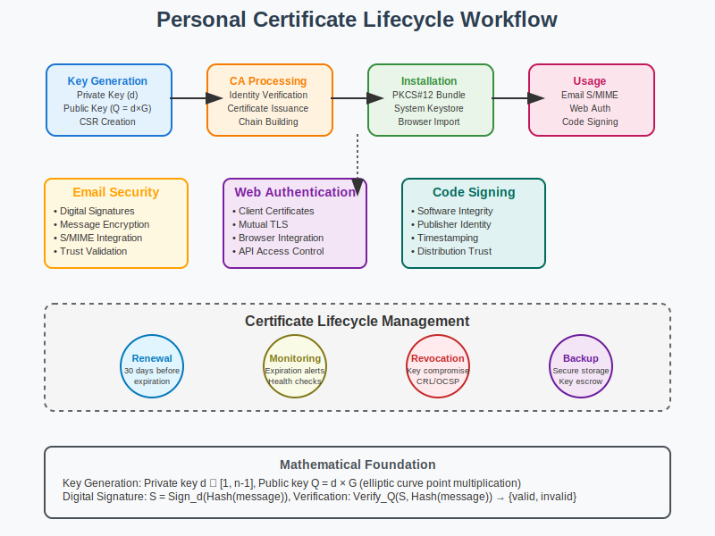

# Personal Certificates Workflow



## Scenario Overview

**User**: Alice Thompson, software developer  
**Project**: Setting up personal digital identity for secure communications  
**Context**: Individual user managing personal certificates for email, web authentication, and code signing  
**Timeline**: Initial setup and ongoing certificate lifecycle management

## The Challenge

Alice wants to:
- Establish a trusted digital identity for professional communications
- Sign and encrypt emails using S/MIME certificates
- Authenticate to web services using client certificates
- Sign her software releases with code signing certificates
- Manage certificate lifecycle including renewal and revocation
- Securely store and backup her private keys

## PKI Workflow Solution

### Mathematical Foundation

In personal certificate management, PKI relies on asymmetric cryptography and hierarchical trust:

```
Trust Hierarchy:
Root CA → Intermediate CA → Personal Certificate

Key Pair Generation:
Private Key (d) ← Random Generation
Public Key (Q) = d × G (Elliptic Curve)

Certificate Binding:
Certificate = Sign_CA(Public Key + Identity + Validity)
```

The mathematical beauty is that the private key remains secret while the public key can be freely distributed, enabling authentication, digital signatures, and encryption without shared secrets.

## Step-by-Step Workflow

### Phase 1: Key Generation and Certificate Request

```bash
# Generate private key (ECC P-256 for efficiency)
alice@laptop:~$ openssl ecparam -genkey -name prime256v1 -out alice_private.key

# Create certificate signing request (CSR)
alice@laptop:~$ openssl req -new -key alice_private.key -out alice.csr \
    -subj "/CN=Alice Thompson/emailAddress=alice@example.com/O=Freelance Developer"
```

**Mathematical Insight**: 
- Private key `d` is randomly selected from `[1, n-1]` where `n` is the order of the elliptic curve
- Public key `Q = d × G` where `G` is the generator point
- CSR contains the public key and identity information, signed with the private key

### Phase 2: Certificate Authority Interaction

```bash
# Submit CSR to Certificate Authority (via web interface or API)
# CA performs identity verification (email validation, domain control, etc.)

# Receive issued certificate
alice@laptop:~$ wget https://ca.example.com/certs/alice_cert.pem

# Verify certificate chain
alice@laptop:~$ openssl verify -CAfile ca_chain.pem alice_cert.pem
alice_cert.pem: OK
```

**Mathematical Analysis**: 
- CA creates certificate: `Cert = Sign_CA(CSR_content + validity_period + extensions)`
- Certificate validation: `Verify_CA_Public_Key(Cert_signature, Cert_content)`
- Chain validation ensures path from root trust anchor to end-entity certificate

### Phase 3: Certificate Installation and Storage

```bash
# Create PKCS#12 bundle for secure storage
alice@laptop:~$ openssl pkcs12 -export -out alice_identity.p12 \
    -inkey alice_private.key -in alice_cert.pem -certfile ca_chain.pem \
    -password pass:SecurePassword123

# Install in system keystore (Windows)
alice@laptop:~$ certlm.msc  # Import alice_identity.p12

# Install in browser (Firefox/Chrome)
# Navigate to Settings → Privacy & Security → Certificates → Import
```

**Security Considerations**:
- PKCS#12 format provides password-based encryption of private key
- System keystore integration enables automatic certificate selection
- Hardware Security Module (HSM) integration for high-security environments

### Phase 4: Email Security Configuration

```bash
# Configure S/MIME in email client
# Thunderbird: Account Settings → End-to-End Encryption → Import certificate

# Send signed email
alice@laptop:~$ echo "Test message" | openssl smime -sign \
    -signer alice_cert.pem -inkey alice_private.key \
    -text -out signed_message.txt

# Encrypt email to recipient
alice@laptop:~$ echo "Confidential message" | openssl smime -encrypt \
    -in message.txt -out encrypted_message.txt recipient_cert.pem
```

**Cryptographic Operations**:
- Digital Signature: `Sign_Alice(Hash(message)) = d_Alice × Hash(message) mod n`
- Signature Verification: `Verify(signature) = signature × G =? Hash(message) × Q_Alice`
- Encryption: Generate session key `K`, encrypt message with `K`, encrypt `K` with recipient's public key

### Phase 5: Web Authentication

```bash
# Configure client certificate authentication
# Apache configuration:
# SSLVerifyClient require
# SSLCACertificateFile ca_chain.pem

# Test client certificate authentication
alice@laptop:~$ curl --cert alice_cert.pem --key alice_private.key \
    https://secure.example.com/api/profile

# Browser automatic certificate selection
# Chrome/Firefox will prompt for certificate when server requests client authentication
```

**Authentication Protocol**:
1. Server requests client certificate during TLS handshake
2. Client sends certificate chain
3. Server validates chain and extracts identity
4. Server may perform additional authorization checks

### Phase 6: Code Signing

```bash
# Sign software package
alice@laptop:~$ jarsigner -keystore alice_identity.p12 \
    -storepass SecurePassword123 myapp.jar alice

# Verify signed package
alice@laptop:~$ jarsigner -verify -verbose myapp.jar

# Create detached signature for distribution
alice@laptop:~$ openssl dgst -sha256 -sign alice_private.key \
    -out software.sig software.zip
```

**Code Signing Mathematics**:
- Hash computation: `H = SHA256(software_bytes)`
- Signature generation: `S = Sign_Alice(H)`
- Verification: `Verify_Alice_Public(S, H) → {valid, invalid}`

## Certificate Lifecycle Management

### Renewal Process

```bash
# Check certificate expiration
alice@laptop:~$ openssl x509 -in alice_cert.pem -noout -enddate
notAfter=Dec 31 23:59:59 2024 GMT

# Generate new CSR with same key (key continuity)
alice@laptop:~$ openssl req -new -key alice_private.key -out alice_renewal.csr \
    -subj "/CN=Alice Thompson/emailAddress=alice@example.com/O=Freelance Developer"

# Submit renewal request 30 days before expiration
# Receive renewed certificate with extended validity period
```

### Revocation Handling

```bash
# Check certificate revocation status
alice@laptop:~$ openssl ocsp -issuer ca_cert.pem -cert alice_cert.pem \
    -url http://ocsp.ca.example.com -resp_text

# In case of key compromise, request revocation
alice@laptop:~$ curl -X POST https://ca.example.com/revoke \
    -d "certificate_serial=123456789&reason=keyCompromise"
```

## Performance Analysis

### Key Generation Performance

```python
def key_generation_performance():
    """
    Performance characteristics of different key types
    """
    performance_metrics = {
        "RSA-2048": {
            "generation_time": "2000ms",
            "signature_time": "15ms", 
            "verification_time": "1ms",
            "key_size": "2048 bits"
        },
        "ECDSA-P256": {
            "generation_time": "50ms",
            "signature_time": "2ms",
            "verification_time": "3ms", 
            "key_size": "256 bits"
        },
        "Ed25519": {
            "generation_time": "1ms",
            "signature_time": "0.1ms",
            "verification_time": "0.3ms",
            "key_size": "256 bits"
        }
    }
    return performance_metrics
```

### Storage Requirements

```
Certificate Storage Analysis:
- X.509 Certificate: ~1-4 KB (depending on extensions)
- Private Key (ECDSA P-256): 32 bytes + metadata
- PKCS#12 Bundle: ~5-10 KB (including chain)
- Annual Storage Growth: ~10-50 KB per certificate renewal
```

## Security Best Practices

### Key Protection

1. **Private Key Storage**:
   - Use hardware security modules (HSM) for high-value certificates
   - Enable OS-level keystore encryption
   - Implement key backup and escrow procedures

2. **Certificate Validation**:
   - Always verify certificate chains to trusted root
   - Check certificate revocation status (CRL/OCSP)
   - Validate certificate purpose and constraints

3. **Operational Security**:
   - Monitor certificate expiration dates
   - Implement automated renewal processes
   - Maintain secure backup of identity credentials

### Risk Assessment Matrix

```
Risk Level    Scenario                    Mitigation Strategy
High          Private key compromise      Immediate revocation + new key generation
Medium        Certificate expiration      Automated renewal 30 days before expiry
Medium        CA compromise              Monitor CT logs, update trust store
Low           Performance degradation     Optimize validation caching
```

## Mathematical Deep Dive

### Elliptic Curve Certificate Generation

The process of generating a personal certificate using elliptic curve cryptography:

```python
def generate_ecc_certificate():
    """
    Mathematical representation of ECC certificate generation
    """
    # 1. Key Generation
    # Private key: random integer d in [1, n-1]
    # Public key: Q = d * G where G is generator point
    
    # 2. Certificate Signing Request
    # CSR = {
    #   public_key: Q,
    #   subject: "CN=Alice Thompson,emailAddress=alice@example.com",
    #   signature: Sign_d(Hash(CSR_content))
    # }
    
    # 3. Certificate Issuance
    # Certificate = {
    #   version: 3,
    #   serial_number: unique_id,
    #   issuer: "CN=CA,O=Certificate Authority", 
    #   subject: "CN=Alice Thompson,emailAddress=alice@example.com",
    #   public_key: Q,
    #   validity: {not_before: timestamp, not_after: timestamp + 365_days},
    #   extensions: {key_usage, extended_key_usage, subject_alt_name},
    #   signature_algorithm: "ecdsa-with-SHA256",
    #   signature: Sign_CA_private_key(Hash(certificate_content))
    # }
    
    return certificate
```

### Trust Chain Validation Algorithm

```python
def validate_certificate_chain(certificate, trusted_roots):
    """
    Mathematical validation of certificate trust chain
    """
    current_cert = certificate
    validation_path = []
    
    while current_cert.issuer != current_cert.subject:  # Not self-signed
        # Find issuer certificate
        issuer_cert = find_issuer_certificate(current_cert.issuer)
        
        # Verify signature: Verify_issuer_public_key(cert_signature, cert_content)
        if not verify_signature(current_cert, issuer_cert.public_key):
            return False, "Invalid signature in chain"
            
        # Check validity period
        if not is_valid_time_period(current_cert):
            return False, "Certificate expired or not yet valid"
            
        # Check revocation status
        if is_revoked(current_cert):
            return False, "Certificate revoked"
            
        validation_path.append(current_cert)
        current_cert = issuer_cert
    
    # Verify root certificate is trusted
    if current_cert.fingerprint in trusted_roots:
        return True, validation_path
    else:
        return False, "Root certificate not trusted"
```

## Troubleshooting Guide

### Common Issues

1. **Certificate Installation Failures**:
   ```bash
   # Check certificate format
   alice@laptop:~$ openssl x509 -in alice_cert.pem -text -noout
   
   # Verify private key matches certificate
   alice@laptop:~$ openssl x509 -in alice_cert.pem -pubkey -noout | openssl md5
   alice@laptop:~$ openssl rsa -in alice_private.key -pubout | openssl md5
   ```

2. **Email Client Configuration**:
   ```bash
   # Export certificate for email client
   alice@laptop:~$ openssl pkcs12 -in alice_identity.p12 -out alice_email.pem -nodes
   
   # Check S/MIME capabilities
   alice@laptop:~$ openssl smime -verify -in signed_message.eml -CAfile ca_chain.pem
   ```

3. **Browser Certificate Issues**:
   - Clear browser certificate cache
   - Reimport PKCS#12 bundle
   - Check browser certificate store permissions

## Conclusion

Personal certificate management demonstrates PKI's power to enable individual digital identity. The mathematical foundations of asymmetric cryptography, combined with hierarchical trust models, provide a robust framework for authentication, digital signatures, and encryption at the personal level.

Key takeaways:
- Elliptic Curve Cryptography provides optimal security-to-performance ratio
- Certificate lifecycle management requires proactive renewal and monitoring
- Hardware security modules enhance private key protection
- Trust chain validation ensures certificate authenticity and integrity

## Files in This Use Case

- `README.md` - This comprehensive workflow guide
- `workflow.svg` - Visual representation of personal certificate lifecycle
- `examples/` - Sample configuration files and scripts
- `tools/` - Certificate management utilities

## Navigation

**Previous**: [PKI Use Cases Overview](../README.md) 📚  
**Next**: [Certificate Authorities](../02-certificate-authorities/README.md) 🏢  
**Home**: [PKI Main README](../../README.md) 🏠