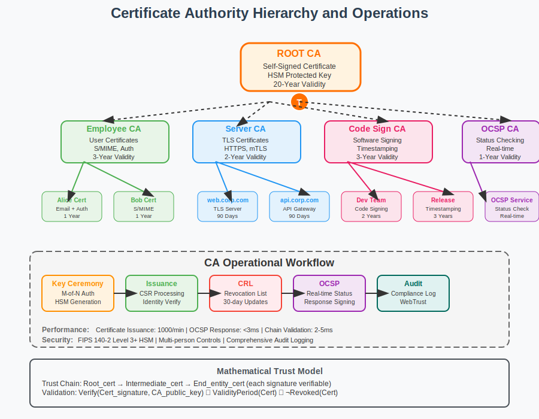

# Certificate Authorities Workflow



## Scenario Overview

**Organization**: TechCorp Enterprise  
**Project**: Establishing an internal Certificate Authority for organizational PKI  
**Context**: IT department setting up CA infrastructure for employee certificates, server authentication, and code signing  
**Timeline**: CA deployment, root key ceremony, and ongoing certificate issuance operations

## The Challenge

TechCorp IT team wants to:
- Establish a trusted root Certificate Authority for internal use
- Implement secure root key management and storage
- Design hierarchical CA structure with intermediate CAs
- Automate certificate issuance and lifecycle management
- Ensure compliance with industry standards (RFC 5280, CA/Browser Forum)
- Implement certificate revocation and status checking infrastructure

## PKI Workflow Solution

### Mathematical Foundation

Certificate Authority operations are built on hierarchical trust and cryptographic signatures:

```
Trust Hierarchy:
Root CA (self-signed)
 ├── Intermediate CA 1 (for employee certificates)
 ├── Intermediate CA 2 (for server certificates) 
 └── Intermediate CA 3 (for code signing)

Certificate Issuance:
Certificate = {
  Subject: End-entity identity
  Public Key: Subject's public key
  Validity: Not before/after timestamps
  Extensions: Key usage, constraints, policies
  Signature: Sign_CA_private_key(Hash(certificate_content))
}
```

The mathematical foundation ensures that any certificate can be validated by following the trust chain up to a trusted root, with each signature mathematically proving authenticity.

## Step-by-Step Workflow

### Phase 1: Root CA Establishment

```bash
# Generate root CA private key (highest security - offline HSM recommended)
ca-admin@secure-host:~$ openssl genrsa -aes256 -out root-ca-private.key 4096

# Create root CA certificate (self-signed)
ca-admin@secure-host:~$ openssl req -new -x509 -days 7300 -key root-ca-private.key \
    -out root-ca-cert.pem \
    -subj "/CN=TechCorp Root CA/O=TechCorp Inc/C=US" \
    -extensions v3_ca

# Create certificate serial number tracking
ca-admin@secure-host:~$ echo "1000" > serial
ca-admin@secure-host:~$ touch index.txt
```

**Mathematical Insight**: 
- Root certificate is self-signed: `Signature = Sign_root_private_key(Hash(root_cert_content))`
- Self-signature creates the trust anchor: `Verify_root_public_key(signature, cert_content) = valid`
- 20-year validity (7300 days) provides long-term trust anchor stability

### Phase 2: HSM Integration and Key Ceremony

```bash
# Initialize Hardware Security Module
ca-admin@secure-host:~$ pkcs11-tool --module /usr/lib/libCryptoki2_64.so --init-token \
    --label "TechCorp-Root-CA" --so-pin 123456

# Generate root key in HSM (requires key ceremony with multiple authorized personnel)
ca-admin@secure-host:~$ pkcs11-tool --module /usr/lib/libCryptoki2_64.so \
    --login --pin 654321 --keypairgen --key-type rsa:4096 \
    --label "root-ca-key" --id 01

# Export root certificate for distribution
ca-admin@secure-host:~$ openssl x509 -in root-ca-cert.pem -outform DER \
    -out root-ca-cert.crt
```

**Security Considerations**:
- Key ceremony requires M-of-N authentication (e.g., 3-of-5 key holders)
- Root private key never exists in software - HSM only
- Physical security controls for HSM access
- Comprehensive audit logging of all HSM operations

### Phase 3: Intermediate CA Deployment

```bash
# Generate intermediate CA key
ca-admin@intermediate:~$ openssl genrsa -aes256 -out intermediate-ca-private.key 2048

# Create intermediate CA certificate signing request
ca-admin@intermediate:~$ openssl req -new -key intermediate-ca-private.key \
    -out intermediate-ca.csr \
    -subj "/CN=TechCorp Intermediate CA/O=TechCorp Inc/C=US"

# Sign intermediate certificate with root CA (offline process)
ca-admin@secure-host:~$ openssl ca -config ca.conf -extensions v3_intermediate_ca \
    -days 3650 -notext -batch -in intermediate-ca.csr \
    -out intermediate-ca-cert.pem

# Create certificate chain file
ca-admin@intermediate:~$ cat intermediate-ca-cert.pem root-ca-cert.pem > ca-chain.pem
```

**Hierarchical Trust Mathematics**:
- Intermediate cert signature: `Sign_root_private_key(Hash(intermediate_cert_content))`
- Chain validation: Root validates Intermediate validates End-entity
- Path length constraints limit hierarchy depth

### Phase 4: Certificate Issuance Infrastructure

```bash
# Set up OpenSSL CA configuration
ca-admin@intermediate:~$ cat > openssl-ca.conf << EOF
[ ca ]
default_ca = CA_default

[ CA_default ]
dir = /opt/ca
certs = \$dir/certs
crl_dir = \$dir/crl
database = \$dir/index.txt
new_certs_dir = \$dir/newcerts
certificate = \$dir/intermediate-ca-cert.pem
serial = \$dir/serial
crlnumber = \$dir/crlnumber
crl = \$dir/crl/intermediate-ca.crl.pem
private_key = \$dir/private/intermediate-ca-private.key
default_days = 365
default_crl_days = 30
default_md = sha256
preserve = no
policy = policy_strict

[ policy_strict ]
countryName = match
stateOrProvinceName = match
organizationName = match
organizationalUnitName = optional
commonName = supplied
emailAddress = optional
EOF

# Issue employee certificate
ca-admin@intermediate:~$ openssl ca -config openssl-ca.conf \
    -extensions employee_cert -days 365 -notext -batch \
    -in employee.csr -out employee-cert.pem
```

**Certificate Validation Algorithm**:
```python
def validate_certificate_chain(cert_chain, trusted_roots):
    """
    Validate certificate chain from end-entity to root
    """
    for i in range(len(cert_chain) - 1):
        current_cert = cert_chain[i]
        issuer_cert = cert_chain[i + 1]
        
        # Verify signature
        if not verify_signature(current_cert, issuer_cert.public_key):
            return False, f"Invalid signature at depth {i}"
        
        # Check validity period
        if not is_within_validity_period(current_cert):
            return False, f"Certificate expired at depth {i}"
        
        # Verify name chaining
        if current_cert.issuer != issuer_cert.subject:
            return False, f"Name chaining broken at depth {i}"
    
    # Check root is trusted
    root_cert = cert_chain[-1]
    if root_cert.fingerprint in trusted_roots:
        return True, "Chain validation successful"
    
    return False, "Root certificate not trusted"
```

### Phase 5: OCSP Responder Setup

```bash
# Generate OCSP responder key
ca-admin@ocsp:~$ openssl genrsa -out ocsp-responder.key 2048

# Create OCSP responder certificate
ca-admin@ocsp:~$ openssl req -new -key ocsp-responder.key \
    -subj "/CN=TechCorp OCSP Responder/O=TechCorp Inc/C=US" | \
    openssl ca -config openssl-ca.conf -extensions ocsp_responder \
    -days 365 -notext -batch -out ocsp-responder.crt

# Start OCSP responder service
ca-admin@ocsp:~$ openssl ocsp -index index.txt -port 8080 \
    -rsigner ocsp-responder.crt -rkey ocsp-responder.key \
    -CA ca-chain.pem -text
```

**OCSP Response Mathematics**:
- Status query: `Query = {cert_serial, cert_issuer, nonce}`
- Response: `Sign_OCSP_key(cert_status + timestamp + nonce)`
- Real-time revocation checking with cryptographic proof

### Phase 6: Certificate Revocation List (CRL)

```bash
# Generate CRL
ca-admin@intermediate:~$ openssl ca -config openssl-ca.conf -gencrl \
    -out intermediate-ca.crl.pem

# Revoke a certificate
ca-admin@intermediate:~$ openssl ca -config openssl-ca.conf \
    -revoke compromised-cert.pem -crl_reason keyCompromise

# Update CRL with revoked certificate
ca-admin@intermediate:~$ openssl ca -config openssl-ca.conf -gencrl \
    -out intermediate-ca.crl.pem

# Convert to DER format for distribution
ca-admin@intermediate:~$ openssl crl -in intermediate-ca.crl.pem \
    -outform DER -out intermediate-ca.crl
```

**CRL Structure and Validation**:
```python
def validate_crl(crl, ca_certificate):
    """
    Validate Certificate Revocation List
    """
    # Verify CRL signature
    if not verify_signature(crl, ca_certificate.public_key):
        return False, "Invalid CRL signature"
    
    # Check CRL validity period
    if not is_within_validity_period(crl):
        return False, "CRL expired or not yet valid"
    
    # Verify CRL issuer matches CA
    if crl.issuer != ca_certificate.subject:
        return False, "CRL issuer mismatch"
    
    return True, "CRL validation successful"

def check_revocation_status(certificate_serial, crl):
    """
    Check if certificate is revoked
    """
    for revoked_cert in crl.revoked_certificates:
        if revoked_cert.serial == certificate_serial:
            return True, revoked_cert.revocation_reason, revoked_cert.revocation_date
    
    return False, None, None
```

## CA Security Architecture

### Root Key Protection

```bash
# Root key backup procedure (requires multiple key holders)
ca-admin@secure-host:~$ openssl rsa -in root-ca-private.key -out root-backup-1.key \
    -aes256 -passout pass:KeyHolder1Password

# Split key using Shamir's Secret Sharing (conceptual)
ca-admin@secure-host:~$ secret-split -t 3 -n 5 root-ca-private.key \
    -o root-key-shares/share
```

**Key Management Mathematics**:
- Shamir's Secret Sharing: `Secret = Σ(share_i × lagrange_basis_i) mod p`
- Threshold scheme: Any 3 of 5 shares can reconstruct root key
- Information-theoretic security: < 3 shares reveal no information

### Certificate Policy and Practice Statement

```text
Certificate Policy (CP) Structure:
1. Introduction and Overview
2. Publication and Repository Responsibilities  
3. Identification and Authentication
4. Certificate Life-Cycle Operational Requirements
5. Facility, Management, and Operational Controls
6. Technical Security Controls
7. Certificate, CRL, and OCSP Profiles
8. Compliance Audit and Other Assessment
9. Other Business and Legal Matters

Key Policy Elements:
- Identity verification requirements
- Key generation and storage standards
- Certificate validity periods
- Revocation procedures and timelines
- Audit and compliance requirements
```

## Performance and Scalability Analysis

### Certificate Issuance Performance

```python
def ca_performance_analysis():
    """
    Certificate Authority performance characteristics
    """
    performance_metrics = {
        "certificate_issuance": {
            "rsa_2048": "50ms processing time",
            "ecdsa_p256": "15ms processing time", 
            "batch_processing": "1000 certs/minute",
            "peak_throughput": "10,000 certs/hour"
        },
        "validation_operations": {
            "chain_validation": "2-5ms per certificate",
            "ocsp_response": "1-3ms per query",
            "crl_processing": "O(n) where n = revoked certificates"
        },
        "storage_requirements": {
            "certificate_database": "~2KB per certificate",
            "audit_logs": "~500 bytes per operation",
            "crl_size": "~100 bytes per revoked certificate"
        }
    }
    return performance_metrics
```

### Scalability Considerations

```python
def ca_scalability_planning():
    """
    Planning CA infrastructure for scale
    """
    scaling_factors = {
        "certificate_volume": {
            "small_org": "< 1,000 certificates",
            "medium_org": "1,000 - 100,000 certificates", 
            "large_org": "100,000 - 1,000,000 certificates",
            "enterprise": "> 1,000,000 certificates"
        },
        "infrastructure_requirements": {
            "small": "Single CA server + OCSP responder",
            "medium": "HA CA cluster + distributed OCSP",
            "large": "Geographic distribution + CDN for CRL/OCSP",
            "enterprise": "Multi-tier CA hierarchy + global distribution"
        }
    }
    return scaling_factors
```

## Compliance and Audit Framework

### Audit Log Analysis

```python
def audit_log_analysis():
    """
    Comprehensive audit logging for CA operations
    """
    audit_events = {
        "key_management": [
            "key_generation", "key_storage", "key_usage", 
            "key_backup", "key_recovery", "key_destruction"
        ],
        "certificate_lifecycle": [
            "certificate_request", "identity_verification",
            "certificate_issuance", "certificate_renewal",
            "certificate_revocation", "certificate_expiration"
        ],
        "system_operations": [
            "system_startup", "system_shutdown", "configuration_changes",
            "software_updates", "hardware_maintenance", "security_events"
        ],
        "access_control": [
            "user_authentication", "privilege_escalation",
            "administrative_access", "failed_login_attempts"
        ]
    }
    
    # Audit log integrity protection
    audit_protection = {
        "log_signing": "Each entry signed with CA audit key",
        "log_encryption": "AES-256 encryption of sensitive data",
        "log_redundancy": "Replicated to multiple secure locations",
        "tamper_detection": "Hash chains and digital timestamps"
    }
    
    return audit_events, audit_protection
```

### Compliance Frameworks

```text
Compliance Standards:
- WebTrust for Certification Authorities
- Common Criteria (CC) evaluation
- FIPS 140-2 Level 3/4 for HSMs
- RFC 5280 (Internet X.509 PKI)
- CA/Browser Forum Baseline Requirements

Regulatory Compliance:
- SOX (financial reporting)
- HIPAA (healthcare data)  
- PCI DSS (payment card industry)
- GDPR (data protection)
- Federal PKI (government)
```

## Mathematical Deep Dive

### Certificate Chain Validation Algorithm

```python
def certificate_chain_validation_algorithm(certificate_chain):
    """
    Detailed mathematical validation of certificate chains
    """
    
    def verify_certificate_signature(cert, issuer_public_key):
        """
        Verify certificate signature using issuer's public key
        """
        # Extract signature and signed data
        signature = cert.signature
        signed_data = cert.tbs_certificate  # "to be signed" portion
        
        # Hash the signed data
        hash_value = sha256(signed_data)
        
        # Verify signature based on algorithm
        if cert.signature_algorithm == "RSA-SHA256":
            # RSA signature verification: signature^e mod n == hash
            decrypted = pow(signature, issuer_public_key.e, issuer_public_key.n)
            return decrypted == hash_value
        
        elif cert.signature_algorithm == "ECDSA-SHA256":
            # ECDSA verification using elliptic curve mathematics
            return ecdsa_verify(hash_value, signature, issuer_public_key)
    
    def validate_certificate_extensions(cert):
        """
        Validate certificate extensions and constraints
        """
        # Key usage constraints
        if hasattr(cert, 'key_usage'):
            if not validate_key_usage(cert.key_usage, cert.intended_purpose):
                return False
        
        # Basic constraints (CA certificates only)
        if hasattr(cert, 'basic_constraints'):
            if cert.basic_constraints.ca and cert.basic_constraints.path_len_constraint:
                # Check path length constraint
                remaining_depth = cert.basic_constraints.path_len_constraint
                if remaining_depth < 0:
                    return False
        
        return True
    
    # Main validation loop
    for i in range(len(certificate_chain) - 1):
        current_cert = certificate_chain[i]
        issuer_cert = certificate_chain[i + 1]
        
        # Verify signature
        if not verify_certificate_signature(current_cert, issuer_cert.public_key):
            return False, f"Signature verification failed at depth {i}"
        
        # Validate extensions
        if not validate_certificate_extensions(current_cert):
            return False, f"Extension validation failed at depth {i}"
        
        # Check validity periods
        current_time = datetime.now()
        if current_time < current_cert.not_valid_before:
            return False, f"Certificate not yet valid at depth {i}"
        if current_time > current_cert.not_valid_after:
            return False, f"Certificate expired at depth {i}"
    
    return True, "Certificate chain validation successful"
```

### CA Hierarchy Trust Model

```python
def ca_hierarchy_trust_model():
    """
    Mathematical model of CA hierarchy trust relationships
    """
    
    class TrustNode:
        def __init__(self, name, level, trust_value=1.0):
            self.name = name
            self.level = level  # 0=root, 1=intermediate, 2=end-entity
            self.trust_value = trust_value
            self.children = []
            self.parent = None
    
    def calculate_trust_path(end_entity_cert, root_certs):
        """
        Calculate trust value along certification path
        """
        trust_path = []
        current_cert = end_entity_cert
        cumulative_trust = 1.0
        
        while current_cert.parent:
            trust_path.append(current_cert)
            # Trust degrades with distance from root
            cumulative_trust *= current_cert.trust_value * 0.95
            current_cert = current_cert.parent
        
        # Verify root is trusted
        if current_cert in root_certs:
            return cumulative_trust, trust_path
        else:
            return 0.0, []  # No trusted path found
    
    def trust_transitivity(cert_a, cert_b):
        """
        Calculate transitive trust between certificates
        """
        # Find common trust anchor
        path_a = get_certification_path(cert_a)
        path_b = get_certification_path(cert_b)
        
        # Find lowest common ancestor
        common_ancestor = find_common_ancestor(path_a, path_b)
        
        if common_ancestor:
            # Trust based on distance from common ancestor
            distance_a = len(path_a) - path_a.index(common_ancestor)
            distance_b = len(path_b) - path_b.index(common_ancestor)
            trust_factor = 1.0 / (1.0 + distance_a + distance_b)
            return trust_factor
        
        return 0.0  # No common trust anchor
```

## Troubleshooting Guide

### Common CA Operational Issues

1. **Certificate Chain Validation Failures**:
   ```bash
   # Debug certificate chain
   ca-admin@server:~$ openssl verify -CAfile root-ca.pem -untrusted intermediate-ca.pem end-entity.pem
   
   # Check certificate details
   ca-admin@server:~$ openssl x509 -in certificate.pem -text -noout
   
   # Validate certificate against CRL
   ca-admin@server:~$ openssl crl -in ca.crl -noout -text | grep -A 5 "Serial Number"
   ```

2. **OCSP Responder Issues**:
   ```bash
   # Test OCSP response
   ca-admin@server:~$ openssl ocsp -issuer ca-cert.pem -cert test-cert.pem \
       -url http://ocsp.techcorp.com -resp_text
   
   # Verify OCSP responder certificate
   ca-admin@server:~$ openssl verify -CAfile ca-chain.pem ocsp-responder.crt
   ```

3. **HSM Connectivity Problems**:
   ```bash
   # Check HSM status
   ca-admin@server:~$ pkcs11-tool --module /usr/lib/libCryptoki2_64.so --list-slots
   
   # Test HSM operations
   ca-admin@server:~$ pkcs11-tool --module /usr/lib/libCryptoki2_64.so \
       --login --pin 654321 --list-objects
   ```

## Best Practices and Recommendations

### CA Security Controls

1. **Physical Security**:
   - Controlled access facilities for CA operations
   - Video surveillance and access logging
   - Secure storage for backup materials
   - Environmental controls (temperature, humidity, power)

2. **Logical Security**:
   - Multi-factor authentication for all CA access
   - Role-based access control (RBAC)
   - Principle of least privilege
   - Regular security assessments and penetration testing

3. **Operational Security**:
   - Comprehensive documented procedures
   - Regular staff training and certification
   - Incident response plans
   - Business continuity and disaster recovery

### Key Management Best Practices

```python
def key_management_best_practices():
    """
    Comprehensive key management guidelines
    """
    practices = {
        "key_generation": {
            "entropy_source": "Hardware random number generator",
            "key_strength": "RSA 3072-bit or ECDSA P-384 minimum",
            "generation_environment": "Offline, air-gapped systems",
            "witness_requirements": "Multiple authorized personnel"
        },
        "key_storage": {
            "root_ca_keys": "FIPS 140-2 Level 3+ HSM",
            "intermediate_keys": "FIPS 140-2 Level 2+ HSM or secure software",
            "backup_procedures": "Encrypted, geographically distributed",
            "access_controls": "M-of-N authentication schemes"
        },
        "key_usage": {
            "usage_logging": "All key operations logged and monitored",
            "usage_limits": "Operational controls on signature volume",
            "algorithm_restrictions": "Approved algorithms and parameters only",
            "key_escrow": "Secure backup and recovery procedures"
        },
        "key_lifecycle": {
            "rotation_schedule": "Root CA: 10-20 years, Intermediate: 5-10 years",
            "renewal_procedures": "Overlapping validity periods",
            "retirement_process": "Secure key destruction and archival",
            "migration_planning": "Algorithm and key length transitions"
        }
    }
    return practices
```

## Conclusion

Operating a Certificate Authority requires deep understanding of cryptographic principles, security controls, and operational procedures. The mathematical foundations of PKI enable scalable trust relationships, while proper implementation ensures security, compliance, and reliability.

Key takeaways:
- Root key protection is paramount - use HSMs and multi-person controls
- Certificate chain validation relies on cryptographic signatures and trust hierarchies
- Revocation infrastructure (CRL/OCSP) is essential for security
- Comprehensive audit logging enables compliance and forensic analysis
- Performance planning must consider certificate volume and validation requirements

## Files in This Use Case

- `README.md` - This comprehensive CA operational guide
- `workflow.svg` - Visual representation of CA hierarchy and operations
- `examples/` - Sample configuration files and scripts
- `tools/` - CA management and monitoring utilities

## Navigation

**Previous**: [Personal Certificates](../01-personal-certificates/README.md) 👤  
**Next**: [Web Authentication](../03-web-authentication/README.md) 🌐  
**Home**: [PKI Main README](../../README.md) 🏠