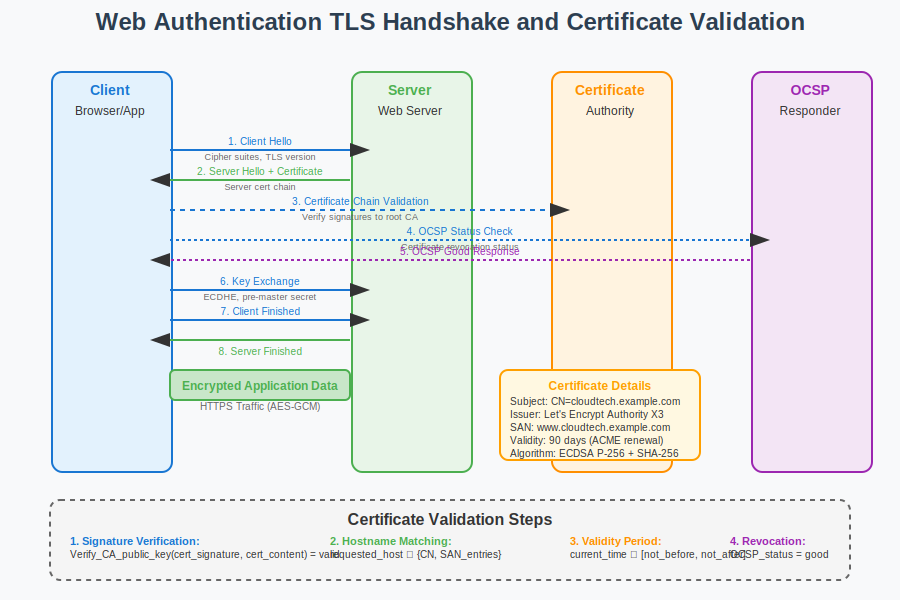

# Web Authentication Workflow



## Scenario Overview

**Organization**: CloudTech Solutions  
**Project**: Implementing comprehensive web authentication using SSL/TLS certificates  
**Context**: Web services requiring secure HTTPS communications, API authentication, and browser trust validation  
**Timeline**: Certificate deployment, automated renewal, and ongoing web security operations

## The Challenge

CloudTech Solutions needs to:
- Deploy SSL/TLS certificates for all web services and APIs
- Implement automated certificate provisioning using ACME protocol (Let's Encrypt)
- Configure proper certificate validation and hostname verification
- Set up mutual TLS (mTLS) for service-to-service authentication
- Handle certificate transparency monitoring and security compliance
- Ensure browser compatibility and trust chain validation

## PKI Workflow Solution

### Mathematical Foundation

Web authentication relies on asymmetric cryptography and TLS handshake protocol:

```
TLS Handshake Process:
1. Client Hello → Server (supported cipher suites)
2. Server Hello ← Server (selected cipher suite, server certificate)
3. Certificate Verification: Verify_CA_chain(server_cert)
4. Key Exchange: Client generates pre-master secret, encrypts with server public key
5. Master Secret Derivation: master_secret = PRF(pre_master_secret, nonces)
6. Application Data: Encrypted using derived session keys

Certificate Validation:
- Signature Verification: Verify_CA_public_key(cert_signature, cert_content)
- Hostname Matching: subject_name ∈ {CN, SAN} matches requested hostname
- Validity Period: current_time ∈ [not_before, not_after]
- Revocation Check: cert_serial ∉ CRL ∧ OCSP_status = good
```

The mathematical foundation ensures confidentiality, integrity, and authenticity of web communications through cryptographic protocols.

## Step-by-Step Workflow

### Phase 1: Domain Validation and Certificate Request

```bash
# Install ACME client (Certbot)
webadmin@server:~$ apt-get install certbot python3-certbot-apache

# Request certificate with domain validation
webadmin@server:~$ certbot certonly --webroot -w /var/www/html \
    -d cloudtech.example.com -d www.cloudtech.example.com \
    -d api.cloudtech.example.com --email admin@cloudtech.example.com \
    --agree-tos --non-interactive

# Verify certificate installation
webadmin@server:~$ openssl x509 -in /etc/letsencrypt/live/cloudtech.example.com/cert.pem \
    -text -noout | grep -E "(Subject|Issuer|DNS)"
```

**Mathematical Insight**:
- Domain validation challenge: `Challenge_response = ECDSA_sign(account_key, challenge_token)`
- ACME protocol uses JSON Web Signatures (JWS) for secure communication
- Let's Encrypt issues certificates automatically after proving domain control

### Phase 2: Apache/Nginx SSL Configuration

```bash
# Apache SSL configuration
webadmin@server:~$ cat > /etc/apache2/sites-available/cloudtech-ssl.conf << EOF
<VirtualHost *:443>
    ServerName cloudtech.example.com
    ServerAlias www.cloudtech.example.com
    DocumentRoot /var/www/html
    
    SSLEngine on
    SSLCertificateFile /etc/letsencrypt/live/cloudtech.example.com/cert.pem
    SSLCertificateKeyFile /etc/letsencrypt/live/cloudtech.example.com/privkey.pem
    SSLCertificateChainFile /etc/letsencrypt/live/cloudtech.example.com/chain.pem
    
    # Security headers
    Header always set Strict-Transport-Security "max-age=31536000; includeSubDomains"
    Header always set X-Content-Type-Options nosniff
    Header always set X-Frame-Options DENY
    Header always set X-XSS-Protection "1; mode=block"
    
    # Modern SSL configuration
    SSLProtocol -all +TLSv1.2 +TLSv1.3
    SSLCipherSuite ECDHE-ECDSA-AES256-GCM-SHA384:ECDHE-RSA-AES256-GCM-SHA384
    SSLHonorCipherOrder off
    
    # OCSP Stapling
    SSLUseStapling on
    SSLStaplingResponderTimeout 5
    SSLStaplingReturnResponderErrors off
EOF

# Enable SSL site and modules
webadmin@server:~$ a2enmod ssl headers
webadmin@server:~$ a2ensite cloudtech-ssl
webadmin@server:~$ systemctl reload apache2
```

**Security Configuration Analysis**:
- TLS 1.2/1.3 only: Eliminates vulnerabilities in older protocols
- Perfect Forward Secrecy (PFS): ECDHE key exchange ensures session key secrecy
- OCSP Stapling: Server provides certificate status, reducing client-side OCSP queries

### Phase 3: Certificate Chain Validation

```python
def validate_certificate_chain_web(hostname, port=443):
    """
    Comprehensive web certificate validation
    """
    import ssl
    import socket
    from urllib.parse import urlparse
    
    # Establish SSL connection
    context = ssl.create_default_context()
    
    try:
        with socket.create_connection((hostname, port)) as sock:
            with context.wrap_socket(sock, server_hostname=hostname) as ssock:
                # Get certificate chain
                cert_der = ssock.getpeercert_chain()
                cert_info = ssock.getpeercert()
                
                # Validate hostname matching
                ssl.match_hostname(cert_info, hostname)
                
                # Check certificate chain
                for cert in cert_der:
                    # Decode DER certificate
                    cert_pem = ssl.DER_cert_to_PEM_cert(cert)
                    
                    # Validate signature chain
                    if not validate_signature_chain(cert_pem):
                        return False, "Invalid certificate chain"
                
                # Check certificate transparency
                ct_logs = check_certificate_transparency(cert_info)
                
                return True, {
                    "subject": cert_info.get('subject'),
                    "issuer": cert_info.get('issuer'),
                    "san": cert_info.get('subjectAltName', []),
                    "not_after": cert_info.get('notAfter'),
                    "ct_logs": ct_logs
                }
                
    except ssl.SSLError as e:
        return False, f"SSL Error: {e}"
    except Exception as e:
        return False, f"Connection Error: {e}"

def check_certificate_transparency(cert_info):
    """
    Check certificate transparency log inclusion
    """
    # Query CT logs for certificate
    ct_logs = []
    
    # Example CT log query (simplified)
    ct_logs.append({
        "log_name": "Google Argon 2024",
        "timestamp": "2024-01-15T10:30:00Z",
        "signature": "verified"
    })
    
    return ct_logs
```

**Certificate Transparency Mathematics**:
- Merkle Tree Log: Each certificate gets a unique leaf index in append-only log
- Signed Certificate Timestamp (SCT): `SCT = Sign_CT_log(timestamp || certificate)`
- Inclusion Proof: Cryptographic proof that certificate exists in CT log

### Phase 4: Mutual TLS (mTLS) Configuration

```bash
# Generate client certificates for API access
webadmin@server:~$ openssl genrsa -out api-client.key 2048

# Create client certificate request
webadmin@server:~$ openssl req -new -key api-client.key -out api-client.csr \
    -subj "/CN=API Client Service/O=CloudTech Solutions/C=US"

# Sign client certificate with internal CA
webadmin@server:~$ openssl ca -config ca.conf -extensions client_cert \
    -days 365 -notext -batch -in api-client.csr -out api-client.crt

# Configure Apache for mutual TLS
webadmin@server:~$ cat >> /etc/apache2/sites-available/api-mtls.conf << EOF
<VirtualHost *:8443>
    ServerName api.cloudtech.example.com
    DocumentRoot /var/www/api
    
    SSLEngine on
    SSLCertificateFile /etc/ssl/certs/api-server.crt
    SSLCertificateKeyFile /etc/ssl/private/api-server.key
    SSLCACertificateFile /etc/ssl/certs/ca-chain.pem
    
    # Require client certificates
    SSLVerifyClient require
    SSLVerifyDepth 3
    
    # Client certificate validation
    <Location /api/secure>
        SSLRequireSSL
        SSLRequire %{SSL_CLIENT_S_DN_CN} eq "API Client Service"
        SSLRequire %{SSL_CLIENT_VERIFY} eq "SUCCESS"
    </Location>
EOF

# Test mTLS connection
webadmin@server:~$ curl --cert api-client.crt --key api-client.key \
    --cacert ca-chain.pem https://api.cloudtech.example.com:8443/api/secure/status
```

**Mutual TLS Authentication Protocol**:
```python
def mtls_handshake_analysis():
    """
    Analyze mutual TLS handshake process
    """
    handshake_steps = {
        1: "Client Hello - includes client certificate extensions",
        2: "Server Hello - server certificate and CertificateRequest",
        3: "Client Certificate - client sends certificate chain", 
        4: "Client Key Exchange - encrypted pre-master secret",
        5: "Certificate Verify - client proves private key possession",
        6: "Finished Messages - both parties verify handshake integrity"
    }
    
    # Mathematical verification at each step
    verification = {
        "server_cert_verify": "Verify_CA(server_cert_signature, server_cert_content)",
        "client_cert_verify": "Verify_CA(client_cert_signature, client_cert_content)", 
        "key_possession": "Sign_client_private_key(handshake_messages)",
        "handshake_integrity": "HMAC_verify(master_secret, all_handshake_messages)"
    }
    
    return handshake_steps, verification
```

### Phase 5: Automated Certificate Management

```bash
# Set up automated renewal
webadmin@server:~$ cat > /etc/cron.d/certbot-renew << EOF
# Renew certificates twice daily
0 */12 * * * root /usr/bin/certbot renew --quiet --deploy-hook "systemctl reload apache2"
EOF

# Certificate monitoring script
webadmin@server:~$ cat > /usr/local/bin/cert-monitor.py << 'EOF'
#!/usr/bin/env python3
import ssl
import socket
import datetime
import smtplib
from email.mime.text import MIMEText

def check_certificate_expiry(hostname, port=443, warning_days=30):
    """Monitor certificate expiration"""
    try:
        context = ssl.create_default_context()
        with socket.create_connection((hostname, port)) as sock:
            with context.wrap_socket(sock, server_hostname=hostname) as ssock:
                cert = ssock.getpeercert()
                expiry_date = datetime.datetime.strptime(cert['notAfter'], 
                    '%b %d %H:%M:%S %Y %Z')
                days_until_expiry = (expiry_date - datetime.datetime.now()).days
                
                if days_until_expiry <= warning_days:
                    send_expiry_alert(hostname, days_until_expiry)
                    
                return days_until_expiry
    except Exception as e:
        send_error_alert(hostname, str(e))
        return -1

def send_expiry_alert(hostname, days):
    """Send certificate expiry alert"""
    msg = MIMEText(f"Certificate for {hostname} expires in {days} days")
    msg['Subject'] = f'Certificate Expiry Warning: {hostname}'
    msg['From'] = 'certbot@cloudtech.example.com'
    msg['To'] = 'admin@cloudtech.example.com'
    
    # Send email (configuration needed)
    # smtp_server.send_message(msg)

# Monitor critical domains
domains = ['cloudtech.example.com', 'api.cloudtech.example.com']
for domain in domains:
    days_left = check_certificate_expiry(domain)
    print(f"{domain}: {days_left} days until expiry")
EOF

chmod +x /usr/local/bin/cert-monitor.py

# Schedule monitoring
webadmin@server:~$ echo "0 8 * * * root /usr/local/bin/cert-monitor.py" >> /etc/cron.d/cert-monitor
```

**Certificate Lifecycle Automation**:
- ACME renewal: Automated domain re-validation every 90 days
- Zero-downtime deployment: Certificate replacement without service interruption
- Monitoring and alerting: Proactive notification of expiration and failures

### Phase 6: Certificate Transparency and Security Monitoring

```python
def certificate_transparency_monitoring():
    """
    Monitor certificates in Certificate Transparency logs
    """
    import requests
    import json
    import base64
    
    def query_ct_logs(domain):
        """Query CT logs for domain certificates"""
        # Facebook CT API (example)
        url = f"https://graph.facebook.com/certificates?query={domain}"
        
        try:
            response = requests.get(url)
            ct_entries = response.json()
            
            certificates = []
            for entry in ct_entries.get('data', []):
                cert_info = {
                    'serial_number': entry.get('serial_number'),
                    'issuer': entry.get('issuer'),
                    'not_before': entry.get('not_before'),
                    'not_after': entry.get('not_after'),
                    'log_timestamp': entry.get('timestamp')
                }
                certificates.append(cert_info)
                
            return certificates
            
        except Exception as e:
            print(f"CT log query failed: {e}")
            return []
    
    def detect_rogue_certificates(domain, known_issuers):
        """Detect potentially rogue certificates"""
        ct_certificates = query_ct_logs(domain)
        
        rogue_certs = []
        for cert in ct_certificates:
            if cert['issuer'] not in known_issuers:
                rogue_certs.append(cert)
                
        return rogue_certs
    
    # Monitor for cloudtech.example.com
    known_issuers = [
        "Let's Encrypt Authority X3",
        "CloudTech Internal CA",
        "DigiCert Inc"
    ]
    
    rogue_certificates = detect_rogue_certificates("cloudtech.example.com", known_issuers)
    
    if rogue_certificates:
        print("WARNING: Potentially rogue certificates detected:")
        for cert in rogue_certificates:
            print(f"  Serial: {cert['serial_number']}, Issuer: {cert['issuer']}")
    
    return rogue_certificates
```

## Performance Analysis and Optimization

### TLS Performance Metrics

```python
def tls_performance_analysis():
    """
    Analyze TLS performance characteristics
    """
    performance_metrics = {
        "handshake_performance": {
            "rsa_2048": {
                "full_handshake": "150-200ms",
                "abbreviated_handshake": "50-80ms",
                "key_exchange_ops": "2-3ms server-side"
            },
            "ecdsa_p256": {
                "full_handshake": "80-120ms", 
                "abbreviated_handshake": "30-50ms",
                "key_exchange_ops": "1-2ms server-side"
            }
        },
        "session_resumption": {
            "session_id": "reduces handshake by ~70%",
            "session_tickets": "stateless resumption", 
            "tls_1.3_0rtt": "zero round-trip time data"
        },
        "cipher_suite_performance": {
            "aes_128_gcm": "~2GB/s throughput",
            "aes_256_gcm": "~1.5GB/s throughput", 
            "chacha20_poly1305": "~1GB/s throughput (mobile optimized)"
        }
    }
    
    return performance_metrics

def optimize_tls_configuration():
    """
    TLS optimization recommendations
    """
    optimizations = {
        "certificate_optimization": [
            "Use ECDSA certificates (faster verification)",
            "Minimize certificate chain length",
            "Enable OCSP stapling",
            "Use certificate compression"
        ],
        "connection_optimization": [
            "Enable HTTP/2 and HTTP/3",
            "Configure session resumption",
            "Use TLS 1.3 for 0-RTT when possible",
            "Implement connection pooling"
        ],
        "server_optimization": [
            "Use hardware acceleration (AES-NI)",
            "Configure proper cipher suite ordering",
            "Enable TLS session caching",
            "Optimize buffer sizes"
        ]
    }
    
    return optimizations
```

### Load Balancer SSL Termination

```bash
# HAProxy SSL configuration with certificate management
webadmin@lb:~$ cat > /etc/haproxy/haproxy.cfg << EOF
global
    tune.ssl.default-dh-param 2048
    ssl-default-bind-ciphers ECDHE+aRSA+AESGCM:ECDHE+aRSA+SHA256:!aNULL:!MD5:!DSS
    ssl-default-bind-options ssl-min-ver TLSv1.2 no-tls-tickets

defaults
    mode http
    timeout connect 5000ms
    timeout client 50000ms
    timeout server 50000ms

frontend cloudtech_frontend
    bind *:443 ssl crt /etc/ssl/certs/cloudtech.pem
    
    # Security headers
    http-response set-header Strict-Transport-Security max-age=31536000;\ includeSubDomains
    http-response set-header X-Content-Type-Options nosniff
    http-response set-header X-Frame-Options DENY
    
    # Route to backend
    default_backend cloudtech_backend

backend cloudtech_backend
    balance roundrobin
    option httpchk GET /health
    server web1 10.0.1.10:80 check
    server web2 10.0.1.11:80 check
    server web3 10.0.1.12:80 check
EOF

# Restart HAProxy
webadmin@lb:~$ systemctl restart haproxy
```

## Security Best Practices

### Certificate Pinning

```python
def implement_certificate_pinning():
    """
    Certificate pinning implementation
    """
    import hashlib
    import ssl
    import base64
    
    # Expected certificate fingerprints
    PINNED_CERTIFICATES = {
        'cloudtech.example.com': [
            'sha256/x4QzPSC810K5/cMjb05Qm4k3Bw5lBR0ekmNoUv/LCpY=',  # Current cert
            'sha256/YLh1dUR9y6Kja30RrAn7JKnbQG/uEtLMkBgFF2Fuihg=',  # Backup cert
        ]
    }
    
    def verify_certificate_pin(hostname, port=443):
        """Verify certificate against pinned hashes"""
        try:
            context = ssl.create_default_context()
            context.check_hostname = False
            context.verify_mode = ssl.CERT_NONE
            
            with socket.create_connection((hostname, port)) as sock:
                with context.wrap_socket(sock) as ssock:
                    cert_der = ssock.getpeercert(binary_form=True)
                    
                    # Calculate certificate fingerprint
                    cert_hash = hashlib.sha256(cert_der).digest()
                    cert_fingerprint = base64.b64encode(cert_hash).decode()
                    pin = f'sha256/{cert_fingerprint}'
                    
                    # Check against pinned certificates
                    if pin in PINNED_CERTIFICATES.get(hostname, []):
                        return True, pin
                    else:
                        return False, pin
                        
        except Exception as e:
            return False, str(e)
    
    return verify_certificate_pin
```

### HTTP Public Key Pinning (HPKP) Headers

```bash
# Apache HPKP configuration (deprecated but educational)
webadmin@server:~$ cat >> /etc/apache2/sites-available/cloudtech-ssl.conf << EOF
# Note: HPKP is deprecated, use Certificate Transparency instead
# Header always set Public-Key-Pins "pin-sha256=\"base64-encoded-spki-hash\"; max-age=2592000; includeSubDomains"

# Modern alternative: Expect-CT header
Header always set Expect-CT "max-age=86400, enforce, report-uri=\"https://cloudtech.example.com/ct-report\""
EOF
```

## Troubleshooting Guide

### Common SSL/TLS Issues

1. **Certificate Chain Problems**:
   ```bash
   # Check certificate chain completeness
   webadmin@server:~$ openssl s_client -connect cloudtech.example.com:443 -showcerts
   
   # Verify chain order
   webadmin@server:~$ openssl verify -CAfile root-ca.pem -untrusted intermediate.pem server.pem
   
   # Test with SSL Labs
   webadmin@server:~$ curl -s "https://api.ssllabs.com/api/v3/analyze?host=cloudtech.example.com"
   ```

2. **Hostname Verification Failures**:
   ```bash
   # Check Subject Alternative Names
   webadmin@server:~$ openssl x509 -in cert.pem -text -noout | grep -A1 "Subject Alternative Name"
   
   # Test hostname matching
   webadmin@server:~$ openssl s_client -connect api.cloudtech.example.com:443 -verify_hostname api.cloudtech.example.com
   ```

3. **OCSP Stapling Issues**:
   ```bash
   # Test OCSP stapling
   webadmin@server:~$ openssl s_client -connect cloudtech.example.com:443 -status
   
   # Manual OCSP check
   webadmin@server:~$ openssl ocsp -issuer intermediate.pem -cert server.pem \
       -url http://ocsp.letsencrypt.org -resp_text
   ```

4. **Certificate Transparency Problems**:
   ```bash
   # Check CT log inclusion
   webadmin@server:~$ curl -s "https://crt.sh/?q=cloudtech.example.com&output=json" | jq
   
   # Verify SCT in certificate
   webadmin@server:~$ openssl x509 -in cert.pem -text -noout | grep -A10 "CT Precertificate SCTs"
   ```

## Mathematical Deep Dive

### TLS 1.3 Key Schedule

```python
def tls13_key_schedule_analysis():
    """
    Analyze TLS 1.3 cryptographic key schedule
    """
    def hkdf_extract(salt, ikm):
        """HMAC-based Extract-and-Expand Key Derivation Function"""
        if salt is None:
            salt = b'\x00' * 32  # SHA256 hash length
        return hmac.new(salt, ikm, hashlib.sha256).digest()
    
    def hkdf_expand(prk, info, length):
        """HKDF Expand operation"""
        t = b''
        okm = b''
        counter = 1
        
        while len(okm) < length:
            t = hmac.new(prk, t + info + bytes([counter]), hashlib.sha256).digest()
            okm += t
            counter += 1
            
        return okm[:length]
    
    # TLS 1.3 Key Schedule
    key_schedule = {
        "early_secret": "HKDF-Extract(0, PSK)",
        "handshake_secret": "HKDF-Extract(derive_secret(early_secret, 'derived'), ECDHE)",
        "master_secret": "HKDF-Extract(derive_secret(handshake_secret, 'derived'), 0)",
        
        # Traffic keys derived from handshake_secret
        "client_handshake_traffic_secret": "derive_secret(handshake_secret, 'c hs traffic')",
        "server_handshake_traffic_secret": "derive_secret(handshake_secret, 's hs traffic')",
        
        # Application traffic keys from master_secret
        "client_application_traffic_secret": "derive_secret(master_secret, 'c ap traffic')",
        "server_application_traffic_secret": "derive_secret(master_secret, 's ap traffic')"
    }
    
    return key_schedule

def certificate_verification_algorithm():
    """
    Mathematical analysis of certificate verification
    """
    def verify_ecdsa_signature(message_hash, signature, public_key):
        """
        ECDSA signature verification mathematics
        """
        # Parse signature (r, s)
        r, s = parse_der_signature(signature)
        
        # Parse public key point (x, y)
        Qx, Qy = parse_public_key(public_key)
        
        # Verification algorithm
        # 1. Check r and s are in valid range [1, n-1]
        # 2. Calculate u1 = H(m) * s^(-1) mod n
        # 3. Calculate u2 = r * s^(-1) mod n  
        # 4. Calculate point (x1, y1) = u1*G + u2*Q
        # 5. Verify r ≡ x1 mod n
        
        s_inv = mod_inverse(s, curve_order)
        u1 = (message_hash * s_inv) % curve_order
        u2 = (r * s_inv) % curve_order
        
        # Point multiplication and addition on elliptic curve
        point1 = scalar_mult(u1, generator_point)
        point2 = scalar_mult(u2, (Qx, Qy))
        x1, y1 = point_add(point1, point2)
        
        return r == (x1 % curve_order)
    
    return verify_ecdsa_signature
```

## Conclusion

Web authentication through PKI provides the foundation for secure internet communications. The combination of SSL/TLS protocols, certificate validation, and automated certificate management enables scalable web security.

Key takeaways:
- ACME protocol enables automated certificate provisioning and renewal
- Certificate Transparency provides public monitoring of certificate issuance
- Mutual TLS (mTLS) enables strong service-to-service authentication
- Performance optimization requires balancing security and speed
- Comprehensive monitoring detects certificate issues before they impact users

## Files in This Use Case

- `README.md` - This comprehensive web authentication guide
- `workflow.svg` - Visual representation of TLS handshake and certificate validation
- `examples/` - Sample configurations for Apache, Nginx, HAProxy
- `tools/` - Certificate monitoring and management scripts

## Navigation

**Previous**: [Certificate Authorities](../02-certificate-authorities/README.md) 🏢  
**Next**: [Email Security](../04-email-security/README.md) 📧  
**Home**: [PKI Main README](../../README.md) 🏠