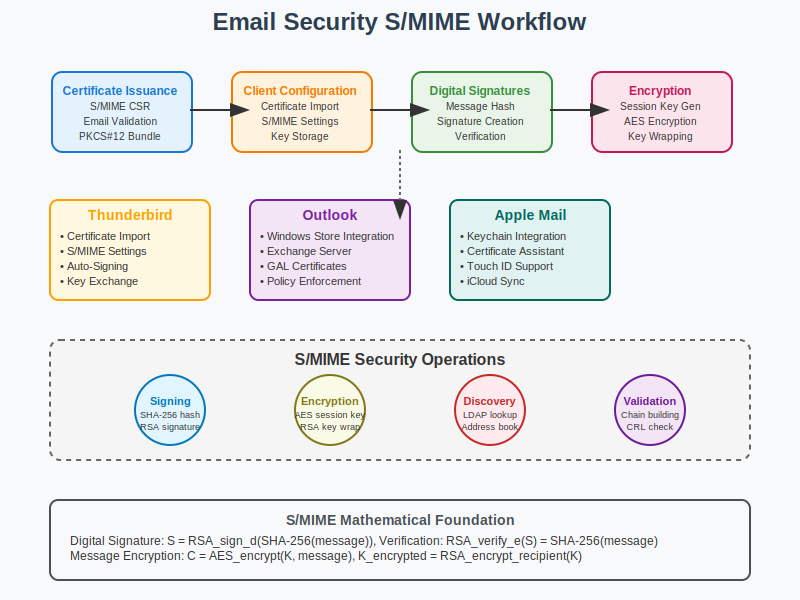

# Email Security Workflow



## Scenario Overview

**Organization**: SecureMail Corp  
**Project**: Implementing enterprise email security using S/MIME certificates  
**Context**: Secure email communications, digital signatures, message encryption, and compliance requirements  
**Timeline**: Certificate deployment, email client configuration, and ongoing security operations

## The Challenge

SecureMail Corp needs to:
- Deploy S/MIME certificates for all employees
- Configure email clients for digital signatures and encryption
- Establish key management and certificate distribution
- Implement automated certificate renewal processes
- Ensure email security compliance and audit capabilities
- Handle cross-organization secure email communications

## PKI Workflow Solution

### Mathematical Foundation

Email security using S/MIME relies on asymmetric cryptography and digital signatures:

```
S/MIME Digital Signature:
1. Message Hash: H = SHA-256(email_message)
2. Signature Generation: S = Sign_private_key(H)
3. Signature Verification: Verify_public_key(S, H) → {valid, invalid}

S/MIME Encryption:
1. Generate Session Key: K = Random_256_bits
2. Encrypt Message: C = AES_encrypt(K, email_message)
3. Encrypt Session Key: E_K = RSA_encrypt(recipient_public_key, K)
4. S/MIME Package: {E_K, C, sender_certificate}

Certificate Validation:
- Chain verification to trusted root CA
- Certificate purpose validation (emailProtection)
- Email address matching in Subject or SAN
- Revocation status checking (CRL/OCSP)
```

## Step-by-Step Workflow

### Phase 1: S/MIME Certificate Issuance

```bash
# Generate employee private key
employee@workstation:~$ openssl genrsa -aes256 -out john.smith.key 2048

# Create certificate signing request with email
employee@workstation:~$ openssl req -new -key john.smith.key -out john.smith.csr \
    -subj "/CN=John Smith/emailAddress=john.smith@securemail.corp/O=SecureMail Corp/C=US"

# Submit CSR to internal CA
ca-admin@ca-server:~$ openssl ca -config email-ca.conf -extensions email_cert \
    -days 365 -notext -batch -in john.smith.csr -out john.smith.crt

# Create PKCS#12 bundle for email client
employee@workstation:~$ openssl pkcs12 -export -out john.smith.p12 \
    -inkey john.smith.key -in john.smith.crt -certfile ca-chain.pem \
    -name "John Smith Email Certificate"
```

**Mathematical Insight**: 
- Email certificates include emailProtection key usage extension
- Subject Alternative Name contains email address for validation
- PKCS#12 format enables secure import into email clients

### Phase 2: Email Client Configuration

```bash
# Thunderbird S/MIME configuration
# Account Settings → End-to-End Encryption → S/MIME
# Import john.smith.p12 certificate

# Outlook configuration via PowerShell
employee@workstation:~$ powershell -Command "
Import-PfxCertificate -FilePath 'john.smith.p12' -CertStoreLocation 'Cert:\CurrentUser\My' -Password (ConvertTo-SecureString 'password' -AsPlainText -Force)
"

# Test certificate installation
employee@workstation:~$ openssl pkcs12 -in john.smith.p12 -nokeys -out cert-only.pem
employee@workstation:~$ openssl x509 -in cert-only.pem -text -noout | grep -E "(Subject|Email|Key Usage)"
```

### Phase 3: Digital Signature Implementation

```python
def create_signed_email():
    """
    Create digitally signed S/MIME email
    """
    import email
    import smime
    from cryptography import x509
    from cryptography.hazmat.primitives import hashes, serialization
    from cryptography.hazmat.primitives.asymmetric import padding
    
    # Load certificate and private key
    with open('john.smith.crt', 'rb') as f:
        cert = x509.load_pem_x509_certificate(f.read())
    
    with open('john.smith.key', 'rb') as f:
        private_key = serialization.load_pem_private_key(f.read(), password=b'password')
    
    # Create email message
    msg = email.message.EmailMessage()
    msg['From'] = 'john.smith@securemail.corp'
    msg['To'] = 'jane.doe@securemail.corp'
    msg['Subject'] = 'Confidential Project Update'
    msg.set_content('This message contains sensitive project information.')
    
    # Sign message
    signed_msg = smime.sign(msg, cert, private_key)
    
    return signed_msg

def verify_signed_email(signed_message):
    """
    Verify S/MIME digital signature
    """
    # Extract certificate from signed message
    signer_cert = smime.get_signer_cert(signed_message)
    
    # Validate certificate chain
    if not validate_certificate_chain(signer_cert):
        return False, "Invalid certificate chain"
    
    # Verify signature
    try:
        original_msg = smime.verify(signed_message, signer_cert)
        return True, original_msg
    except smime.VerificationError as e:
        return False, f"Signature verification failed: {e}"
```

### Phase 4: Email Encryption

```bash
# Encrypt email to recipient
employee@workstation:~$ openssl smime -encrypt -aes256 -in message.txt \
    -out encrypted-message.eml recipient-cert.pem

# Decrypt received email
employee@workstation:~$ openssl smime -decrypt -in encrypted-message.eml \
    -out decrypted-message.txt -inkey john.smith.key -recip john.smith.crt
```

**Encryption Process Analysis**:
```python
def email_encryption_process():
    """
    Analyze S/MIME encryption mathematics
    """
    process = {
        "session_key_generation": "K = CSPRNG(256_bits)",
        "message_encryption": "C = AES-256-CBC(K, message + padding)",
        "key_encryption": "E_K = RSA-OAEP(recipient_public_key, K)",
        "package_creation": "S/MIME_package = {E_K, C, algorithm_identifiers}"
    }
    
    security_properties = {
        "confidentiality": "Only recipient can decrypt with private key",
        "forward_secrecy": "Unique session key per message",
        "algorithm_agility": "Support for multiple cipher suites"
    }
    
    return process, security_properties
```

### Phase 5: Certificate Management and Renewal

```bash
# Monitor certificate expiration
ca-admin@ca-server:~$ cat > /usr/local/bin/email-cert-monitor.sh << 'EOF'
#!/bin/bash
# Check email certificates expiring in 30 days

LDAP_SERVER="ldap://directory.securemail.corp"
CERT_STORE="/etc/ssl/email-certs"
WARNING_DAYS=30

# Query LDAP for employee certificates
ldapsearch -x -H $LDAP_SERVER -b "ou=people,dc=securemail,dc=corp" \
    "(objectClass=inetOrgPerson)" userCertificate | \
while read -r line; do
    if [[ $line =~ ^userCertificate:: ]]; then
        cert_b64=$(echo $line | cut -d' ' -f2)
        echo $cert_b64 | base64 -d > temp_cert.der
        
        # Check expiration
        expiry=$(openssl x509 -in temp_cert.der -inform DER -noout -enddate | cut -d= -f2)
        expiry_epoch=$(date -d "$expiry" +%s)
        current_epoch=$(date +%s)
        days_left=$(( (expiry_epoch - current_epoch) / 86400 ))
        
        if [[ $days_left -le $WARNING_DAYS ]]; then
            email_addr=$(openssl x509 -in temp_cert.der -inform DER -noout -email)
            echo "Certificate for $email_addr expires in $days_left days"
            # Send renewal notification
        fi
    fi
done

rm -f temp_cert.der
EOF

chmod +x /usr/local/bin/email-cert-monitor.sh

# Schedule daily monitoring
echo "0 9 * * * root /usr/local/bin/email-cert-monitor.sh" >> /etc/cron.d/email-cert-monitor
```

## Advanced Email Security Features

### Secure/Multipurpose Internet Mail Extensions (S/MIME) v3

```python
def smime_v3_features():
    """
    Advanced S/MIME v3 capabilities
    """
    features = {
        "triple_wrapping": "Sign, then encrypt, then sign again",
        "receipt_requests": "Request signed delivery receipts",
        "security_labels": "Classify message sensitivity levels",
        "encrypted_key_exchange": "Enhanced key management"
    }
    
    algorithms = {
        "symmetric": ["AES-128", "AES-256", "3DES"],
        "asymmetric": ["RSA-2048", "RSA-3072", "ECDSA-P256", "ECDSA-P384"],
        "hash": ["SHA-256", "SHA-384", "SHA-512"],
        "key_derivation": ["PBKDF2", "scrypt"]
    }
    
    return features, algorithms
```

### Email Gateway Security

```bash
# Postfix S/MIME gateway configuration
postfix@gateway:~$ cat >> /etc/postfix/main.cf << EOF
# S/MIME processing
smtpd_tls_security_level = encrypt
smtpd_tls_auth_only = yes
smtpd_tls_cert_file = /etc/ssl/certs/mail.securemail.corp.crt
smtpd_tls_key_file = /etc/ssl/private/mail.securemail.corp.key
smtpd_tls_CAfile = /etc/ssl/certs/ca-bundle.pem

# Content filtering for S/MIME
content_filter = smime-filter:dummy

# S/MIME policy enforcement
smtpd_recipient_restrictions = 
    permit_mynetworks,
    permit_sasl_authenticated,
    check_policy_service inet:127.0.0.1:10025,
    reject_unauth_destination
EOF

# Configure S/MIME content filter
postfix@gateway:~$ cat > /etc/postfix/smime-filter.conf << EOF
# Require S/MIME signatures for external emails
external_signature_required = yes
# Encrypt all outbound emails to specific domains
encrypt_to_domains = partner1.com, partner2.com
# Archive decrypted messages for compliance
archive_decrypted = yes
EOF
```

## Key Management and Distribution

### Public Key Infrastructure for Email

```python
def email_pki_architecture():
    """
    Email-specific PKI architecture
    """
    architecture = {
        "certificate_hierarchy": {
            "root_ca": "SecureMail Root CA (offline)",
            "email_ca": "SecureMail Email CA (online)",
            "user_certs": "Individual employee S/MIME certificates"
        },
        "certificate_distribution": {
            "ldap_directory": "Corporate directory service",
            "dns_cert_records": "CERT RR in DNS for external lookup",
            "key_servers": "PGP-style keyserver for public keys",
            "certificate_repositories": "HTTP-accessible cert store"
        },
        "key_escrow": {
            "encryption_keys": "Escrowed for legal compliance",
            "signing_keys": "Not escrowed (non-repudiation)",
            "recovery_process": "Authorized personnel only"
        }
    }
    
    return architecture
```

### Cross-Organization Email Security

```bash
# Configure trust relationships with partner organizations
ca-admin@ca-server:~$ cat > /etc/ssl/trusted-email-cas.conf << EOF
# Trusted CAs for email certificate validation
trusted_cas = [
    "/etc/ssl/certs/partner1-email-ca.pem",
    "/etc/ssl/certs/partner2-email-ca.pem", 
    "/etc/ssl/certs/public-email-ca-bundle.pem"
]

# Certificate validation policies
validation_policy = {
    "require_key_usage": ["digitalSignature", "keyEncipherment"],
    "require_extended_key_usage": ["emailProtection"],
    "check_crl": true,
    "check_ocsp": true,
    "max_path_length": 3
}
EOF

# Test cross-organization certificate validation
ca-admin@ca-server:~$ openssl verify -CAfile trusted-email-cas.pem \
    -untrusted partner-intermediate.pem partner-user.crt
```

## Conclusion

Email security through S/MIME certificates provides end-to-end confidentiality, integrity, and non-repudiation for email communications. Proper implementation requires certificate management, client configuration, and policy enforcement.

Key takeaways:
- S/MIME provides both digital signatures and encryption
- Certificate lifecycle management is critical for operations
- Cross-organization trust requires careful policy configuration
- Email gateways can enforce security policies automatically
- Compliance often requires key escrow for encryption keys

## Files in This Use Case

- `README.md` - This comprehensive email security guide
- `workflow.svg` - Visual representation of S/MIME operations
- `examples/` - Sample configurations and scripts
- `tools/` - Email certificate management utilities

## Navigation

**Previous**: [Web Authentication](../03-web-authentication/README.md) 🌐  
**Next**: [Code Signing](../05-code-signing/README.md) 🔒  
**Home**: [PKI Main README](../../README.md) 🏠