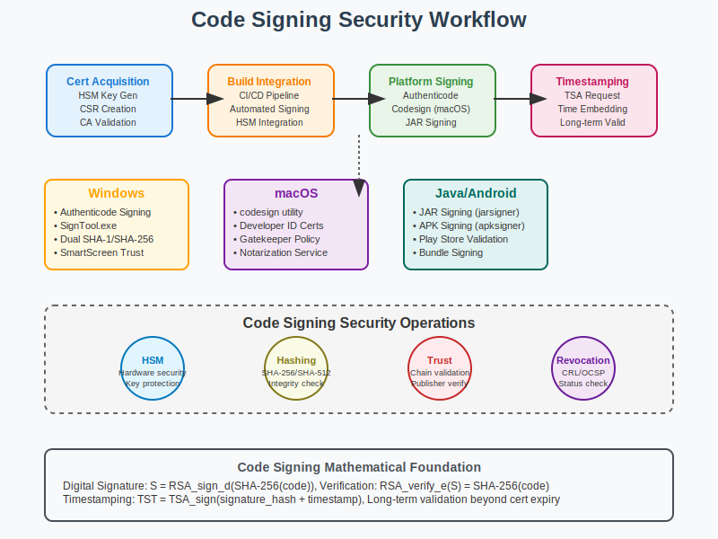

# Code Signing Workflow



## Scenario Overview

**Organization**: DevSecure Software  
**Project**: Implementing comprehensive code signing for software distribution  
**Context**: Securing software supply chain, ensuring code integrity, and establishing publisher trust  
**Timeline**: Certificate deployment, build pipeline integration, and ongoing signing operations

## The Challenge

DevSecure Software needs to:
- Deploy code signing certificates for software releases
- Integrate signing into CI/CD pipelines and build processes
- Implement timestamping to extend signature validity beyond certificate expiration
- Establish different signing policies for different software types
- Ensure hardware security module (HSM) protection for signing keys
- Handle cross-platform signing (Windows, macOS, Linux, mobile)

## PKI Workflow Solution

### Mathematical Foundation

Code signing relies on digital signatures to provide authenticity and integrity:

```
Code Signing Process:
1. Code Hash: H = SHA-256(executable_binary)
2. Signature Generation: S = Sign_private_key(H)
3. Certificate Embedding: Signed_binary = {original_binary, S, certificate_chain}
4. Verification: Verify_public_key(S, H) ∧ Validate_certificate_chain(cert_chain)

Timestamping:
1. Timestamp Request: TSR = {signature_hash, nonce}
2. Timestamp Response: TST = Sign_TSA_key(TSR + current_time)
3. Verification: Signature remains valid even after certificate expiration

Trust Evaluation:
- Certificate chain validation to trusted root
- Code signing policy compliance
- Revocation status verification
- Publisher identity verification
```

## Step-by-Step Workflow

### Phase 1: Code Signing Certificate Acquisition

```bash
# Generate code signing private key (HSM recommended)
developer@build-server:~$ openssl genrsa -aes256 -out devsecure-codesign.key 3072

# Create certificate signing request
developer@build-server:~$ openssl req -new -key devsecure-codesign.key \
    -out devsecure-codesign.csr \
    -subj "/CN=DevSecure Software Inc/O=DevSecure Software/C=US" \
    -config code-signing.conf

# Code signing certificate configuration
developer@build-server:~$ cat > code-signing.conf << EOF
[req]
distinguished_name = req_distinguished_name
req_extensions = v3_req

[req_distinguished_name]
CN = DevSecure Software Inc
O = DevSecure Software
C = US

[v3_req]
keyUsage = critical, digitalSignature
extendedKeyUsage = critical, codeSigning
basicConstraints = critical, CA:false
EOF

# Submit to code signing CA (commercial or internal)
ca-admin@ca-server:~$ openssl ca -config ca.conf -extensions codesign_cert \
    -days 1095 -notext -batch -in devsecure-codesign.csr \
    -out devsecure-codesign.crt
```

**Mathematical Insight**: 
- Code signing certificates use extended key usage "codeSigning"
- 3-year validity typical for code signing certificates
- Hardware Security Modules protect high-value signing keys

### Phase 2: Windows Authenticode Signing

```bash
# Sign Windows executable
developer@build-server:~$ signtool sign /f devsecure-codesign.p12 /p password \
    /t http://timestamp.digicert.com /v application.exe

# Sign with SHA-256 and dual signing
developer@build-server:~$ signtool sign /f devsecure-codesign.p12 /p password \
    /fd SHA256 /tr http://timestamp.digicert.com /td SHA256 /as /v application.exe

# Verify signature
developer@build-server:~$ signtool verify /pa /v application.exe

# Check signature details
developer@build-server:~$ signtool verify /pa /v /d application.exe
```

**Windows Trust Evaluation Process**:
```python
def windows_trust_evaluation():
    """
    Windows Authenticode trust evaluation
    """
    trust_steps = {
        1: "Extract certificate chain from PE signature",
        2: "Validate certificate chain to trusted root",
        3: "Check certificate extended key usage (codeSigning)",
        4: "Verify hash algorithm matches signature",
        5: "Calculate file hash and verify signature",
        6: "Check timestamp validity if present",
        7: "Evaluate publisher reputation and policies"
    }
    
    trust_levels = {
        "trusted_publisher": "Certificate from trusted store, no prompt",
        "known_publisher": "Valid certificate, minimal warning",
        "unknown_publisher": "Valid certificate, full warning dialog", 
        "untrusted": "Invalid or revoked certificate, blocking error"
    }
    
    return trust_steps, trust_levels
```

### Phase 3: macOS Code Signing

```bash
# Import certificate to keychain
developer@mac-build:~$ security import devsecure-codesign.p12 -P password \
    -k ~/Library/Keychains/login.keychain

# Sign macOS application
developer@mac-build:~$ codesign -s "DevSecure Software Inc" \
    --timestamp --options runtime Application.app

# Sign with hardened runtime
developer@mac-build:~$ codesign -s "DevSecure Software Inc" \
    --timestamp --options runtime --entitlements app.entitlements \
    Application.app

# Verify signature
developer@mac-build:~$ codesign -v -v Application.app
developer@mac-build:~$ spctl -a -v Application.app

# Notarization for distribution
developer@mac-build:~$ xcrun altool --notarize-app --primary-bundle-id com.devsecure.app \
    --username developer@devsecure.com --password app-password \
    --file Application.dmg
```

### Phase 4: Linux Package Signing

```bash
# Sign RPM packages
developer@linux-build:~$ rpm --addsign package.rpm

# Sign DEB packages with dpkg-sig
developer@linux-build:~$ dpkg-sig --sign builder package.deb

# Sign AppImage
developer@linux-build:~$ gpg --armor --detach-sig Application.AppImage

# Create signature verification script
developer@linux-build:~$ cat > verify-signature.sh << 'EOF'
#!/bin/bash
PACKAGE=$1
SIGNATURE=$2

case "${PACKAGE##*.}" in
    rpm)
        rpm -K "$PACKAGE"
        ;;
    deb)
        dpkg-sig --verify "$PACKAGE"
        ;;
    AppImage)
        gpg --verify "$SIGNATURE" "$PACKAGE"
        ;;
    *)
        echo "Unsupported package type"
        exit 1
        ;;
esac
EOF

chmod +x verify-signature.sh
```

### Phase 5: CI/CD Pipeline Integration

```yaml
# GitHub Actions workflow for automated signing
name: Build and Sign
on:
  push:
    tags: ['v*']

jobs:
  build-and-sign:
    runs-on: ubuntu-latest
    steps:
    - uses: actions/checkout@v3
    
    - name: Build application
      run: |
        make build
        
    - name: Import signing certificate
      env:
        SIGNING_CERT_B64: ${{ secrets.SIGNING_CERT_B64 }}
        CERT_PASSWORD: ${{ secrets.CERT_PASSWORD }}
      run: |
        echo "$SIGNING_CERT_B64" | base64 -d > signing-cert.p12
        
    - name: Sign Windows executable
      run: |
        docker run --rm -v $(pwd):/workspace \
          mcr.microsoft.com/windows/servercore:ltsc2022 \
          signtool sign /f /workspace/signing-cert.p12 /p "$CERT_PASSWORD" \
          /t http://timestamp.digicert.com /v /workspace/application.exe
          
    - name: Sign Linux packages
      run: |
        # Import GPG key for Linux package signing
        echo "${{ secrets.GPG_PRIVATE_KEY }}" | gpg --import
        dpkg-sig --sign builder application.deb
        
    - name: Upload signed artifacts
      uses: actions/upload-artifact@v3
      with:
        name: signed-packages
        path: |
          application.exe
          application.deb
```

## Advanced Code Signing Features

### Timestamping Service Integration

```python
def timestamp_service_workflow():
    """
    RFC 3161 Timestamping workflow
    """
    workflow = {
        "timestamp_request": {
            "format": "RFC 3161 TimeStampReq",
            "content": "Hash of signature + nonce + policy",
            "transport": "HTTP POST to TSA endpoint"
        },
        "tsa_processing": {
            "validation": "Verify request format and policy",
            "timestamp_creation": "Sign current time + request hash",
            "response_format": "RFC 3161 TimeStampToken"
        },
        "timestamp_verification": {
            "signature_check": "Verify TSA signature on timestamp",
            "time_validation": "Ensure timestamp within validity window",
            "policy_compliance": "Check timestamp policy requirements"
        }
    }
    
    # Mathematical representation
    timestamp_math = {
        "request_hash": "H(signature_to_be_timestamped)",
        "timestamp_token": "Sign_TSA_key(current_time || request_hash || nonce)",
        "verification": "Verify_TSA_public_key(timestamp_token) ∧ time_within_bounds"
    }
    
    return workflow, timestamp_math
```

### Hardware Security Module Integration

```bash
# Configure PKCS#11 HSM for code signing
hsm-admin@secure-build:~$ cat > hsm-config.conf << EOF
# PKCS#11 configuration for code signing
library=/usr/lib/libCryptoki2_64.so
slot=0
pin=123456
key_label=devsecure-codesign-key
cert_label=devsecure-codesign-cert
EOF

# Generate key pair in HSM
hsm-admin@secure-build:~$ pkcs11-tool --module /usr/lib/libCryptoki2_64.so \
    --login --pin 123456 --keypairgen --key-type rsa:3072 \
    --label devsecure-codesign-key --id 01

# Sign using HSM-protected key
developer@build-server:~$ signtool sign /csp "Microsoft Base Smart Card Crypto Provider" \
    /kc "[{{SUBJECT}}]" /t http://timestamp.digicert.com /v application.exe
```

### Multi-Platform Signing Pipeline

```python
def multi_platform_signing():
    """
    Coordinated signing across platforms
    """
    platforms = {
        "windows": {
            "tool": "signtool.exe",
            "format": "Authenticode PE signature", 
            "algorithm": "SHA-256 with RSA",
            "timestamp": "RFC 3161 compatible TSA"
        },
        "macos": {
            "tool": "codesign",
            "format": "Mach-O embedded signature",
            "algorithm": "ECDSA P-256 with SHA-256",
            "notarization": "Apple notary service"
        },
        "linux": {
            "tools": ["rpm --addsign", "dpkg-sig", "gpg"],
            "formats": ["RPM signatures", "DEB control files", "Detached GPG"],
            "algorithms": ["RSA-2048", "ECDSA-P256", "EdDSA"]
        },
        "android": {
            "tool": "apksigner",
            "format": "JAR signature in APK",
            "algorithm": "ECDSA P-256 with SHA-256",
            "store": "Google Play Console upload key"
        }
    }
    
    return platforms
```

## Security and Compliance

### Code Signing Security Policies

```python
def code_signing_policies():
    """
    Enterprise code signing security policies
    """
    policies = {
        "key_protection": {
            "high_risk": "FIPS 140-2 Level 3 HSM required",
            "medium_risk": "FIPS 140-2 Level 2 HSM or secure software",
            "low_risk": "Encrypted software key storage acceptable"
        },
        "signing_authorization": {
            "release_builds": "Two-person authorization required",
            "development_builds": "Single developer authorization",
            "patch_releases": "Automated signing with approval workflow"
        },
        "timestamp_requirements": {
            "public_distribution": "RFC 3161 timestamp mandatory",
            "internal_distribution": "Timestamp recommended", 
            "development_testing": "Timestamp optional"
        },
        "certificate_validation": {
            "chain_verification": "Full chain to trusted root required",
            "revocation_checking": "OCSP preferred, CRL acceptable",
            "extended_validation": "EV certificates for high-risk software"
        }
    }
    
    return policies
```

### Supply Chain Security

```bash
# SLSA (Supply-chain Levels for Software Artifacts) compliance
developer@build-server:~$ cat > slsa-provenance.json << EOF
{
  "buildType": "https://slsa.dev/provenance/v0.2",
  "builder": {
    "id": "https://github.com/devsecure/build-system@v1.2.3"
  },
  "recipe": {
    "type": "https://slsa.dev/provenance/v0.2",
    "definedInMaterial": 0,
    "entryPoint": "make build"
  },
  "materials": [
    {
      "uri": "git+https://github.com/devsecure/application@v1.0.0",
      "digest": {
        "sha256": "abcd1234..."
      }
    }
  ],
  "metadata": {
    "buildStartedOn": "2024-01-15T10:30:00Z",
    "buildFinishedOn": "2024-01-15T10:45:00Z"
  }
}
EOF

# Sign provenance document
developer@build-server:~$ gpg --armor --detach-sig slsa-provenance.json

# Generate SBOM (Software Bill of Materials)
developer@build-server:~$ syft packages dir:. -o spdx-json > sbom.spdx.json
developer@build-server:~$ gpg --armor --detach-sig sbom.spdx.json
```

## Performance and Scalability

### Signing Performance Optimization

```python
def signing_performance_analysis():
    """
    Code signing performance characteristics
    """
    performance_metrics = {
        "signature_generation": {
            "rsa_2048": "~50ms per signature",
            "rsa_3072": "~150ms per signature",
            "ecdsa_p256": "~5ms per signature",
            "ecdsa_p384": "~15ms per signature"
        },
        "verification_speed": {
            "rsa_2048": "~1ms per verification",
            "rsa_3072": "~2ms per verification", 
            "ecdsa_p256": "~3ms per verification",
            "ecdsa_p384": "~6ms per verification"
        },
        "scalability_factors": {
            "hsm_throughput": "100-1000 signatures/second",
            "network_latency": "Timestamping adds 50-200ms",
            "file_size_impact": "Minimal for signature, linear for hashing"
        }
    }
    
    return performance_metrics
```

## Troubleshooting and Validation

### Common Code Signing Issues

```bash
# Validate certificate chain for code signing
developer@workstation:~$ openssl verify -CAfile root-ca.pem \
    -untrusted intermediate-ca.pem devsecure-codesign.crt

# Check certificate key usage
developer@workstation:~$ openssl x509 -in devsecure-codesign.crt -text -noout | \
    grep -A5 "Key Usage\|Extended Key Usage"

# Test signature verification
developer@workstation:~$ openssl dgst -sha256 -verify public-key.pem \
    -signature signature.bin application.exe

# Debug Windows signature issues
developer@windows:~$ signtool verify /pa /v /debug application.exe

# Check macOS signature validity
developer@mac:~$ codesign -dv --verbose=4 Application.app
developer@mac:~$ codesign --test-requirement="=anchor apple generic" Application.app
```

### Signature Validation Scripts

```python
def validate_code_signature(file_path, expected_publisher=None):
    """
    Cross-platform signature validation
    """
    import hashlib
    import subprocess
    import os
    
    def get_file_hash(filepath):
        """Calculate file hash for integrity check"""
        sha256_hash = hashlib.sha256()
        with open(filepath, "rb") as f:
            for chunk in iter(lambda: f.read(4096), b""):
                sha256_hash.update(chunk)
        return sha256_hash.hexdigest()
    
    def validate_windows_signature(filepath):
        """Validate Windows Authenticode signature"""
        try:
            result = subprocess.run(['signtool', 'verify', '/pa', '/v', filepath],
                                  capture_output=True, text=True)
            return result.returncode == 0, result.stdout
        except FileNotFoundError:
            return False, "signtool not found"
    
    def validate_macos_signature(filepath):
        """Validate macOS code signature"""
        try:
            result = subprocess.run(['codesign', '-v', '-v', filepath],
                                  capture_output=True, text=True)
            return result.returncode == 0, result.stderr
        except FileNotFoundError:
            return False, "codesign not found"
    
    # Determine platform and validate
    if os.name == 'nt':
        return validate_windows_signature(file_path)
    elif os.uname().sysname == 'Darwin':
        return validate_macos_signature(file_path)
    else:
        # Linux: check for detached signature
        sig_path = file_path + '.sig'
        if os.path.exists(sig_path):
            try:
                result = subprocess.run(['gpg', '--verify', sig_path, file_path],
                                      capture_output=True, text=True)
                return result.returncode == 0, result.stderr
            except FileNotFoundError:
                return False, "gpg not found"
        else:
            return False, "No signature file found"
```

## Conclusion

Code signing provides software authenticity and integrity through cryptographic signatures. Proper implementation requires secure key management, robust signing processes, and comprehensive validation procedures.

Key takeaways:
- HSM protection is essential for high-value signing keys
- Timestamping extends signature validity beyond certificate expiration
- Different platforms require different signing tools and formats
- CI/CD integration enables automated, secure signing workflows
- Supply chain security requires comprehensive provenance tracking

## Files in This Use Case

- `README.md` - This comprehensive code signing guide
- `workflow.svg` - Visual representation of signing and validation process
- `examples/` - Platform-specific signing scripts and configurations
- `tools/` - Signature validation and certificate management utilities

## Navigation

**Previous**: [Email Security](../04-email-security/README.md) 📧  
**Next**: [Device Identity](../06-device-identity/README.md) 🔌  
**Home**: [PKI Main README](../../README.md) 🏠