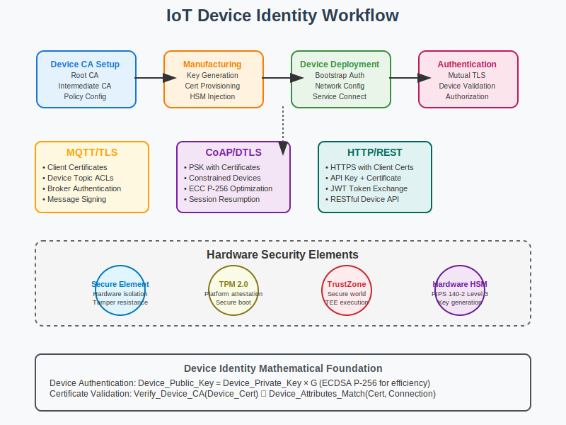

# Device Identity Workflow



## Scenario Overview

**Organization**: IoT Solutions Inc  
**Project**: Implementing device identity certificates for IoT ecosystem  
**Context**: Secure device authentication, manufacturing integration, and lifecycle management  
**Timeline**: Device provisioning, certificate deployment, and ongoing identity operations

## The Challenge

IoT Solutions Inc needs to:
- Provision unique identity certificates for millions of IoT devices
- Integrate certificate generation into manufacturing processes
- Implement secure device authentication and authorization
- Handle certificate lifecycle management at scale
- Ensure hardware-backed security for device credentials
- Support various IoT protocols and platforms

## PKI Workflow Solution

### Mathematical Foundation

Device identity relies on embedded certificates and hardware security:

```
Device Identity Certificate:
- Subject: Device-specific identifier (serial number, MAC address)
- Extensions: Device type, capabilities, authorization policies
- Key Storage: Hardware Security Module (HSM) or Secure Element

Authentication Protocol:
1. Device presents certificate during connection
2. Server validates certificate chain to trusted device CA
3. Mutual authentication using device private key
4. Authorization based on device certificate attributes

Hardware Root of Trust:
Device_Identity = Sign_Device_CA(Device_Public_Key + Device_Attributes)
Device_Public_Key = Device_Private_Key × G (elliptic curve)
Device_Private_Key = Stored_in_Hardware_Security_Module
```

## Step-by-Step Workflow

### Phase 1: Device CA Infrastructure

```bash
# Set up Device Certificate Authority
ca-admin@device-ca:~$ openssl genrsa -aes256 -out device-root-ca.key 4096

# Create device root CA certificate
ca-admin@device-ca:~$ openssl req -new -x509 -days 7300 -key device-root-ca.key \
    -out device-root-ca.crt \
    -subj "/CN=IoT Solutions Device Root CA/O=IoT Solutions Inc/C=US" \
    -extensions v3_ca

# Generate intermediate device CA
ca-admin@device-ca:~$ openssl genrsa -aes256 -out device-intermediate-ca.key 2048

ca-admin@device-ca:~$ openssl req -new -key device-intermediate-ca.key \
    -out device-intermediate-ca.csr \
    -subj "/CN=IoT Solutions Device Intermediate CA/O=IoT Solutions Inc/C=US"

# Sign intermediate CA certificate
ca-admin@device-ca:~$ openssl ca -config device-ca.conf \
    -extensions v3_intermediate_ca -days 3650 -notext -batch \
    -in device-intermediate-ca.csr -out device-intermediate-ca.crt
```

### Phase 2: Manufacturing Integration

```python
def manufacturing_certificate_provisioning():
    """
    Automated certificate provisioning during manufacturing
    """
    import hashlib
    import secrets
    from cryptography import x509
    from cryptography.hazmat.primitives import serialization, hashes
    from cryptography.hazmat.primitives.asymmetric import ec
    
    def generate_device_certificate(device_serial, device_type, ca_cert, ca_key):
        """Generate device certificate during manufacturing"""
        
        # Generate device key pair (ECDSA P-256 for IoT efficiency)
        device_private_key = ec.generate_private_key(ec.SECP256R1())
        device_public_key = device_private_key.public_key()
        
        # Create device certificate with device-specific attributes
        subject = x509.Name([
            x509.NameAttribute(x509.NameOID.COMMON_NAME, f"device-{device_serial}"),
            x509.NameAttribute(x509.NameOID.ORGANIZATION_NAME, "IoT Solutions Inc"),
            x509.NameAttribute(x509.NameOID.SERIAL_NUMBER, device_serial),
        ])
        
        # Add device-specific extensions
        extensions = [
            x509.KeyUsage(
                digital_signature=True,
                key_encipherment=True,
                key_agreement=True,
                key_cert_sign=False,
                crl_sign=False,
                content_commitment=False,
                data_encipherment=False,
                encipher_only=False,
                decipher_only=False
            ),
            x509.ExtendedKeyUsage([
                x509.oid.ExtendedKeyUsageOID.CLIENT_AUTH,
                x509.oid.ExtendedKeyUsageOID.SERVER_AUTH
            ]),
            x509.SubjectAlternativeName([
                x509.DNSName(f"device-{device_serial}.iotsolutions.com"),
                x509.RFC822Name(f"device-{device_serial}@iotsolutions.com")
            ]),
            # Custom device type extension
            x509.UnrecognizedExtension(
                x509.ObjectIdentifier("1.3.6.1.4.1.12345.1.1"),
                device_type.encode('utf-8')
            )
        ]
        
        # Build and sign certificate
        builder = x509.CertificateBuilder()
        builder = builder.subject_name(subject)
        builder = builder.issuer_name(ca_cert.subject)
        builder = builder.public_key(device_public_key)
        builder = builder.serial_number(int(device_serial.replace('-', ''), 16) & 0x7FFFFFFFFFFFFFFFFFFFFFFFFFFFFFFF)
        builder = builder.not_valid_before(datetime.utcnow())
        builder = builder.not_valid_after(datetime.utcnow() + timedelta(days=3650))
        
        for ext in extensions:
            builder = builder.add_extension(ext, critical=False)
        
        device_cert = builder.sign(ca_key, hashes.SHA256())
        
        return device_private_key, device_cert
    
    return generate_device_certificate
```

### Phase 3: Secure Element Integration

```bash
# Configure secure element for device identity
manufacturing@factory:~$ cat > secure-element-config.json << EOF
{
  "secure_element": {
    "type": "ATECC608A",
    "i2c_address": "0x60",
    "key_slots": {
      "device_private_key": 0,
      "device_certificate": 10,
      "ca_certificate": 11
    }
  },
  "provisioning": {
    "lock_configuration": true,
    "lock_data": true,
    "enable_hardware_rng": true
  }
}
EOF

# Provision device certificate to secure element
manufacturing@factory:~$ python3 provision-device.py \
    --device-serial ABC123DEF456 \
    --device-type "temperature-sensor" \
    --secure-element-config secure-element-config.json
```

### Phase 4: Device Authentication Protocol

```python
def device_authentication_protocol():
    """
    Implement device authentication using certificates
    """
    
    class DeviceAuthenticator:
        def __init__(self, ca_cert_path, trusted_device_ca_path):
            self.ca_cert = self.load_certificate(ca_cert_path)
            self.trusted_device_ca = self.load_certificate(trusted_device_ca_path)
        
        def authenticate_device(self, device_cert, device_signature, challenge):
            """Authenticate device using certificate and signature"""
            
            # 1. Validate certificate chain
            if not self.validate_certificate_chain(device_cert):
                return False, "Invalid certificate chain"
            
            # 2. Check certificate is not revoked
            if self.is_certificate_revoked(device_cert):
                return False, "Certificate revoked"
            
            # 3. Verify device can sign with private key
            if not self.verify_challenge_response(device_cert, device_signature, challenge):
                return False, "Invalid signature"
            
            # 4. Extract device attributes
            device_attributes = self.extract_device_attributes(device_cert)
            
            return True, device_attributes
        
        def generate_challenge(self):
            """Generate random challenge for device authentication"""
            return secrets.token_bytes(32)
        
        def verify_challenge_response(self, device_cert, signature, challenge):
            """Verify device signed the challenge correctly"""
            try:
                public_key = device_cert.public_key()
                public_key.verify(signature, challenge, ec.ECDSA(hashes.SHA256()))
                return True
            except Exception:
                return False
        
        def extract_device_attributes(self, device_cert):
            """Extract device-specific attributes from certificate"""
            attributes = {
                'serial_number': None,
                'device_type': None,
                'capabilities': []
            }
            
            # Extract serial number from subject
            for attribute in device_cert.subject:
                if attribute.oid == x509.NameOID.SERIAL_NUMBER:
                    attributes['serial_number'] = attribute.value
            
            # Extract custom extensions
            for extension in device_cert.extensions:
                if extension.oid.dotted_string == "1.3.6.1.4.1.12345.1.1":
                    attributes['device_type'] = extension.value.decode('utf-8')
            
            return attributes
    
    return DeviceAuthenticator
```

### Phase 5: IoT Protocol Integration

```python
def mqtt_certificate_authentication():
    """
    MQTT over TLS with client certificate authentication
    """
    
    # MQTT broker configuration with client certificates
    mqtt_config = {
        "broker_config": {
            "port": 8883,
            "ca_cert": "/etc/ssl/certs/device-ca.pem",
            "cert_required": True,
            "tls_version": "TLSv1.2"
        },
        "client_cert_validation": {
            "verify_mode": "CERT_REQUIRED",
            "check_hostname": False,
            "ca_certs": "/etc/ssl/certs/device-ca-bundle.pem"
        }
    }
    
    # Device MQTT client with certificate
    device_mqtt_config = {
        "client_id": "device-ABC123DEF456",
        "ca_certs": "/etc/ssl/certs/ca-bundle.pem",
        "certfile": "/etc/ssl/certs/device-cert.pem",
        "keyfile": "/etc/ssl/private/device-key.pem",
        "tls_version": "TLSv1.2"
    }
    
    return mqtt_config, device_mqtt_config

def coap_dtls_authentication():
    """
    CoAP over DTLS with certificate authentication
    """
    
    # CoAP server configuration
    coap_config = {
        "dtls_config": {
            "psk_store": None,  # Use certificates instead of PSK
            "ca_cert": "/etc/ssl/certs/device-ca.pem",
            "server_cert": "/etc/ssl/certs/coap-server.pem",
            "server_key": "/etc/ssl/private/coap-server-key.pem",
            "client_cert_required": True
        }
    }
    
    return coap_config
```

## Advanced Device Identity Features

### Zero-Touch Provisioning

```python
def zero_touch_provisioning():
    """
    Automated device provisioning without manual intervention
    """
    
    provisioning_flow = {
        "manufacturing": {
            1: "Generate device key pair in secure element",
            2: "Create certificate signing request",
            3: "Submit CSR to manufacturing CA",
            4: "Install device certificate in secure element",
            5: "Lock secure element configuration"
        },
        "first_boot": {
            1: "Device connects to provisioning network",
            2: "Present device certificate for authentication",
            3: "Receive operational configuration and credentials",
            4: "Download and install operational certificates",
            5: "Switch to operational network"
        },
        "operational": {
            1: "Use operational certificates for service access",
            2: "Periodic certificate renewal",
            3: "Security monitoring and anomaly detection"
        }
    }
    
    return provisioning_flow

def device_attestation():
    """
    Device attestation using hardware roots of trust
    """
    
    attestation_process = {
        "hardware_evidence": {
            "secure_boot": "Cryptographic proof of boot integrity",
            "hardware_id": "Unique hardware identifier", 
            "firmware_hash": "Measurement of running firmware",
            "configuration": "Device configuration state"
        },
        "attestation_report": {
            "format": "TCG Attestation format or proprietary",
            "signature": "Signed by device attestation key",
            "nonce": "Fresh nonce to prevent replay",
            "timestamp": "Time of attestation generation"
        },
        "verification": {
            "signature_check": "Verify attestation signature",
            "freshness": "Validate nonce and timestamp", 
            "policy_evaluation": "Check against expected values",
            "trust_decision": "Allow/deny based on attestation"
        }
    }
    
    return attestation_process
```

### Certificate Lifecycle Management

```bash
# Device certificate monitoring and renewal
iot-admin@management:~$ cat > device-cert-renewal.py << 'EOF'
#!/usr/bin/env python3
"""
Automated device certificate renewal system
"""

import asyncio
import aiohttp
import ssl
from datetime import datetime, timedelta

class DeviceCertificateManager:
    def __init__(self, device_registry_url, ca_api_url):
        self.device_registry_url = device_registry_url
        self.ca_api_url = ca_api_url
        self.renewal_threshold = timedelta(days=30)
    
    async def check_certificate_expiration(self, device_id):
        """Check if device certificate is approaching expiration"""
        try:
            # Get device certificate from registry
            async with aiohttp.ClientSession() as session:
                async with session.get(f"{self.device_registry_url}/devices/{device_id}/certificate") as resp:
                    cert_data = await resp.json()
            
            # Parse expiration date
            expiry_date = datetime.fromisoformat(cert_data['not_after'])
            time_until_expiry = expiry_date - datetime.now()
            
            if time_until_expiry <= self.renewal_threshold:
                await self.renew_device_certificate(device_id)
                return True
            
            return False
            
        except Exception as e:
            print(f"Error checking certificate for device {device_id}: {e}")
            return False
    
    async def renew_device_certificate(self, device_id):
        """Initiate certificate renewal for device"""
        try:
            # Generate new CSR using device's existing key
            renewal_data = {
                'device_id': device_id,
                'renewal_type': 'automatic',
                'validity_days': 365
            }
            
            async with aiohttp.ClientSession() as session:
                async with session.post(f"{self.ca_api_url}/renew", json=renewal_data) as resp:
                    if resp.status == 200:
                        new_cert = await resp.json()
                        await self.deploy_certificate_to_device(device_id, new_cert)
                        print(f"Certificate renewed for device {device_id}")
                    else:
                        print(f"Certificate renewal failed for device {device_id}")
                        
        except Exception as e:
            print(f"Error renewing certificate for device {device_id}: {e}")
    
    async def deploy_certificate_to_device(self, device_id, certificate):
        """Deploy new certificate to device"""
        # Implementation depends on device management protocol
        # Could use MQTT, CoAP, or proprietary device management
        pass

# Run certificate monitoring
async def main():
    manager = DeviceCertificateManager(
        "https://registry.iotsolutions.com/api/v1",
        "https://ca.iotsolutions.com/api/v1"
    )
    
    # Get list of all devices
    async with aiohttp.ClientSession() as session:
        async with session.get("https://registry.iotsolutions.com/api/v1/devices") as resp:
            devices = await resp.json()
    
    # Check each device certificate
    tasks = []
    for device in devices:
        task = manager.check_certificate_expiration(device['id'])
        tasks.append(task)
    
    await asyncio.gather(*tasks)

if __name__ == "__main__":
    asyncio.run(main())
EOF

chmod +x device-cert-renewal.py

# Schedule daily certificate monitoring
echo "0 2 * * * /usr/local/bin/device-cert-renewal.py" >> /etc/cron.d/device-cert-monitor
```

## Performance and Scalability

### High-Volume Device Provisioning

```python
def scalable_provisioning_architecture():
    """
    Architecture for provisioning millions of devices
    """
    
    architecture = {
        "manufacturing_ca": {
            "type": "Hardware Security Module cluster",
            "throughput": "10,000 certificates/minute",
            "availability": "99.9% uptime SLA",
            "geographic_distribution": "Multiple manufacturing sites"
        },
        "certificate_database": {
            "type": "Distributed database (e.g., MongoDB, Cassandra)",
            "partitioning": "By device serial number range",
            "replication": "3x replication across regions",
            "indexing": "Indexed on device_id, serial_number, expiry_date"
        },
        "provisioning_api": {
            "type": "Microservices architecture",
            "load_balancing": "Kubernetes with horizontal pod autoscaling",
            "caching": "Redis for frequently accessed certificates",
            "rate_limiting": "Per-client rate limiting"
        },
        "monitoring": {
            "metrics": "Certificate issuance rate, error rate, latency",
            "alerting": "PagerDuty integration for critical issues",
            "logging": "Centralized logging with ELK stack"
        }
    }
    
    performance_targets = {
        "certificate_issuance": "< 100ms per certificate",
        "database_queries": "< 50ms 95th percentile",
        "api_response_time": "< 200ms 95th percentile",
        "system_availability": "99.95% uptime"
    }
    
    return architecture, performance_targets
```

## Conclusion

Device identity through PKI certificates enables secure IoT ecosystems with strong authentication and authorization. Proper implementation requires hardware security, scalable provisioning, and comprehensive lifecycle management.

Key takeaways:
- Hardware-backed device keys provide strongest security
- Zero-touch provisioning enables scalable device deployment
- Certificate lifecycle management is critical for large IoT fleets
- Protocol integration (MQTT, CoAP) requires careful security configuration
- Performance optimization essential for high-volume manufacturing

## Files in This Use Case

- `README.md` - This comprehensive device identity guide
- `workflow.svg` - Visual representation of device provisioning and authentication
- `examples/` - Device provisioning scripts and configurations
- `tools/` - Certificate lifecycle management utilities

## Navigation

**Previous**: [Code Signing](../05-code-signing/README.md) 🔒  
**Next**: [Enterprise SSO](../07-enterprise-sso/README.md) 🏢  
**Home**: [PKI Main README](../../README.md) 🏠