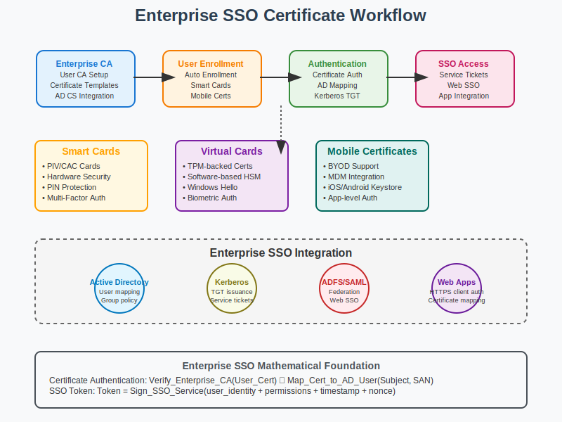

# Enterprise Single Sign-On Workflow



## Scenario Overview

**Organization**: GlobalTech Enterprise  
**Project**: Implementing certificate-based Single Sign-On for enterprise applications  
**Context**: User authentication across multiple systems, Active Directory integration, and smart card deployment  
**Timeline**: PKI infrastructure setup, user enrollment, and SSO system integration

## The Challenge

GlobalTech Enterprise needs to:
- Deploy certificate-based authentication for 10,000+ employees
- Integrate with Active Directory and enterprise applications
- Support smart cards and mobile device certificates
- Implement seamless single sign-on across all systems
- Ensure strong authentication without user friction
- Maintain compliance with corporate security policies

## PKI Workflow Solution

### Mathematical Foundation

Enterprise SSO relies on certificate-based authentication and trust relationships:

```
Certificate-Based Authentication:
1. User presents certificate during login
2. System validates certificate chain to enterprise CA
3. Certificate attributes mapped to user identity
4. Authorization based on certificate and directory attributes

SSO Token Generation:
Token = Sign_SSO_Service(user_identity + permissions + timestamp + nonce)

Kerberos Integration:
TGT = Encrypt_KDC_key(user_principal + session_key + validity)
Service_Ticket = Encrypt_Service_key(user_principal + client_address + validity)
```

## Step-by-Step Workflow

### Phase 1: Enterprise CA Setup for User Certificates

```bash
# Create Enterprise User CA
ca-admin@enterprise-ca:~$ openssl genrsa -aes256 -out enterprise-user-ca.key 3072

# Generate Enterprise User CA certificate
ca-admin@enterprise-ca:~$ openssl req -new -x509 -days 3650 \
    -key enterprise-user-ca.key -out enterprise-user-ca.crt \
    -subj "/CN=GlobalTech Enterprise User CA/O=GlobalTech Corp/C=US" \
    -extensions v3_ca

# Create certificate template for user certificates
ca-admin@enterprise-ca:~$ cat > user-cert-template.conf << EOF
[req]
distinguished_name = req_distinguished_name
req_extensions = v3_user

[req_distinguished_name]
CN = Common Name
emailAddress = Email Address
O = Organization
OU = Organizational Unit

[v3_user]
keyUsage = critical, digitalSignature, keyEncipherment, keyAgreement
extendedKeyUsage = clientAuth, emailProtection, msSmartcardLogin
basicConstraints = critical, CA:false
subjectKeyIdentifier = hash
authorityKeyIdentifier = keyid,issuer
certificatePolicies = @user_policy

[user_policy]
policyIdentifier = 1.3.6.1.4.1.12345.1.2.1
CPS.1 = "https://pki.globaltech.com/cps"
userNotice.1 = @user_notice

[user_notice]
explicitText = "This certificate is for GlobalTech employees only"
EOF
```

### Phase 2: Active Directory Certificate Services Integration

```powershell
# Configure AD CS for automatic enrollment
# Run on Windows Server with AD CS role

# Create certificate template for users
$TemplateOID = "1.3.6.1.4.1.311.21.8.123456.654321"
$Template = @{
    Name = "GlobalTechUserAuth"
    DisplayName = "GlobalTech User Authentication"
    KeyUsage = @("DigitalSignature", "KeyEncipherment")
    ExtendedKeyUsage = @("ClientAuthentication", "SmartCardLogon", "EmailProtection")
    ValidityPeriod = "2 years"
    SubjectNameFormat = "CN=<DisplayName>,E=<EmailAddress>,OU=<Department>,O=GlobalTech Corp"
    MinimumKeySize = 2048
    AllowedCAs = @("GlobalTech Enterprise CA")
    AutoEnrollment = $true
}

# Configure certificate template in AD
certlm.msc
# Certificate Templates → New Template → Based on User template
# Configure template settings as per $Template above

# Enable auto-enrollment via Group Policy
gpmc.msc
# Computer Configuration → Policies → Windows Settings → Security Settings
# → Public Key Policies → Certificate Services Client - Auto-Enrollment
# Configuration: Enabled
# Renew expired certificates: Yes
# Update pending certificates: Yes
```

### Phase 3: Smart Card Deployment

```bash
# Smart card middleware installation
sysadmin@workstation:~$ apt-get install opensc pcsc-tools

# Initialize smart card with user certificate
sysadmin@workstation:~$ pkcs15-init --create-pkcs15

# Generate key pair on smart card
sysadmin@workstation:~$ pkcs15-init --generate-key rsa/2048 --auth-id 01 \
    --key-usage sign,decrypt --label "GlobalTech User Key"

# Create certificate request using smart card key
sysadmin@workstation:~$ openssl req -new -engine pkcs11 \
    -keyform engine -key slot_1-id_01 \
    -subj "/CN=John Smith/emailAddress=john.smith@globaltech.com/O=GlobalTech Corp" \
    -out john_smith.csr

# Install certificate on smart card
sysadmin@workstation:~$ pkcs15-init --store-certificate john_smith.crt \
    --auth-id 01 --id 01 --label "GlobalTech User Certificate"
```

### Phase 4: Web Application SSO Integration

```python
def enterprise_sso_implementation():
    """
    Enterprise SSO with certificate authentication
    """
    
    class EnterpriseSSOHandler:
        def __init__(self, ca_cert_path, ldap_config):
            self.ca_cert = self.load_ca_certificate(ca_cert_path)
            self.ldap_config = ldap_config
            self.session_timeout = 8 * 3600  # 8 hours
        
        def authenticate_user(self, client_certificate):
            """Authenticate user with client certificate"""
            
            # 1. Validate certificate chain
            if not self.validate_certificate_chain(client_certificate):
                return None, "Invalid certificate chain"
            
            # 2. Check certificate is not revoked
            if self.is_certificate_revoked(client_certificate):
                return None, "Certificate revoked"
            
            # 3. Extract user identity from certificate
            user_identity = self.extract_user_identity(client_certificate)
            if not user_identity:
                return None, "Cannot extract user identity"
            
            # 4. Query Active Directory for user attributes
            user_attributes = self.query_active_directory(user_identity)
            if not user_attributes:
                return None, "User not found in directory"
            
            # 5. Generate SSO token
            sso_token = self.generate_sso_token(user_identity, user_attributes)
            
            return sso_token, user_attributes
        
        def extract_user_identity(self, certificate):
            """Extract user identity from certificate subject"""
            subject_components = {}
            for component in certificate.subject:
                subject_components[component.oid._name] = component.value
            
            # Extract UPN from certificate if available
            upn = None
            for extension in certificate.extensions:
                if extension.oid._name == 'subjectAltName':
                    for name in extension.value:
                        if hasattr(name, 'value') and '@' in name.value:
                            upn = name.value
                            break
            
            return upn or f"{subject_components.get('emailAddress')}"
        
        def query_active_directory(self, user_principal_name):
            """Query Active Directory for user attributes"""
            import ldap
            
            try:
                conn = ldap.initialize(self.ldap_config['server'])
                conn.simple_bind_s(
                    self.ldap_config['bind_dn'], 
                    self.ldap_config['bind_password']
                )
                
                search_filter = f"(userPrincipalName={user_principal_name})"
                attributes = [
                    'displayName', 'department', 'title', 'manager',
                    'memberOf', 'employeeID', 'telephoneNumber'
                ]
                
                result = conn.search_s(
                    self.ldap_config['base_dn'],
                    ldap.SCOPE_SUBTREE,
                    search_filter,
                    attributes
                )
                
                if result:
                    dn, attrs = result[0]
                    return {k: v[0].decode('utf-8') if v else None 
                           for k, v in attrs.items()}
                
                return None
                
            except Exception as e:
                print(f"LDAP query error: {e}")
                return None
        
        def generate_sso_token(self, user_identity, user_attributes):
            """Generate JWT SSO token"""
            import jwt
            import time
            
            payload = {
                'sub': user_identity,
                'name': user_attributes.get('displayName'),
                'department': user_attributes.get('department'),
                'groups': user_attributes.get('memberOf', []),
                'iat': int(time.time()),
                'exp': int(time.time()) + self.session_timeout,
                'iss': 'GlobalTech Enterprise SSO',
                'aud': 'GlobalTech Applications'
            }
            
            # Sign with enterprise SSO private key
            token = jwt.encode(payload, self.sso_private_key, algorithm='RS256')
            return token
    
    return EnterpriseSSOHandler
```

### Phase 5: Application Integration

```python
def application_sso_integration():
    """
    Integrate enterprise applications with certificate SSO
    """
    
    # Web application SSO middleware
    class SSOMiddleware:
        def __init__(self, sso_public_key, trusted_ca_certs):
            self.sso_public_key = sso_public_key
            self.trusted_ca_certs = trusted_ca_certs
        
        def process_request(self, request):
            """Process incoming request for SSO authentication"""
            
            # Check for existing SSO token in cookie/header
            sso_token = self.extract_sso_token(request)
            if sso_token:
                user_info = self.validate_sso_token(sso_token)
                if user_info:
                    request.user = user_info
                    return True
            
            # Check for client certificate
            client_cert = self.extract_client_certificate(request)
            if client_cert:
                # Redirect to SSO service for authentication
                sso_url = f"https://sso.globaltech.com/auth?return_url={request.url}"
                return self.redirect(sso_url)
            
            # No authentication found
            return self.unauthorized_response()
        
        def validate_sso_token(self, token):
            """Validate JWT SSO token"""
            import jwt
            
            try:
                payload = jwt.decode(
                    token, 
                    self.sso_public_key, 
                    algorithms=['RS256'],
                    audience='GlobalTech Applications',
                    issuer='GlobalTech Enterprise SSO'
                )
                return payload
            except jwt.ExpiredSignatureError:
                return None  # Token expired
            except jwt.InvalidTokenError:
                return None  # Invalid token
    
    # SAML 2.0 integration for legacy applications
    saml_config = {
        "entity_id": "https://sso.globaltech.com",
        "sso_url": "https://sso.globaltech.com/saml/sso",
        "slo_url": "https://sso.globaltech.com/saml/slo",
        "x509_cert": "/etc/ssl/certs/sso-signing.crt",
        "attribute_mapping": {
            "http://schemas.xmlsoap.org/ws/2005/05/identity/claims/name": "displayName",
            "http://schemas.xmlsoap.org/ws/2005/05/identity/claims/emailaddress": "mail",
            "http://schemas.microsoft.com/ws/2008/06/identity/claims/groups": "memberOf"
        }
    }
    
    return SSOMiddleware, saml_config
```

## Advanced Enterprise SSO Features

### Multi-Factor Authentication Integration

```python
def mfa_integration():
    """
    Multi-factor authentication with certificates
    """
    
    mfa_config = {
        "certificate_factor": {
            "type": "possession",
            "description": "User certificate on smart card or device",
            "validation": "Certificate chain validation + private key proof"
        },
        "additional_factors": {
            "biometric": {
                "type": "inherence", 
                "methods": ["fingerprint", "face_recognition", "retina_scan"],
                "integration": "Platform authenticator (Windows Hello, Touch ID)"
            },
            "token": {
                "type": "possession",
                "methods": ["TOTP", "hardware_token", "SMS"],
                "providers": ["RSA SecurID", "Duo", "Azure MFA"]
            },
            "knowledge": {
                "type": "knowledge",
                "methods": ["PIN", "password", "security_questions"],
                "policy": "Optional third factor for high-risk operations"
            }
        }
    }
    
    # Risk-based authentication
    risk_assessment = {
        "low_risk": ["certificate_only"],
        "medium_risk": ["certificate", "biometric_or_token"], 
        "high_risk": ["certificate", "biometric", "token_or_knowledge"]
    }
    
    return mfa_config, risk_assessment
```

### Privileged Access Management

```bash
# Configure privileged access with certificate authentication
pam-admin@jumpbox:~$ cat > /etc/pam.d/sshd << EOF
# Certificate-based authentication for privileged access
auth    required    pam_pkcs11.so
auth    required    pam_permit.so
account required    pam_unix.so
session required    pam_unix.so
EOF

# PKCS#11 configuration for certificate authentication  
pam-admin@jumpbox:~$ cat > /etc/pam_pkcs11/pam_pkcs11.conf << EOF
use_pkcs11_module = opensc;

pkcs11_module opensc {
    module = /usr/lib/x86_64-linux-gnu/opensc-pkcs11.so;
    description = "OpenSC PKCS#11 module";
    slot_num = 0;
    ca_file = /etc/ssl/certs/globaltech-ca.pem;
    cert_policy = signature;
    cert_policy = crl_auto;
}

# Certificate to username mapping
mapper cert_mapper {
    debug = false;
    module = /usr/lib/pam_pkcs11/subject_mapper.so;
    ignorecase = false;
    mapfile = /etc/pam_pkcs11/subject_mapping;
}
EOF

# Subject mapping for certificate authentication
pam-admin@jumpbox:~$ cat > /etc/pam_pkcs11/subject_mapping << EOF
# Map certificate subjects to Unix usernames
john.smith@globaltech.com -> jsmith
jane.doe@globaltech.com -> jdoe
admin.user@globaltech.com -> admin
EOF
```

## Performance and Scalability

### Enterprise Scale Considerations

```python
def enterprise_sso_scaling():
    """
    Scaling considerations for enterprise SSO
    """
    
    scaling_metrics = {
        "user_population": {
            "small_enterprise": "< 1,000 users",
            "medium_enterprise": "1,000 - 10,000 users",
            "large_enterprise": "10,000 - 100,000 users", 
            "global_enterprise": "> 100,000 users"
        },
        "authentication_load": {
            "peak_concurrent_logins": "10-20% of user base during business hours",
            "certificate_validation_time": "50-100ms per authentication",
            "ldap_query_time": "10-50ms per user attribute lookup",
            "token_generation_time": "5-10ms per JWT token"
        },
        "infrastructure_requirements": {
            "sso_servers": "Load balanced cluster with 99.9% availability",
            "certificate_validation": "Dedicated OCSP responders",
            "session_storage": "Distributed cache (Redis cluster)",
            "directory_integration": "Multiple AD domain controllers"
        }
    }
    
    performance_optimization = {
        "certificate_caching": "Cache validated certificates for session lifetime",
        "ldap_connection_pooling": "Persistent LDAP connections",
        "token_caching": "Cache JWT tokens to reduce regeneration",
        "health_monitoring": "Real-time monitoring of all SSO components"
    }
    
    return scaling_metrics, performance_optimization
```

## Security and Compliance

### Audit and Compliance Framework

```python
def sso_audit_framework():
    """
    Comprehensive audit framework for certificate SSO
    """
    
    audit_events = {
        "authentication_events": [
            "successful_certificate_authentication",
            "failed_certificate_authentication", 
            "certificate_validation_failure",
            "user_account_locked",
            "privileged_access_granted"
        ],
        "certificate_events": [
            "certificate_issued",
            "certificate_renewed",
            "certificate_revoked",
            "certificate_expiration_warning",
            "invalid_certificate_presented"
        ],
        "session_events": [
            "sso_token_issued",
            "sso_token_expired",
            "session_terminated",
            "concurrent_session_detected",
            "session_hijacking_detected"
        ],
        "administrative_events": [
            "ca_key_usage",
            "certificate_template_modified",
            "user_access_granted",
            "security_policy_changed",
            "system_configuration_modified"
        ]
    }
    
    compliance_requirements = {
        "SOX": "User access logging and periodic recertification",
        "HIPAA": "User authentication audit trails",
        "PCI_DSS": "Strong authentication for cardholder data access",
        "ISO_27001": "Access control and identity management",
        "NIST_800-53": "Identification and authentication controls"
    }
    
    return audit_events, compliance_requirements
```

## Conclusion

Enterprise Single Sign-On with certificate authentication provides strong security while enabling seamless user experience. Success requires careful integration with existing identity infrastructure and comprehensive lifecycle management.

Key takeaways:
- Certificate-based authentication eliminates password vulnerabilities
- Smart card integration provides hardware-backed security
- Active Directory integration enables centralized identity management
- SSO tokens reduce authentication overhead across applications
- Comprehensive audit logging ensures compliance and security monitoring

## Files in This Use Case

- `README.md` - This comprehensive enterprise SSO guide
- `workflow.svg` - Visual representation of certificate SSO flow
- `examples/` - Integration scripts and configuration files
- `tools/` - Certificate management and monitoring utilities

## Navigation

**Previous**: [Device Identity](../06-device-identity/README.md) 🔌  
**Next**: [Mutual TLS](../08-mutual-tls/README.md) 🔐  
**Home**: [PKI Main README](../../README.md) 🏠