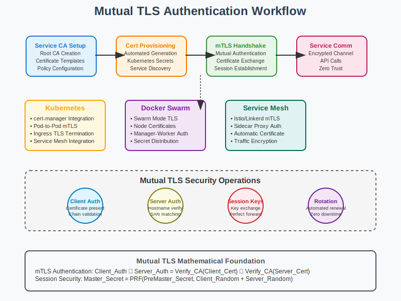

# Mutual TLS Authentication Workflow



## Scenario Overview

**Organization**: CloudSecure Services  
**Project**: Implementing mutual TLS authentication for microservices communication  
**Context**: Service-to-service authentication, API security, and zero-trust architecture  
**Timeline**: Certificate deployment, service configuration, and automated certificate management

## The Challenge

CloudSecure Services needs to:
- Implement mutual TLS (mTLS) for all inter-service communications
- Automate certificate provisioning and rotation for hundreds of microservices
- Ensure strong authentication between services without shared secrets
- Integrate with container orchestration platforms (Kubernetes, Docker)
- Implement certificate-based API authentication for external clients
- Handle certificate lifecycle management at scale

## PKI Workflow Solution

### Mathematical Foundation

Mutual TLS provides bidirectional authentication using client and server certificates:

```
Mutual TLS Handshake:
1. Client initiates TLS connection to Server
2. Server presents Server Certificate → Client validates
3. Server requests Client Certificate → Client presents
4. Both parties validate certificate chains to trusted CAs
5. Establish encrypted channel with mutual authentication

Certificate Validation:
Server_Auth = Verify_CA(Server_Cert) ∧ Hostname_Match(Server_Cert, Target)
Client_Auth = Verify_CA(Client_Cert) ∧ AuthZ_Policy(Client_Cert, Resource)

Key Exchange Security:
PreMaster_Secret = RSA_Encrypt(Server_Public_Key, Random_48_bytes)
Master_Secret = PRF(PreMaster_Secret, Client_Random + Server_Random)
```

## Step-by-Step Workflow

### Phase 1: Service Certificate Authority Setup

```bash
# Create Service CA for mTLS certificates
ca-admin@service-ca:~$ openssl genrsa -aes256 -out service-ca.key 3072

# Generate Service CA certificate
ca-admin@service-ca:~$ openssl req -new -x509 -days 3650 \
    -key service-ca.key -out service-ca.crt \
    -subj "/CN=CloudSecure Service CA/O=CloudSecure Services/C=US" \
    -extensions v3_ca

# Create service certificate template
ca-admin@service-ca:~$ cat > service-cert.conf << EOF
[req]
distinguished_name = req_distinguished_name
req_extensions = v3_service

[req_distinguished_name]
CN = Service Common Name
O = CloudSecure Services

[v3_service]
keyUsage = critical, digitalSignature, keyEncipherment, keyAgreement
extendedKeyUsage = serverAuth, clientAuth
basicConstraints = critical, CA:false
subjectKeyIdentifier = hash
authorityKeyIdentifier = keyid,issuer
subjectAltName = @alt_names

[alt_names]
DNS.1 = service.cloudsecure.local
DNS.2 = *.cloudsecure.local
DNS.3 = localhost
IP.1 = 127.0.0.1
IP.2 = 10.0.0.0/8
EOF
```

**Mathematical Insight**: 
- Service certificates include both serverAuth and clientAuth extended key usage
- Subject Alternative Names support service discovery and load balancing
- Elliptic Curve certificates recommended for performance in high-throughput scenarios

### Phase 2: Automated Service Certificate Provisioning

```python
def automated_service_certificate_provisioning():
    """
    Automated certificate provisioning for microservices
    """
    import os
    import yaml
    import requests
    from cryptography import x509
    from cryptography.hazmat.primitives import serialization, hashes
    from cryptography.hazmat.primitives.asymmetric import ec
    
    def generate_service_certificate(service_name, namespace, ca_cert, ca_key):
        """Generate certificate for microservice"""
        
        # Generate service key pair (ECDSA P-256 for performance)
        service_private_key = ec.generate_private_key(ec.SECP256R1())
        service_public_key = service_private_key.public_key()
        
        # Create service-specific subject
        subject = x509.Name([
            x509.NameAttribute(x509.NameOID.COMMON_NAME, f"{service_name}.{namespace}"),
            x509.NameAttribute(x509.NameOID.ORGANIZATION_NAME, "CloudSecure Services"),
        ])
        
        # Service-specific Subject Alternative Names
        san_list = [
            x509.DNSName(f"{service_name}.{namespace}"),
            x509.DNSName(f"{service_name}.{namespace}.svc.cluster.local"),
            x509.DNSName(f"{service_name}-service"),
            x509.IPAddress(ipaddress.IPv4Address("127.0.0.1")),
        ]
        
        # Build certificate with service extensions
        cert_builder = x509.CertificateBuilder()
        cert_builder = cert_builder.subject_name(subject)
        cert_builder = cert_builder.issuer_name(ca_cert.subject)
        cert_builder = cert_builder.public_key(service_public_key)
        cert_builder = cert_builder.serial_number(x509.random_serial_number())
        cert_builder = cert_builder.not_valid_before(datetime.utcnow())
        cert_builder = cert_builder.not_valid_after(datetime.utcnow() + timedelta(days=90))
        
        # Add extensions for mTLS
        cert_builder = cert_builder.add_extension(
            x509.KeyUsage(
                digital_signature=True,
                key_encipherment=True,
                key_agreement=True,
                key_cert_sign=False,
                crl_sign=False,
                content_commitment=False,
                data_encipherment=False,
                encipher_only=False,
                decipher_only=False
            ), critical=True
        )
        
        cert_builder = cert_builder.add_extension(
            x509.ExtendedKeyUsage([
                x509.ExtendedKeyUsageOID.SERVER_AUTH,
                x509.ExtendedKeyUsageOID.CLIENT_AUTH,
            ]), critical=True
        )
        
        cert_builder = cert_builder.add_extension(
            x509.SubjectAlternativeName(san_list), critical=False
        )
        
        # Sign certificate with service CA
        certificate = cert_builder.sign(ca_key, hashes.SHA256())
        
        return service_private_key, certificate

    def deploy_certificate_to_kubernetes(service_name, namespace, private_key, certificate, ca_cert):
        """Deploy certificate as Kubernetes secret"""
        
        # Serialize certificate and key
        cert_pem = certificate.public_bytes(serialization.Encoding.PEM)
        key_pem = private_key.private_bytes(
            encoding=serialization.Encoding.PEM,
            format=serialization.PrivateFormat.PKCS8,
            encryption_algorithm=serialization.NoEncryption()
        )
        ca_cert_pem = ca_cert.public_bytes(serialization.Encoding.PEM)
        
        # Create Kubernetes secret manifest
        secret_manifest = {
            "apiVersion": "v1",
            "kind": "Secret",
            "metadata": {
                "name": f"{service_name}-tls",
                "namespace": namespace,
                "labels": {
                    "app": service_name,
                    "cert-manager": "service-ca"
                }
            },
            "type": "kubernetes.io/tls",
            "data": {
                "tls.crt": base64.b64encode(cert_pem).decode(),
                "tls.key": base64.b64encode(key_pem).decode(),
                "ca.crt": base64.b64encode(ca_cert_pem).decode()
            }
        }
        
        return secret_manifest

    # Example usage
    load_ca_certificate_and_key()
    cert_data = generate_service_certificate("api-gateway", "production", ca_cert, ca_key)
    k8s_secret = deploy_certificate_to_kubernetes("api-gateway", "production", *cert_data, ca_cert)
    
    return k8s_secret
```

### Phase 3: Service Configuration for Mutual TLS

```yaml
# Kubernetes Deployment with mTLS configuration
apiVersion: apps/v1
kind: Deployment
metadata:
  name: secure-api-service
  namespace: production
spec:
  replicas: 3
  selector:
    matchLabels:
      app: secure-api-service
  template:
    metadata:
      labels:
        app: secure-api-service
    spec:
      containers:
      - name: api-service
        image: cloudsecure/api-service:v1.2.3
        ports:
        - containerPort: 8443
          name: https
        env:
        - name: TLS_CERT_PATH
          value: "/etc/certs/tls.crt"
        - name: TLS_KEY_PATH
          value: "/etc/certs/tls.key"
        - name: TLS_CA_PATH
          value: "/etc/certs/ca.crt"
        - name: MTLS_ENABLED
          value: "true"
        volumeMounts:
        - name: tls-certs
          mountPath: "/etc/certs"
          readOnly: true
      volumes:
      - name: tls-certs
        secret:
          secretName: secure-api-service-tls
---
apiVersion: v1
kind: Service
metadata:
  name: secure-api-service
  namespace: production
  annotations:
    service.beta.kubernetes.io/aws-load-balancer-backend-protocol: "ssl"
    service.beta.kubernetes.io/aws-load-balancer-ssl-ports: "https"
spec:
  type: LoadBalancer
  ports:
  - port: 443
    targetPort: 8443
    protocol: TCP
    name: https
  selector:
    app: secure-api-service
```

### Phase 4: Client-Side mTLS Implementation

```go
// Go client implementation for mTLS
package main

import (
    "crypto/tls"
    "crypto/x509"
    "fmt"
    "io/ioutil"
    "net/http"
)

func createMTLSClient(clientCertPath, clientKeyPath, caCertPath string) (*http.Client, error) {
    // Load client certificate and key
    clientCert, err := tls.LoadX509KeyPair(clientCertPath, clientKeyPath)
    if err != nil {
        return nil, fmt.Errorf("failed to load client certificate: %v", err)
    }
    
    // Load CA certificate
    caCert, err := ioutil.ReadFile(caCertPath)
    if err != nil {
        return nil, fmt.Errorf("failed to read CA certificate: %v", err)
    }
    
    // Create CA certificate pool
    caCertPool := x509.NewCertPool()
    if !caCertPool.AppendCertsFromPEM(caCert) {
        return nil, fmt.Errorf("failed to parse CA certificate")
    }
    
    // Configure TLS with mutual authentication
    tlsConfig := &tls.Config{
        Certificates: []tls.Certificate{clientCert},
        RootCAs:      caCertPool,
        ServerName:   "api-gateway.production", // Must match server certificate
        MinVersion:   tls.VersionTLS12,
        CipherSuites: []uint16{
            tls.TLS_ECDHE_ECDSA_WITH_AES_256_GCM_SHA384,
            tls.TLS_ECDHE_RSA_WITH_AES_256_GCM_SHA384,
            tls.TLS_ECDHE_ECDSA_WITH_CHACHA20_POLY1305,
            tls.TLS_ECDHE_RSA_WITH_CHACHA20_POLY1305,
        },
    }
    
    // Create HTTP client with mTLS transport
    transport := &http.Transport{
        TLSClientConfig: tlsConfig,
    }
    
    client := &http.Client{
        Transport: transport,
        Timeout:   time.Second * 30,
    }
    
    return client, nil
}

func makeSecureAPICall() {
    client, err := createMTLSClient(
        "/etc/certs/client.crt",
        "/etc/certs/client.key",
        "/etc/certs/ca.crt",
    )
    if err != nil {
        log.Fatalf("Failed to create mTLS client: %v", err)
    }
    
    // Make authenticated API call
    resp, err := client.Get("https://api-gateway.production.svc.cluster.local:443/api/v1/secure-data")
    if err != nil {
        log.Fatalf("API call failed: %v", err)
    }
    defer resp.Body.Close()
    
    body, err := ioutil.ReadAll(resp.Body)
    if err != nil {
        log.Fatalf("Failed to read response: %v", err)
    }
    
    fmt.Printf("Secure API Response: %s\n", body)
}
```

### Phase 5: Certificate Rotation and Lifecycle Management

```bash
# Automated certificate rotation script
#!/bin/bash

NAMESPACE="production"
SERVICE_NAME="api-gateway"
CERT_VALIDITY_DAYS=90
ROTATION_THRESHOLD_DAYS=30

check_certificate_expiry() {
    local cert_path="/etc/certs/tls.crt"
    local expiry_date=$(openssl x509 -in $cert_path -noout -enddate | cut -d= -f2)
    local expiry_epoch=$(date -d "$expiry_date" +%s)
    local current_epoch=$(date +%s)
    local days_until_expiry=$(( (expiry_epoch - current_epoch) / 86400 ))
    
    echo $days_until_expiry
}

rotate_certificate() {
    echo "Rotating certificate for $SERVICE_NAME in $NAMESPACE"
    
    # Generate new certificate
    python3 /opt/scripts/generate_service_cert.py \
        --service-name $SERVICE_NAME \
        --namespace $NAMESPACE \
        --validity-days $CERT_VALIDITY_DAYS
    
    # Update Kubernetes secret
    kubectl create secret tls ${SERVICE_NAME}-tls-new \
        --cert=/tmp/new-cert.pem \
        --key=/tmp/new-key.pem \
        --namespace=$NAMESPACE
    
    # Rolling update deployment
    kubectl patch deployment $SERVICE_NAME \
        --namespace $NAMESPACE \
        --patch '{
            "spec": {
                "template": {
                    "metadata": {
                        "annotations": {
                            "cert-rotation": "'$(date)'"
                        }
                    }
                }
            }
        }'
    
    # Wait for rollout to complete
    kubectl rollout status deployment/$SERVICE_NAME --namespace=$NAMESPACE
    
    # Replace old secret with new one
    kubectl delete secret ${SERVICE_NAME}-tls --namespace=$NAMESPACE
    kubectl patch secret ${SERVICE_NAME}-tls-new \
        --namespace $NAMESPACE \
        --patch '{"metadata":{"name":"'${SERVICE_NAME}'-tls"}}'
    
    echo "Certificate rotation completed successfully"
}

# Main rotation logic
days_until_expiry=$(check_certificate_expiry)
if [ $days_until_expiry -le $ROTATION_THRESHOLD_DAYS ]; then
    rotate_certificate
else
    echo "Certificate valid for $days_until_expiry days, rotation not needed"
fi
```

## Security Considerations

### Certificate Validation Best Practices

```python
def enhanced_certificate_validation(cert, trusted_ca_certs):
    """
    Enhanced certificate validation for mTLS
    """
    validation_results = {
        "chain_valid": False,
        "not_expired": False,
        "key_usage_valid": False,
        "san_valid": False,
        "revocation_status": "unknown"
    }
    
    try:
        # Build and validate certificate chain
        builder = x509.verification.PolicyBuilder().store(
            x509.verification.Store(trusted_ca_certs)
        )
        verifier = builder.build()
        chain = verifier.verify(cert, [])  # intermediate certs if any
        validation_results["chain_valid"] = True
        
        # Check certificate expiry
        now = datetime.utcnow()
        if cert.not_valid_before <= now <= cert.not_valid_after:
            validation_results["not_expired"] = True
        
        # Validate key usage for mTLS
        try:
            key_usage = cert.extensions.get_extension_for_oid(
                x509.oid.ExtensionOID.KEY_USAGE
            ).value
            ext_key_usage = cert.extensions.get_extension_for_oid(
                x509.oid.ExtensionOID.EXTENDED_KEY_USAGE
            ).value
            
            # Check required key usages for mTLS
            if (key_usage.digital_signature and 
                key_usage.key_encipherment and
                x509.ExtendedKeyUsageOID.CLIENT_AUTH in ext_key_usage and
                x509.ExtendedKeyUsageOID.SERVER_AUTH in ext_key_usage):
                validation_results["key_usage_valid"] = True
        except x509.ExtensionNotFound:
            pass
        
        # Validate Subject Alternative Names
        try:
            san_ext = cert.extensions.get_extension_for_oid(
                x509.oid.ExtensionOID.SUBJECT_ALTERNATIVE_NAME
            ).value
            # Custom SAN validation logic based on service requirements
            validation_results["san_valid"] = True
        except x509.ExtensionNotFound:
            pass
        
        # Check revocation status (implement OCSP/CRL checking)
        validation_results["revocation_status"] = check_revocation_status(cert)
        
    except Exception as e:
        print(f"Certificate validation error: {e}")
    
    return validation_results

def check_revocation_status(cert):
    """
    Check certificate revocation status via OCSP/CRL
    """
    # Implementation would include:
    # 1. Extract OCSP responder URL from certificate
    # 2. Send OCSP request
    # 3. Validate OCSP response
    # 4. Fall back to CRL if OCSP unavailable
    return "good"  # Simplified for example
```

## Performance Optimization

### Connection Pooling and Session Resumption

```python
import ssl
import socket
from urllib3 import PoolManager
from urllib3.util.ssl_ import create_urllib3_context

def create_optimized_mtls_pool():
    """
    Create optimized connection pool for mTLS
    """
    # Create custom SSL context with optimizations
    context = create_urllib3_context()
    context.check_hostname = True
    context.verify_mode = ssl.CERT_REQUIRED
    
    # Load client certificate
    context.load_cert_chain('/etc/certs/client.crt', '/etc/certs/client.key')
    context.load_verify_locations('/etc/certs/ca.crt')
    
    # Optimize cipher suites for performance
    context.set_ciphers(':'.join([
        'ECDHE-ECDSA-AES256-GCM-SHA384',
        'ECDHE-RSA-AES256-GCM-SHA384',
        'ECDHE-ECDSA-CHACHA20-POLY1305',
        'ECDHE-RSA-CHACHA20-POLY1305'
    ]))
    
    # Enable session resumption for performance
    context.options |= ssl.OP_NO_TICKET  # Use session IDs instead of tickets
    
    # Create connection pool with optimized settings
    pool = PoolManager(
        num_pools=10,
        maxsize=100,
        block=True,
        ssl_context=context,
        # Enable HTTP/2 if supported
        socket_options=[(socket.SOL_SOCKET, socket.SO_KEEPALIVE, 1)],
    )
    
    return pool
```

## Monitoring and Observability

### Certificate Metrics and Alerting

```python
def collect_certificate_metrics():
    """
    Collect metrics for certificate monitoring
    """
    metrics = {
        "certificates_total": 0,
        "certificates_expiring_30d": 0,
        "certificates_expiring_7d": 0,
        "certificates_expired": 0,
        "mtls_connections_total": 0,
        "mtls_connection_failures": 0,
        "certificate_validation_errors": 0
    }
    
    # Implementation would collect metrics from:
    # - Kubernetes secrets with certificate labels
    # - Application logs and metrics endpoints
    # - Load balancer and proxy metrics
    # - Certificate transparency logs
    
    return metrics

def setup_certificate_monitoring():
    """
    Setup monitoring and alerting for certificates
    """
    # Prometheus metrics configuration
    prometheus_config = """
    - alert: CertificateExpiringSoon
      expr: cert_expiry_days < 30
      for: 1h
      labels:
        severity: warning
      annotations:
        summary: "Certificate expiring soon"
        description: "Certificate {{ $labels.service }} expires in {{ $value }} days"
    
    - alert: CertificateExpired
      expr: cert_expiry_days <= 0
      for: 0m
      labels:
        severity: critical
      annotations:
        summary: "Certificate has expired"
        description: "Certificate {{ $labels.service }} has expired"
    
    - alert: MTLSConnectionFailures
      expr: rate(mtls_connection_failures_total[5m]) > 0.1
      for: 2m
      labels:
        severity: warning
      annotations:
        summary: "High mTLS connection failure rate"
        description: "mTLS connection failure rate is {{ $value }} per second"
    """
    
    return prometheus_config
```

## Files in This Section

- `README.md` - Comprehensive mTLS implementation guide
- `workflow.svg` - Visual representation of mTLS authentication flow
- `scripts/` - Automation scripts for certificate management
- `examples/` - Client implementation examples in various languages
- `monitoring/` - Prometheus metrics and Grafana dashboards

## Navigation

**Previous**: [Enterprise SSO](../07-enterprise-sso/README.md) 🔐  
**Next**: [Blockchain Integration](../09-blockchain-integration/README.md) ⛓️  
**Home**: [PKI Use Cases](../README.md) 🏠