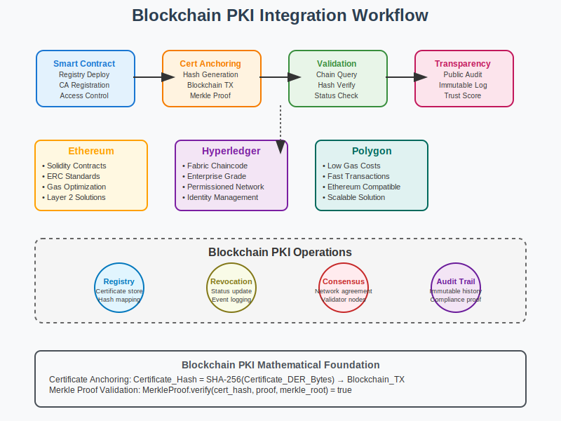

# Blockchain Integration Workflow



## Scenario Overview

**Organization**: CryptoTrust Blockchain  
**Project**: Implementing PKI integration with blockchain for certificate transparency and verification  
**Context**: Decentralized certificate validation, blockchain-based trust anchors, and immutable audit trails  
**Timeline**: Smart contract deployment, certificate anchoring, and distributed validation

## The Challenge

CryptoTrust Blockchain needs to:
- Anchor PKI certificates on blockchain for transparency
- Implement decentralized certificate validation
- Create immutable audit trails for certificate operations
- Integrate with existing PKI infrastructure seamlessly
- Enable cross-chain certificate verification
- Provide cost-effective blockchain operations

## PKI Workflow Solution

### Mathematical Foundation

Blockchain-based PKI combines traditional certificate validation with distributed consensus:

```
Blockchain Certificate Anchoring:
Certificate_Hash = SHA-256(Certificate_DER_Bytes)
Blockchain_Transaction = {
    certificate_hash: Certificate_Hash,
    issuer_id: CA_Identifier,
    timestamp: Block_Timestamp,
    transaction_hash: Merkle_Tree_Hash
}

Smart Contract Validation:
function validateCertificate(cert_hash, signature) public view returns (bool) {
    return certificateRegistry[cert_hash].isValid && 
           verifySignature(cert_hash, signature, trustedCAs[msg.sender]);
}

Merkle Tree Proof:
Certificate_Proof = MerkleProof.verify(cert_hash, merkle_proof, merkle_root)
```

## Step-by-Step Workflow

### Phase 1: Smart Contract Deployment

```solidity
// Smart contract for certificate registry
pragma solidity ^0.8.0;

contract CertificateRegistry {
    struct Certificate {
        bytes32 certHash;
        address issuer;
        uint256 timestamp;
        bool isRevoked;
        string metadata;
    }
    
    mapping(bytes32 => Certificate) public certificates;
    mapping(address => bool) public trustedIssuers;
    
    event CertificateAnchored(bytes32 indexed certHash, address indexed issuer);
    event CertificateRevoked(bytes32 indexed certHash);
    
    function anchorCertificate(bytes32 _certHash, string memory _metadata) public {
        require(trustedIssuers[msg.sender], "Not a trusted issuer");
        require(certificates[_certHash].timestamp == 0, "Certificate already exists");
        
        certificates[_certHash] = Certificate({
            certHash: _certHash,
            issuer: msg.sender,
            timestamp: block.timestamp,
            isRevoked: false,
            metadata: _metadata
        });
        
        emit CertificateAnchored(_certHash, msg.sender);
    }
}
```

### Phase 2: Certificate Anchoring Integration

```python
def anchor_certificate_to_blockchain(certificate, blockchain_client):
    """
    Anchor PKI certificate to blockchain
    """
    from web3 import Web3
    import hashlib
    
    # Calculate certificate hash
    cert_der = certificate.public_bytes(serialization.Encoding.DER)
    cert_hash = hashlib.sha256(cert_der).hexdigest()
    
    # Prepare metadata
    metadata = {
        "subject": certificate.subject.rfc4514_string(),
        "issuer": certificate.issuer.rfc4514_string(),
        "serial": str(certificate.serial_number),
        "not_before": certificate.not_valid_before.isoformat(),
        "not_after": certificate.not_valid_after.isoformat()
    }
    
    # Submit to blockchain
    contract = blockchain_client.eth.contract(
        address=CERTIFICATE_REGISTRY_ADDRESS,
        abi=CERTIFICATE_REGISTRY_ABI
    )
    
    tx_hash = contract.functions.anchorCertificate(
        Web3.toBytes(hexstr=cert_hash),
        json.dumps(metadata)
    ).transact({'from': CA_WALLET_ADDRESS})
    
    return tx_hash
```

### Phase 3: Distributed Validation

```bash
# Certificate validation against blockchain
#!/bin/bash

validate_certificate_blockchain() {
    local cert_file=$1
    local blockchain_endpoint=$2
    
    # Calculate certificate hash
    cert_hash=$(openssl x509 -in "$cert_file" -outform DER | sha256sum | cut -d' ' -f1)
    
    # Query blockchain for certificate
    curl -X POST "$blockchain_endpoint" \
        -H "Content-Type: application/json" \
        -d "{
            \"jsonrpc\": \"2.0\",
            \"method\": \"eth_call\",
            \"params\": [{
                \"to\": \"$CERTIFICATE_REGISTRY_ADDRESS\",
                \"data\": \"$(encode_function_call getCertificate $cert_hash)\"
            }, \"latest\"],
            \"id\": 1
        }"
}
```

## Security Considerations

- **Immutable Records**: Blockchain ensures certificate transparency
- **Distributed Trust**: Multiple nodes validate certificate operations  
- **Privacy Protection**: Only certificate hashes stored on-chain
- **Cost Optimization**: Batch operations and layer-2 solutions

## Files in This Section

- `README.md` - Blockchain PKI integration guide
- `workflow.svg` - Visual blockchain certificate workflow
- `contracts/` - Smart contract implementations
- `scripts/` - Integration automation tools

## Navigation

**Previous**: [Mutual TLS](../08-mutual-tls/README.md) 🔒  
**Next**: [IoT Security](../10-iot-security/README.md) 📱  
**Home**: [PKI Use Cases](../README.md) 🏠