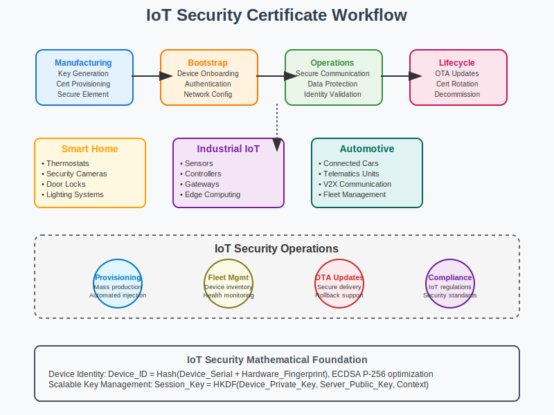

# IoT Security Workflow



## Scenario Overview

**Organization**: SmartHome Industries  
**Project**: Large-scale IoT device certificate management and security  
**Context**: Device lifecycle management, over-the-air updates, and scalable PKI for millions of devices  
**Timeline**: Manufacturing integration, deployment automation, and ongoing security operations

## The Challenge

SmartHome Industries needs to:
- Manage certificates for 10M+ IoT devices across global deployments
- Implement automated certificate provisioning during manufacturing
- Handle device onboarding and bootstrap authentication
- Support over-the-air certificate updates and rotation
- Ensure hardware-backed security for constrained devices
- Maintain compliance with IoT security regulations

## PKI Workflow Solution

### Mathematical Foundation

IoT PKI optimizes for resource constraints and scale:

```
Lightweight Certificate Profile:
- ECDSA P-256 keys (256-bit vs 2048-bit RSA)
- Compressed certificate formats
- Optimized certificate chains

Device Authentication:
Device_ID = Hash(Device_Serial + Hardware_Fingerprint)
Device_Certificate = Sign_Manufacturing_CA(Device_Public_Key + Device_ID)
Bootstrap_Token = HMAC(Shared_Secret, Device_ID + Timestamp)

Scalable Key Management:
Hierarchical_Key_Derivation = HKDF(Master_Key, Device_Info, Salt)
Session_Key = KDF(Device_Private_Key, Server_Public_Key)
```

## Step-by-Step Workflow

### Phase 1: Manufacturing Integration

```python
def manufacturing_certificate_provisioning():
    """IoT device certificate provisioning during manufacturing"""
    
    # Generate unique device keypair
    device_key = ec.generate_private_key(ec.SECP256R1())
    
    # Create device-specific certificate
    device_cert = create_device_certificate(
        device_key.public_key(),
        device_serial=get_device_serial(),
        device_model="SmartThermostat-v2",
        manufacturing_date=datetime.now()
    )
    
    # Inject into secure element
    secure_element.provision_certificate(device_cert, device_key)
    
    return device_cert
```

### Phase 2: Device Bootstrap

```bash
# Device onboarding script
#!/bin/bash

device_bootstrap() {
    local device_id=$1
    local bootstrap_server=$2
    
    # Generate bootstrap request with device certificate
    openssl req -new -key device.key -out bootstrap.csr \
        -subj "/CN=$device_id/O=SmartHome Industries" \
        -config bootstrap.conf
    
    # Submit to bootstrap server
    curl -X POST "$bootstrap_server/api/v1/bootstrap" \
        -H "Content-Type: application/json" \
        -d "{
            \"device_id\": \"$device_id\",
            \"csr\": \"$(base64 -w 0 bootstrap.csr)\",
            \"device_cert\": \"$(base64 -w 0 device.crt)\"
        }"
}
```

### Phase 3: Certificate Lifecycle Management

```python
def iot_certificate_rotation():
    """Automated certificate rotation for IoT devices"""
    
    # Check certificate expiry across device fleet
    devices_needing_rotation = query_devices_by_cert_expiry(days=30)
    
    for device in devices_needing_rotation:
        try:
            # Generate new certificate
            new_cert = provision_new_certificate(device.device_id)
            
            # Push OTA update
            ota_update_result = push_certificate_update(
                device.device_id, 
                new_cert,
                rollback_enabled=True
            )
            
            if ota_update_result.success:
                log.info(f"Certificate updated for {device.device_id}")
            else:
                schedule_retry(device.device_id, delay=3600)
                
        except Exception as e:
            log.error(f"Certificate rotation failed for {device.device_id}: {e}")
```

## Security Considerations

- **Hardware Security**: Secure elements and TPM integration
- **Lightweight Protocols**: Optimized for constrained devices
- **Scalable Operations**: Batch processing and automation
- **OTA Security**: Secure over-the-air updates with rollback

## Navigation

**Previous**: [Blockchain Integration](../09-blockchain-integration/README.md) ⛓️  
**Next**: [VPN Authentication](../11-vpn-authentication/README.md) 🔒  
**Home**: [PKI Use Cases](../README.md) 🏠