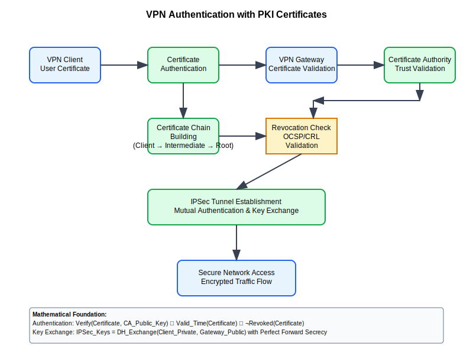

# VPN Authentication Workflow



## Scenario Overview

**Organization**: SecureNet Corporation  
**Project**: Implementing certificate-based VPN authentication for remote workforce  
**Context**: IPSec and SSL VPN deployment, user and machine authentication, scalable certificate management  
**Timeline**: VPN infrastructure setup, certificate deployment, and automated authentication

## The Challenge

SecureNet Corporation needs to:
- Deploy certificate-based VPN authentication for 50,000+ remote employees
- Support both user and machine authentication certificates
- Integrate with existing Active Directory and identity systems
- Implement automated certificate enrollment and renewal
- Ensure compatibility with multiple VPN clients and platforms
- Maintain security compliance for remote access

## PKI Workflow Solution

### Mathematical Foundation

VPN certificate authentication combines IPSec/SSL protocols with PKI:

```
IPSec Certificate Authentication:
IKE_Auth = Sign_Private_Key(DH_Exchange + Nonce + ID)
Certificate_Validation = Verify_CA(VPN_Certificate) ∧ 
                        Check_KeyUsage(clientAuth) ∧
                        Validate_CRL_OCSP(Certificate)

SSL VPN Authentication:
TLS_ClientHello + Certificate_Request
Client_Certificate_Verify = Sign_Client_Key(Handshake_Messages)
Server_Validation = Verify_Chain(Client_Cert, Trusted_CAs)

Perfect Forward Secrecy:
Session_Key = ECDH(Client_Private_Key, Server_Ephemeral_Key)
VPN_Traffic = AES_GCM(Session_Key, User_Data)
```

## Step-by-Step Workflow

### Phase 1: VPN Certificate Authority Setup

```bash
# Create VPN-specific intermediate CA
ca-admin@vpn-ca:~$ openssl genrsa -aes256 -out vpn-intermediate-ca.key 3072

# Generate VPN CA certificate with specific extensions
ca-admin@vpn-ca:~$ openssl req -new -x509 -days 3650 \
    -key vpn-intermediate-ca.key -out vpn-intermediate-ca.crt \
    -subj "/CN=SecureNet VPN Intermediate CA/O=SecureNet Corp/C=US" \
    -extensions vpn_ca_extensions
```

### Phase 2: User Certificate Enrollment

```python
def enroll_vpn_user_certificate(username, user_email):
    """Automated VPN user certificate enrollment"""
    
    # Generate user keypair
    user_key = ec.generate_private_key(ec.SECP256R1())
    
    # Create VPN user certificate with proper extensions
    user_cert = create_vpn_certificate(
        public_key=user_key.public_key(),
        subject_cn=username,
        subject_email=user_email,
        key_usage=['digitalSignature', 'keyAgreement'],
        extended_key_usage=['clientAuth'],
        san_entries=[f'email:{user_email}', f'upn:{username}@securenet.corp']
    )
    
    # Package as PKCS#12 for client distribution
    p12_bundle = create_pkcs12_bundle(user_cert, user_key, ca_chain)
    
    return p12_bundle
```

### Phase 3: VPN Client Configuration

```bash
# OpenVPN client configuration with certificates
cat > client.ovpn << EOF
client
dev tun
proto udp
remote vpn.securenet.corp 1194
cert client.crt
key client.key
ca ca.crt
tls-auth ta.key 1
cipher AES-256-GCM
auth SHA256
verify-x509-name "vpn.securenet.corp" name
remote-cert-tls server
EOF

# IPSec configuration with certificates
cat > ipsec.conf << EOF
conn vpn-connection
    type=tunnel
    left=%defaultroute
    leftcert=client.crt
    leftkey=client.key
    right=vpn.securenet.corp
    rightca=ca.crt
    rightsubnet=10.0.0.0/8
    auto=start
    ike=aes256-sha256-modp2048
    esp=aes256-sha256
EOF
```

## Security Considerations

- **Certificate Validation**: Comprehensive chain and revocation checking
- **Perfect Forward Secrecy**: Ephemeral key exchange for session security
- **Multi-Factor Authentication**: Certificates combined with additional factors
- **Network Isolation**: Certificate-based access control and segmentation

## Navigation

**Previous**: [IoT Security](../10-iot-security/README.md) 📱  
**Next**: [Document Signing](../12-document-signing/README.md) 📄  
**Home**: [PKI Use Cases](../README.md) 🏠