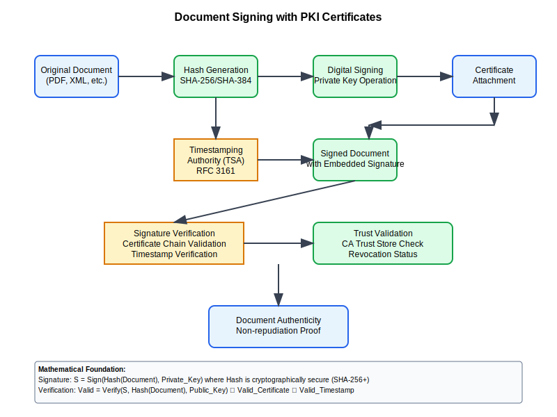

# Document Signing Workflow



## Scenario Overview

**Organization**: LegalTech Solutions  
**Project**: Implementing PKI-based digital document signing for legal and business documents  
**Context**: Advanced electronic signatures, long-term validation, timestamping, and regulatory compliance  
**Timeline**: Signing infrastructure setup, certificate deployment, and signature validation systems

## The Challenge

LegalTech Solutions needs to:
- Implement legally binding digital signatures for contracts and legal documents
- Support long-term signature validation beyond certificate expiry
- Integrate timestamping services for non-repudiation
- Ensure compliance with eIDAS, ESIGN Act, and other digital signature regulations
- Handle bulk document signing and automated workflows
- Provide signature verification and audit capabilities

## PKI Workflow Solution

### Mathematical Foundation

Document signing combines digital signatures with timestamping for long-term validity:

```
Digital Signature Process:
Document_Hash = SHA-256(Document_Content)
Digital_Signature = RSA_Sign_Private_Key(Document_Hash)
Signed_Document = {Document, Digital_Signature, Signer_Certificate}

Timestamping Integration:
Timestamp_Request = SHA-256(Digital_Signature)
Timestamp_Token = TSA_Sign(Timestamp_Request + Current_Time)
Complete_Signature = {Digital_Signature, Timestamp_Token, Certificate_Chain}

Long-term Validation:
Validation_Data = {Certificate_Chain, CRL/OCSP_Responses, Timestamp_Tokens}
LTV_Signature = Embed_Validation_Data(Signed_Document, Validation_Data)
```

## Step-by-Step Workflow

### Phase 1: Document Signing Certificate Setup

```bash
# Generate document signing certificate
openssl genrsa -aes256 -out document-signer.key 3072

openssl req -new -key document-signer.key -out document-signer.csr \
    -subj "/CN=John Smith/emailAddress=john.smith@legaltech.com/O=LegalTech Solutions/C=US"

# Issue certificate with document signing extensions
openssl ca -config ca.conf -extensions document_signing_cert \
    -days 1095 -notext -batch -in document-signer.csr -out document-signer.crt
```

### Phase 2: PDF Document Signing

```python
def sign_pdf_document(pdf_path, certificate_path, private_key_path):
    """Sign PDF document with digital signature"""
    
    from PyPDF2 import PdfReader, PdfWriter
    from cryptography.hazmat.primitives import hashes
    from cryptography.hazmat.primitives.asymmetric import padding
    
    # Load certificate and private key
    with open(certificate_path, 'rb') as cert_file:
        certificate = x509.load_pem_x509_certificate(cert_file.read())
    
    with open(private_key_path, 'rb') as key_file:
        private_key = serialization.load_pem_private_key(
            key_file.read(), password=b'password'
        )
    
    # Create PDF signature
    with open(pdf_path, 'rb') as pdf_file:
        pdf_reader = PdfReader(pdf_file)
        pdf_writer = PdfWriter()
        
        # Add signature field
        signature_field = create_signature_field(
            signer_name="John Smith",
            signing_time=datetime.now(),
            certificate=certificate
        )
        
        # Calculate document hash
        document_hash = calculate_pdf_hash(pdf_reader)
        
        # Create digital signature
        signature = private_key.sign(
            document_hash,
            padding.PSS(
                mgf=padding.MGF1(hashes.SHA256()),
                salt_length=padding.PSS.MAX_LENGTH
            ),
            hashes.SHA256()
        )
        
        # Embed signature in PDF
        embed_signature_in_pdf(pdf_writer, signature, certificate, timestamp_token)
        
        # Save signed PDF
        with open(f'signed_{pdf_path}', 'wb') as output_file:
            pdf_writer.write(output_file)
    
    return f'signed_{pdf_path}'
```

### Phase 3: Timestamp Integration

```bash
# Request timestamp from TSA
curl -X POST "https://timestamp.legaltech.com/tsa" \
    -H "Content-Type: application/timestamp-query" \
    -d "$(openssl ts -query -data document_signature.bin -cert)" \
    -o timestamp_response.tsr

# Verify timestamp response
openssl ts -reply -in timestamp_response.tsr -text
```

## Security Considerations

- **Long-term Validation**: Embedding validation data for signature longevity
- **Timestamping**: Qualified timestamp services for legal compliance
- **Certificate Validation**: Comprehensive chain and revocation checking
- **Document Integrity**: Hash-based verification of document tampering

## Navigation

**Previous**: [VPN Authentication](../11-vpn-authentication/README.md) 🔒  
**Next**: [Multi-Domain Certificates](../13-multi-domain-certificates/README.md) 🌐  
**Home**: [PKI Use Cases](../README.md) 🏠