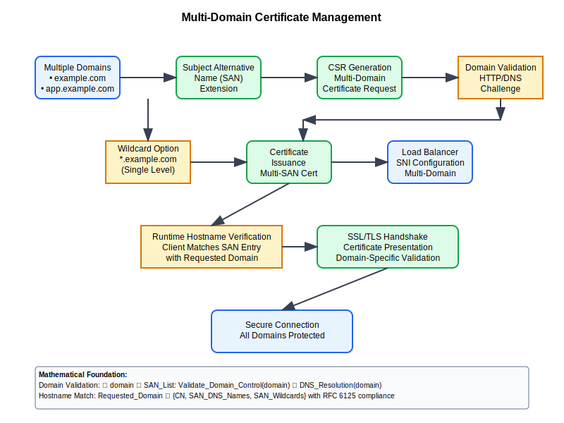

# Multi-Domain Certificates Workflow



## Scenario Overview

**Organization**: CloudScale Enterprises  
**Project**: Managing certificates across multiple domains, subdomains, and wildcard scenarios  
**Context**: Complex domain structures, certificate consolidation, and automated domain validation  
**Timeline**: Multi-domain certificate deployment, validation automation, and lifecycle management

## The Challenge

CloudScale Enterprises needs to:
- Manage certificates for hundreds of domains and subdomains
- Implement wildcard certificates for dynamic subdomain scenarios
- Support Subject Alternative Name (SAN) certificates for multiple domains
- Automate domain validation across different domain registrars
- Balance security with certificate management complexity
- Ensure proper certificate scope and name constraints

## PKI Workflow Solution

### Mathematical Foundation

Multi-domain certificates use Subject Alternative Names and name constraints:

```
Subject Alternative Name Structure:
SAN_Extension = {
    DNS_Names: [example.com, www.example.com, api.example.com],
    Wildcard_Names: [*.dev.example.com, *.staging.example.com],
    IP_Addresses: [203.0.113.1, 203.0.113.2]
}

Name Constraints Validation:
Domain_Match = (Subject_CN ∈ Permitted_Domains) ∨ 
               (SAN_DNS ∈ Permitted_Domains) ∧
               (Domain ∉ Excluded_Domains)

Certificate Scope Optimization:
Certificate_Coverage = Minimize(Cert_Count) ∧ 
                      Maximize(Domain_Coverage) ∧
                      Maintain(Security_Boundaries)
```

## Step-by-Step Workflow

### Phase 1: Domain Analysis and Certificate Planning

```python
def analyze_domain_structure(domain_list):
    """Analyze domains to optimize certificate allocation"""
    
    domain_groups = {}
    wildcard_candidates = []
    
    for domain in domain_list:
        # Group domains by root domain
        root_domain = extract_root_domain(domain)
        if root_domain not in domain_groups:
            domain_groups[root_domain] = []
        domain_groups[root_domain].append(domain)
        
        # Identify wildcard opportunities
        subdomains = get_subdomains(domain)
        if len(subdomains) > 5:  # Threshold for wildcard consideration
            wildcard_candidates.append(f"*.{root_domain}")
    
    return optimize_certificate_strategy(domain_groups, wildcard_candidates)
```

### Phase 2: Multi-Domain Certificate Generation

```bash
# Generate multi-domain certificate with SAN
cat > multi-domain.conf << EOF
[req]
distinguished_name = req_distinguished_name
req_extensions = v3_req

[req_distinguished_name]
CN = example.com

[v3_req]
basicConstraints = CA:FALSE
keyUsage = nonRepudiation, digitalSignature, keyEncipherment
subjectAltName = @alt_names

[alt_names]
DNS.1 = example.com
DNS.2 = www.example.com
DNS.3 = api.example.com
DNS.4 = app.example.com
DNS.5 = *.dev.example.com
DNS.6 = *.staging.example.com
IP.1 = 203.0.113.1
EOF

# Generate certificate request
openssl req -new -key multi-domain.key -out multi-domain.csr -config multi-domain.conf

# Issue multi-domain certificate
openssl ca -config ca.conf -extensions v3_req -days 365 \
    -notext -batch -in multi-domain.csr -out multi-domain.crt
```

### Phase 3: Automated Domain Validation

```bash
# ACME protocol domain validation for multiple domains
certbot certonly --manual --preferred-challenges dns \
    --email admin@cloudscale.com \
    --server https://acme-v02.api.letsencrypt.org/directory \
    --agree-tos \
    -d example.com \
    -d www.example.com \
    -d api.example.com \
    -d app.example.com \
    -d "*.dev.example.com" \
    -d "*.staging.example.com"

# Automated DNS challenge validation
#!/bin/bash
validate_domains() {
    for domain in "$@"; do
        # Create DNS TXT record for validation
        create_dns_txt_record "_acme-challenge.$domain" "$ACME_CHALLENGE"
        
        # Wait for DNS propagation
        wait_for_dns_propagation "$domain"
        
        # Validate domain ownership
        validate_domain_ownership "$domain"
    done
}
```

## Security Considerations

- **Scope Limitation**: Careful SAN selection to minimize certificate scope
- **Wildcard Security**: Understanding wildcard certificate implications
- **Domain Validation**: Robust validation for all included domains
- **Certificate Monitoring**: Tracking usage across multiple domains

## Navigation

**Previous**: [Document Signing](../12-document-signing/README.md) 📄  
**Next**: [Certificate Transparency](../14-certificate-transparency/README.md) 🔍  
**Home**: [PKI Use Cases](../README.md) 🏠