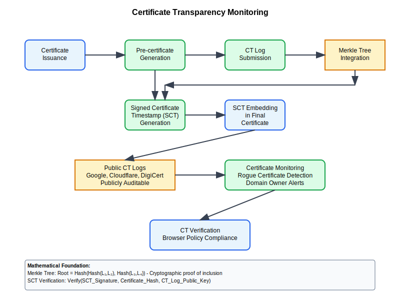

# Certificate Transparency Workflow



## Scenario Overview

**Organization**: TrustGuard Security  
**Project**: Implementing Certificate Transparency (CT) monitoring and compliance system  
**Context**: Public certificate monitoring, rogue certificate detection, and regulatory compliance  
**Timeline**: CT log integration, monitoring system deployment, and automated threat detection

## The Challenge

TrustGuard Security needs to:
- Monitor Certificate Transparency logs for unauthorized certificates
- Implement automated detection of rogue or misissued certificates
- Ensure compliance with CT requirements for publicly trusted certificates
- Integrate CT monitoring with existing security operations center (SOC)
- Provide certificate issuance transparency and public audit capabilities
- Handle high-volume CT log processing and analysis

## PKI Workflow Solution

### Mathematical Foundation

Certificate Transparency uses Merkle tree structures for tamper-evident logs:

```
Merkle Tree Construction:
Leaf_Node = SHA-256(Certificate_Entry)
Internal_Node = SHA-256(Left_Child + Right_Child)
Tree_Head = Root_Hash_of_Merkle_Tree

Certificate Entry Format:
CT_Entry = {
    certificate: DER_encoded_certificate,
    timestamp: submission_timestamp,
    extensions: ct_extensions,
    signature: SCT_signature
}

Signed Certificate Timestamp (SCT):
SCT = CT_Log_Sign(timestamp + certificate_hash + log_id)
SCT_Verification = Verify_CT_Log_Key(SCT, certificate_data)

Inclusion Proof:
Proof = Merkle_Path_from_Leaf_to_Root
Verify_Inclusion = Verify_Merkle_Path(certificate, proof, tree_head)
```

## Step-by-Step Workflow

### Phase 1: CT Log Monitoring Setup

```python
def setup_ct_monitoring():
    """Setup Certificate Transparency log monitoring"""
    
    ct_logs = [
        'https://ct.googleapis.com/logs/argon2024/',
        'https://ct.cloudflare.com/logs/nimbus2024/',
        'https://ct.digicert.com/log/',
        'https://ct.trust-provider.com/'
    ]
    
    for log_url in ct_logs:
        # Get current tree head
        tree_head = get_ct_tree_head(log_url)
        
        # Start monitoring from current position
        start_monitoring_ct_log(log_url, tree_head['tree_size'])
        
        # Setup webhook for new entries
        register_ct_webhook(log_url, callback_url)
    
    return monitoring_status
```

### Phase 2: Automated Certificate Detection

```bash
# CT log certificate monitoring script
#!/bin/bash

monitor_ct_logs() {
    local domain_watchlist="watchlist.txt"
    local ct_api_key="$CT_API_KEY"
    
    # Query CT logs for domain matches
    while read -r domain; do
        echo "Monitoring certificates for: $domain"
        
        # Search CT logs via API
        curl -s -H "Authorization: Bearer $ct_api_key" \
            "https://crt.sh/?q=$domain&output=json" | \
            jq -r '.[] | select(.not_after > now) | .common_name' | \
            while read -r cert_cn; do
                # Check if certificate is authorized
                if ! authorized_certificate "$cert_cn" "$domain"; then
                    alert_rogue_certificate "$cert_cn" "$domain"
                fi
            done
    done < "$domain_watchlist"
}

# Alert on unauthorized certificates
alert_rogue_certificate() {
    local cert_cn=$1
    local domain=$2
    
    echo "ALERT: Unauthorized certificate detected"
    echo "Certificate CN: $cert_cn"
    echo "Domain: $domain"
    echo "Timestamp: $(date -u)"
    
    # Send to SIEM/SOC
    send_security_alert "rogue_certificate" "$cert_cn" "$domain"
}
```

### Phase 3: CT Compliance Verification

```python
def verify_ct_compliance(certificate_path):
    """Verify certificate CT compliance"""
    
    with open(certificate_path, 'rb') as cert_file:
        certificate = x509.load_pem_x509_certificate(cert_file.read())
    
    # Check for SCT extension
    try:
        sct_extension = certificate.extensions.get_extension_for_oid(
            x509.oid.ExtensionOID.PRECERT_SIGNED_CERTIFICATE_TIMESTAMPS
        ).value
        
        scts = parse_sct_extension(sct_extension)
        
        compliance_result = {
            'has_scts': len(scts) > 0,
            'sct_count': len(scts),
            'valid_scts': [],
            'invalid_scts': []
        }
        
        # Validate each SCT
        for sct in scts:
            if verify_sct_signature(sct, certificate):
                compliance_result['valid_scts'].append(sct)
            else:
                compliance_result['invalid_scts'].append(sct)
        
        # Check CT policy compliance
        compliance_result['ct_compliant'] = (
            len(compliance_result['valid_scts']) >= 2 and  # Minimum 2 SCTs
            has_diverse_log_operators(compliance_result['valid_scts'])
        )
        
        return compliance_result
        
    except x509.ExtensionNotFound:
        return {'has_scts': False, 'ct_compliant': False}
```

## Security Considerations

- **Log Diversity**: Using multiple CT logs from different operators
- **Real-time Monitoring**: Continuous monitoring for timely threat detection
- **False Positive Management**: Filtering legitimate certificate issuances
- **Incident Response**: Automated response to rogue certificate detection

## Navigation

**Previous**: [Multi-Domain Certificates](../13-multi-domain-certificates/README.md) 🌐  
**Next**: [Revocation Management](../15-revocation-management/README.md) ❌  
**Home**: [PKI Use Cases](../README.md) 🏠