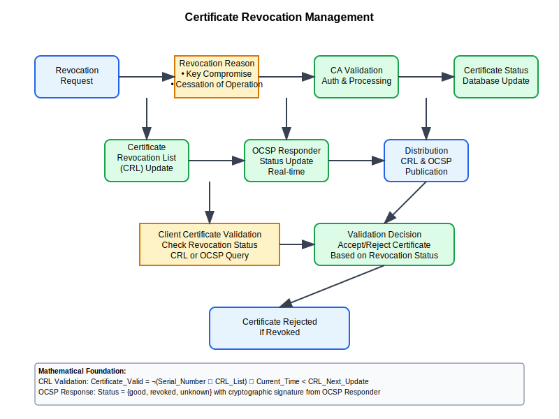

# Revocation Management Workflow



## Scenario Overview

**Organization**: CertGuard Security Services  
**Project**: Comprehensive certificate revocation and status management system  
**Context**: CRL distribution, OCSP deployment, revocation checking optimization, and emergency response  
**Timeline**: Revocation infrastructure setup, status distribution, and performance optimization

## The Challenge

CertGuard Security Services needs to:
- Implement scalable certificate revocation status distribution
- Deploy high-performance OCSP responders for real-time status checking
- Handle emergency certificate revocation scenarios
- Optimize revocation checking performance for high-volume applications
- Ensure revocation status availability and reliability
- Support both CRL and OCSP protocols with fallback mechanisms

## PKI Workflow Solution

### Mathematical Foundation

Revocation management combines CRL distribution with OCSP real-time checking:

```
Certificate Revocation List (CRL):
CRL_Entry = {certificate_serial, revocation_date, reason_code}
CRL = Sign_CA_Key(CRL_Header + CRL_Entries + Next_Update)
CRL_Validation = Verify_CA_Signature(CRL) ∧ (Current_Time < Next_Update)

Online Certificate Status Protocol (OCSP):
OCSP_Request = {certificate_serial, issuer_name_hash, issuer_key_hash}
OCSP_Response = Sign_OCSP_Key(cert_status + this_update + next_update)
Status_Check = (Certificate_Status ∈ {good, revoked, unknown})

Revocation Performance Optimization:
Cache_Hit_Ratio = OCSP_Cache_Hits / Total_Status_Requests
Response_Time = Minimize(OCSP_Lookup_Time + Network_Latency)
```

## Step-by-Step Workflow

### Phase 1: Revocation Infrastructure Setup

```bash
# Setup OCSP responder
ca-admin@ocsp-server:~$ cat > ocsp.conf << EOF
[ocsp]
ca_cert = ca.crt
ca_key = ca.key
cert = ocsp.crt
key = ocsp.key
port = 2560
timeout = 300
cache_expiry = 3600
EOF

# Start OCSP responder
ca-admin@ocsp-server:~$ openssl ocsp -port 2560 -text -sha256 \
    -index index.txt -CA ca.crt -rkey ocsp.key -rsigner ocsp.crt \
    -nrequest 1000 -daemon

# Generate and distribute CRL
ca-admin@ca-server:~$ openssl ca -config ca.conf -gencrl -out ca.crl
ca-admin@ca-server:~$ rsync -av ca.crl webserver:/var/www/crl/
```

### Phase 2: Certificate Revocation Process

```python
def revoke_certificate(certificate_serial, reason_code="unspecified"):
    """Revoke certificate and update distribution points"""
    
    import datetime
    
    # Add to revocation database
    revocation_entry = {
        'serial_number': certificate_serial,
        'revocation_date': datetime.datetime.utcnow(),
        'reason_code': reason_code,
        'status': 'revoked'
    }
    
    # Update certificate database
    update_certificate_database(revocation_entry)
    
    # Generate new CRL
    generate_updated_crl()
    
    # Update OCSP responder cache
    update_ocsp_cache(certificate_serial, 'revoked')
    
    # Distribute to CDPs
    distribute_revocation_status()
    
    # Emergency notification if critical certificate
    if is_critical_certificate(certificate_serial):
        send_emergency_revocation_notice(certificate_serial)
    
    return revocation_entry
```

### Phase 3: High-Performance Status Checking

```bash
# OCSP stapling configuration (nginx)
cat > ocsp-stapling.conf << EOF
ssl_stapling on;
ssl_stapling_verify on;
ssl_trusted_certificate /etc/ssl/ca-chain.pem;
resolver 8.8.8.8 8.8.4.4 valid=300s;
resolver_timeout 5s;
EOF

# Automated revocation checking
#!/bin/bash
check_certificate_status() {
    local cert_file=$1
    local ocsp_url=$2
    
    # Extract OCSP URL if not provided
    if [ -z "$ocsp_url" ]; then
        ocsp_url=$(openssl x509 -in "$cert_file" -noout -ocsp_uri)
    fi
    
    # Check certificate status via OCSP
    openssl ocsp -issuer ca.crt -cert "$cert_file" \
        -url "$ocsp_url" -CAfile ca-chain.pem \
        -resp_text -noverify
    
    local status=$?
    
    # Fallback to CRL if OCSP fails
    if [ $status -ne 0 ]; then
        echo "OCSP failed, checking CRL..."
        check_certificate_in_crl "$cert_file"
    fi
    
    return $status
}
```

### Phase 4: Performance Monitoring and Optimization

```python
def monitor_revocation_performance():
    """Monitor and optimize revocation checking performance"""
    
    metrics = {
        'ocsp_response_time': measure_ocsp_response_time(),
        'crl_download_time': measure_crl_download_time(),
        'cache_hit_ratio': calculate_cache_hit_ratio(),
        'error_rate': calculate_revocation_error_rate()
    }
    
    # Optimize based on metrics
    if metrics['cache_hit_ratio'] < 0.8:
        increase_cache_size()
        extend_cache_ttl()
    
    if metrics['ocsp_response_time'] > 1000:  # ms
        scale_ocsp_responders()
        implement_load_balancing()
    
    if metrics['error_rate'] > 0.05:  # 5%
        investigate_revocation_failures()
        improve_fallback_mechanisms()
    
    return metrics
```

## Security Considerations

- **High Availability**: Redundant OCSP responders and CRL distribution
- **Performance Optimization**: Caching and load balancing for scale
- **Emergency Response**: Rapid revocation propagation for security incidents
- **Fallback Mechanisms**: CRL fallback when OCSP is unavailable

## Navigation

**Previous**: [Certificate Transparency](../14-certificate-transparency/README.md) 🔍  
**Next**: [Cross Certification](../16-cross-certification/README.md) 🔗  
**Home**: [PKI Use Cases](../README.md) 🏠