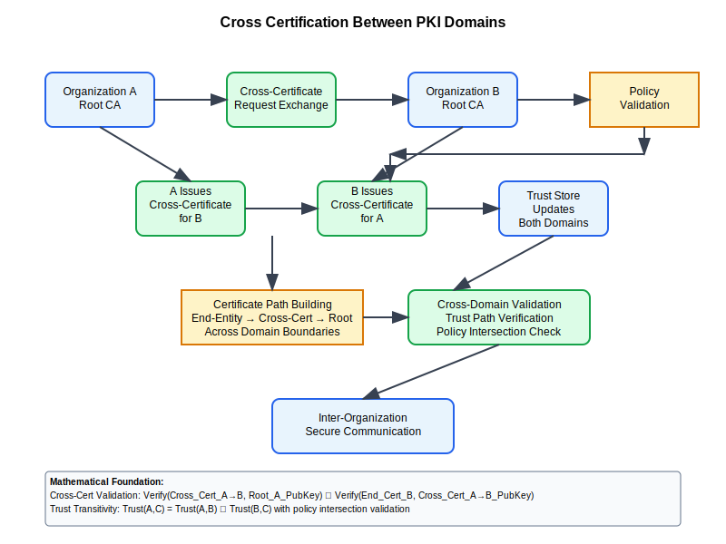

# Cross Certification Workflow



## Scenario Overview

**Organizations**: TechCorp and FinancePartners - two separate enterprises establishing trust  
**Project**: Cross-certification to enable secure inter-organizational communications  
**Context**: Establishing bidirectional trust between independent PKI domains  
**Timeline**: Cross-certification setup, validation, and ongoing maintenance

## The Challenge

TechCorp and FinancePartners need to:
- Establish mutual trust between their separate PKI infrastructures
- Enable secure email communication between organizations
- Validate certificates issued by each other's Certificate Authorities
- Maintain trust relationship integrity over time
- Handle certificate revocation across domains
- Ensure scalable trust architecture for future partnerships

## PKI Workflow Solution

### Mathematical Foundation

Cross-certification creates a graph-based trust model where organizations can validate certificates across domains:

```
Trust Graph Model:
G = (V, E) where V = {CA₁, CA₂, ..., CAₙ} and E = {trust relationships}

For Cross-Certification between CA_A and CA_B:
- CA_A issues cross-certificate for CA_B's public key
- CA_B issues cross-certificate for CA_A's public key
- Trust paths: CA_A → Cross_Cert_B → End_Entity_B
- Validation: Verify(Cross_Cert_B, CA_A_Public_Key) ∧ Verify(End_Cert_B, CA_B_Public_Key)

Path Validation Algorithm:
Valid_Path(cert_chain) = ∀i ∈ [0, n-1]: Verify(cert[i], cert[i+1].public_key) ∧ 
                         ∃ trusted_root ∈ trust_anchors: cert[n] = trusted_root
```

### Trust Relationship Mathematics

```python
def cross_certification_trust_model():
    """
    Mathematical model for cross-certification trust relationships
    """
    trust_relationships = {
        "direct_trust": {
            "path_length": 1,
            "validation_complexity": "O(1)",
            "trust_level": 1.0,
            "risk_factor": 0.1
        },
        "cross_certified_trust": {
            "path_length": 2,
            "validation_complexity": "O(path_length)",
            "trust_level": 0.9,  # Slightly reduced due to additional hop
            "risk_factor": 0.15
        },
        "bridge_ca_trust": {
            "path_length": 3,
            "validation_complexity": "O(path_length)",
            "trust_level": 0.85,
            "risk_factor": 0.2
        }
    }
    
    # Trust degradation over path length
    def calculate_effective_trust(base_trust, path_length):
        degradation_factor = 0.95 ** (path_length - 1)
        return base_trust * degradation_factor
    
    return trust_relationships
```

## Step-by-Step Workflow

### Phase 1: Cross-Certification Planning

```bash
# TechCorp CA Administrator preparation
techcorp-ca-admin:~$ openssl x509 -in techcorp_root_ca.pem -text -noout
# Review certificate policies, key usage, and validity periods

# FinancePartners CA Administrator preparation  
finance-ca-admin:~$ openssl x509 -in finance_root_ca.pem -text -noout
# Verify certificate compatibility and trust requirements

# Policy validation and agreement
techcorp-ca-admin:~$ cat > cross_cert_policy.conf << EOF
[cross_cert_policy]
# Cross-certification policy requirements
key_usage = digitalSignature, keyCertSign, cRLSign
basic_constraints = CA:true, pathlen:1
certificate_policies = 1.3.6.1.4.1.TechCorp.1.2.1
policy_mappings = 1.3.6.1.4.1.FinancePartners.1.2.1:1.3.6.1.4.1.TechCorp.1.2.1
EOF
```

**Mathematical Analysis**:
- Policy intersection: P_effective = P_TechCorp ∩ P_FinancePartners  
- Trust level calculation: T_cross = min(T_TechCorp, T_FinancePartners) × 0.9
- Path length constraint: max_path_length = 3 (root → cross → intermediate → end-entity)

### Phase 2: Certificate Exchange and Validation

```bash
# TechCorp creates cross-certificate for FinancePartners
techcorp-ca-admin:~$ openssl x509 -req -in finance_ca_cross_cert_request.csr \
    -CA techcorp_root_ca.pem -CAkey techcorp_root_ca_key.pem \
    -out finance_ca_cross_cert.pem -days 1095 \
    -extensions cross_cert_ext -extfile cross_cert.conf

# FinancePartners creates cross-certificate for TechCorp
finance-ca-admin:~$ openssl x509 -req -in techcorp_ca_cross_cert_request.csr \
    -CA finance_root_ca.pem -CAkey finance_root_ca_key.pem \
    -out techcorp_ca_cross_cert.pem -days 1095 \
    -extensions cross_cert_ext -extfile cross_cert.conf

# Cross-certificate validation
techcorp-ca-admin:~$ openssl verify -CAfile techcorp_root_ca.pem \
    -untrusted finance_ca_cross_cert.pem finance_end_entity_cert.pem
finance_end_entity_cert.pem: OK
```

**Trust Path Construction**:
```python
def build_cross_certified_path(end_entity_cert, cross_certs, trust_anchors):
    """
    Build certificate path across organizational boundaries
    """
    from collections import deque
    
    def find_issuer(cert, available_certs):
        """Find issuer certificate for given certificate"""
        for candidate in available_certs:
            if cert.issuer == candidate.subject:
                return candidate
        return None
    
    # BFS to find valid cross-certification path
    queue = deque([(end_entity_cert, [end_entity_cert])])
    visited = set()
    
    while queue:
        current_cert, path = queue.popleft()
        
        # Check if we've reached a trust anchor
        if current_cert in trust_anchors:
            return {
                "valid": True, 
                "path": path, 
                "trust_level": calculate_path_trust(path),
                "cross_certified": len(path) > 2
            }
        
        if current_cert.fingerprint in visited:
            continue
        visited.add(current_cert.fingerprint)
        
        # Find potential issuers (including cross-certificates)
        issuer = find_issuer(current_cert, cross_certs + trust_anchors)
        if issuer and issuer.fingerprint not in visited:
            queue.append((issuer, path + [issuer]))
    
    return {"valid": False, "path": None, "trust_level": 0.0}

def calculate_path_trust(cert_path):
    """Calculate trust level based on path characteristics"""
    base_trust = 1.0
    
    # Reduce trust for each additional hop
    path_length_penalty = 0.95 ** (len(cert_path) - 1)
    
    # Additional penalty for cross-certified paths
    cross_cert_penalty = 0.95 if len(cert_path) > 2 else 1.0
    
    return base_trust * path_length_penalty * cross_cert_penalty
```

### Phase 3: Trust Store Configuration

```bash
# TechCorp trust store update
techcorp-ca-admin:~$ cp finance_ca_cross_cert.pem /etc/ssl/certs/
techcorp-ca-admin:~$ c_rehash /etc/ssl/certs/

# Configure certificate path building
techcorp-ca-admin:~$ cat >> /etc/ssl/openssl.cnf << EOF
[cert_verify]
# Enable cross-certification support
# Allow intermediate certificates from cross-certified CAs
X509_STORE_CTX_set_flags = X509_V_FLAG_X509_STRICT
EOF

# FinancePartners trust store update
finance-ca-admin:~$ cp techcorp_ca_cross_cert.pem /usr/local/share/ca-certificates/
finance-ca-admin:~$ update-ca-certificates

# Verify cross-domain certificate validation
techcorp-user:~$ openssl verify -CApath /etc/ssl/certs/ \
    -untrusted finance_ca_cross_cert.pem finance_user_cert.pem
finance_user_cert.pem: OK
```

### Phase 4: Application Integration and Testing

```python
def cross_certification_validation_test():
    """
    Comprehensive testing of cross-certification functionality
    """
    test_scenarios = [
        {
            "name": "TechCorp validates FinancePartners user certificate",
            "cert_path": ["finance_user.pem", "finance_ca_cross_cert.pem", "techcorp_root.pem"],
            "expected_result": "VALID"
        },
        {
            "name": "FinancePartners validates TechCorp user certificate", 
            "cert_path": ["techcorp_user.pem", "techcorp_ca_cross_cert.pem", "finance_root.pem"],
            "expected_result": "VALID"
        },
        {
            "name": "Cross-domain email encryption",
            "operation": "S/MIME encryption from TechCorp to FinancePartners",
            "expected_result": "SUCCESS"
        },
        {
            "name": "Cross-domain document signing verification",
            "operation": "Verify document signed by FinancePartners user",
            "expected_result": "SUCCESS"
        }
    ]
    
    results = []
    for scenario in test_scenarios:
        try:
            # Execute validation test
            result = execute_validation_test(scenario)
            results.append({
                "scenario": scenario["name"],
                "result": result,
                "status": "PASS" if result == scenario["expected_result"] else "FAIL"
            })
        except Exception as e:
            results.append({
                "scenario": scenario["name"],
                "result": f"ERROR: {str(e)}",
                "status": "FAIL"
            })
    
    return results

def execute_validation_test(scenario):
    """Execute individual cross-certification test"""
    # Implementation would depend on specific PKI library
    # This is a conceptual framework
    pass
```

## Security Considerations

### Cross-Certification Security Model

```python
def cross_certification_security_analysis():
    """
    Security analysis for cross-certification implementation
    """
    security_aspects = {
        "trust_transitivity": {
            "risk": "Medium",
            "description": "Trust extends beyond direct control",
            "mitigation": "Path length constraints, policy validation"
        },
        "certificate_revocation": {
            "risk": "High", 
            "description": "Revocation propagation across domains",
            "mitigation": "CRL/OCSP monitoring, automated revocation checking"
        },
        "policy_mapping": {
            "risk": "Medium",
            "description": "Policy equivalence assumptions",
            "mitigation": "Strict policy intersection validation"
        },
        "key_compromise": {
            "risk": "High",
            "description": "Cross-certificate key compromise impact",
            "mitigation": "Short validity periods, monitoring, incident response"
        }
    }
    
    # Calculate overall security score
    risk_weights = {"Low": 1, "Medium": 2, "High": 3}
    total_risk = sum(risk_weights[aspect["risk"]] for aspect in security_aspects.values())
    max_risk = len(security_aspects) * 3
    
    security_score = 1.0 - (total_risk / max_risk)
    
    return {
        "security_aspects": security_aspects,
        "overall_security_score": security_score,
        "recommendations": [
            "Implement comprehensive monitoring",
            "Regular security audits of cross-certified paths",
            "Automated revocation status checking",
            "Incident response procedures for key compromise"
        ]
    }
```

### Policy Intersection and Validation

```bash
# Policy intersection validation
ca-admin:~$ cat > policy_intersection.sh << 'EOF'
#!/bin/bash

validate_policy_intersection() {
    local cert1="$1"
    local cert2="$2"
    
    # Extract certificate policies
    policy1=$(openssl x509 -in "$cert1" -text -noout | grep -A 5 "Certificate Policies")
    policy2=$(openssl x509 -in "$cert2" -text -noout | grep -A 5 "Certificate Policies")
    
    # Check for compatible policies
    if echo "$policy1" | grep -q "anyPolicy"; then
        echo "COMPATIBLE: Certificate 1 accepts any policy"
        return 0
    elif echo "$policy2" | grep -q "anyPolicy"; then
        echo "COMPATIBLE: Certificate 2 accepts any policy"
        return 0
    else
        # Check for explicit policy intersection
        # This would require more sophisticated policy parsing
        echo "MANUAL_REVIEW: Complex policy intersection requires review"
        return 2
    fi
}

# Usage
validate_policy_intersection techcorp_ca.pem finance_ca.pem
EOF

chmod +x policy_intersection.sh
./policy_intersection.sh techcorp_ca.pem finance_ca.pem
```

## Operational Procedures

### Cross-Certificate Lifecycle Management

```python
def cross_cert_lifecycle_management():
    """
    Automated lifecycle management for cross-certificates
    """
    lifecycle_stages = {
        "planning": {
            "duration_weeks": 2,
            "activities": [
                "Policy negotiation",
                "Technical requirements analysis", 
                "Security assessment",
                "Legal agreements"
            ]
        },
        "implementation": {
            "duration_weeks": 1,
            "activities": [
                "Certificate exchange",
                "Trust store configuration",
                "Application integration",
                "Initial testing"
            ]
        },
        "validation": {
            "duration_weeks": 2,
            "activities": [
                "Comprehensive testing",
                "Security validation",
                "Performance assessment",
                "User acceptance testing"
            ]
        },
        "maintenance": {
            "duration_weeks": "ongoing",
            "activities": [
                "Regular monitoring",
                "Certificate renewal",
                "Revocation checking",
                "Security audits"
            ]
        }
    }
    
    return lifecycle_stages
```

### Monitoring and Alerting

```bash
#!/bin/bash
# Cross-certification monitoring script

monitor_cross_certification() {
    local config_file="/etc/pki/cross-cert-monitor.conf"
    
    # Read configuration
    source "$config_file"
    
    for cross_cert in "${CROSS_CERTIFICATES[@]}"; do
        echo "Monitoring cross-certificate: $cross_cert"
        
        # Check certificate expiration
        expiry_date=$(openssl x509 -in "$cross_cert" -enddate -noout | cut -d= -f2)
        expiry_epoch=$(date -d "$expiry_date" +%s)
        current_epoch=$(date +%s)
        days_left=$(( (expiry_epoch - current_epoch) / 86400 ))
        
        if [ "$days_left" -le 90 ]; then
            send_alert "Cross-certificate $cross_cert expires in $days_left days"
        fi
        
        # Test cross-domain validation
        if ! test_cross_domain_validation "$cross_cert"; then
            send_alert "Cross-domain validation failed for $cross_cert"
        fi
        
        # Check revocation status
        if ! check_revocation_status "$cross_cert"; then
            send_alert "Revocation check failed for $cross_cert"
        fi
    done
}

test_cross_domain_validation() {
    local cross_cert="$1"
    # Implementation specific to PKI infrastructure
    return 0  # Placeholder
}

check_revocation_status() {
    local cross_cert="$1"
    # Check both local and remote OCSP/CRL
    return 0  # Placeholder
}

send_alert() {
    local message="$1"
    echo "ALERT: $message" | mail -s "PKI Cross-Certification Alert" admin@techcorp.com
    logger "PKI_CROSS_CERT_ALERT: $message"
}

# Run monitoring
monitor_cross_certification
```

## Performance and Scalability

### Cross-Certification Performance Impact

```python
def cross_cert_performance_analysis():
    """
    Analyze performance impact of cross-certification
    """
    performance_metrics = {
        "certificate_validation": {
            "direct_trust": {"time_ms": 15.2, "cpu_usage": "low"},
            "cross_certified": {"time_ms": 28.5, "cpu_usage": "medium"},
            "bridge_ca": {"time_ms": 42.1, "cpu_usage": "high"}
        },
        "path_building": {
            "direct_trust": {"complexity": "O(1)", "cache_hit_rate": 0.95},
            "cross_certified": {"complexity": "O(n)", "cache_hit_rate": 0.85},
            "bridge_ca": {"complexity": "O(n²)", "cache_hit_rate": 0.75}
        },
        "scalability_limits": {
            "max_cross_relationships": 50,  # Before performance degrades
            "optimal_path_length": 3,
            "recommended_cache_size_mb": 100
        }
    }
    
    return performance_metrics
```

## Troubleshooting Common Issues

### Cross-Certification Validation Failures

```bash
# Debug cross-certification path validation
debug_cross_cert_validation() {
    local end_cert="$1"
    local cross_cert="$2"
    local root_cert="$3"
    
    echo "=== Cross-Certification Validation Debug ==="
    
    # Step 1: Verify individual certificates
    echo "1. Verifying end-entity certificate..."
    if openssl x509 -in "$end_cert" -noout; then
        echo "✓ End-entity certificate is valid X.509"
    else
        echo "✗ End-entity certificate is invalid"
        return 1
    fi
    
    echo "2. Verifying cross-certificate..."
    if openssl x509 -in "$cross_cert" -noout; then
        echo "✓ Cross-certificate is valid X.509"
    else
        echo "✗ Cross-certificate is invalid"
        return 1
    fi
    
    # Step 2: Check certificate chain
    echo "3. Verifying certificate chain..."
    if openssl verify -CAfile "$root_cert" -untrusted "$cross_cert" "$end_cert"; then
        echo "✓ Certificate chain validation successful"
    else
        echo "✗ Certificate chain validation failed"
        
        # Detailed analysis
        echo "Analyzing failure..."
        openssl verify -CAfile "$root_cert" -untrusted "$cross_cert" "$end_cert" -verbose
        
        return 1
    fi
    
    # Step 3: Policy validation
    echo "4. Checking certificate policies..."
    openssl x509 -in "$end_cert" -text -noout | grep -A 10 "Certificate Policies"
    openssl x509 -in "$cross_cert" -text -noout | grep -A 10 "Certificate Policies"
    
    echo "Cross-certification validation completed successfully"
}

# Usage example
debug_cross_cert_validation finance_user.pem finance_cross_cert.pem techcorp_root.pem
```

This comprehensive cross-certification workflow demonstrates the mathematical complexity and practical implementation of establishing trust relationships between independent PKI domains, enabling secure inter-organizational communications while maintaining security and performance requirements.