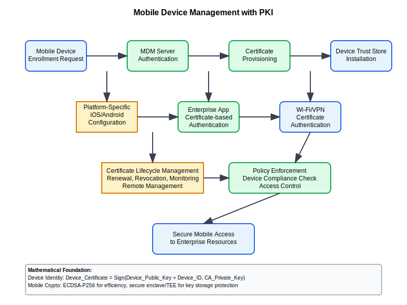

# Mobile Device Management (MDM) with PKI



## Scenario Overview

**Organization**: EnterpriseCorp implementing BYOD (Bring Your Own Device) policy  
**Challenge**: Secure mobile device access to corporate resources using PKI  
**Context**: Certificate-based authentication and encryption for mobile devices  
**Scale**: 5,000 mobile devices across iOS, Android, and Windows platforms

## The Challenge

EnterpriseCorp needs to:
- Securely provision certificates to mobile devices
- Manage device lifecycle (enrollment, renewal, revocation)
- Support multiple mobile platforms with unified PKI
- Integrate with existing Active Directory and MDM solutions
- Ensure compliance with corporate security policies
- Handle lost/stolen device scenarios

## Mathematical Foundation

Mobile PKI involves resource-constrained cryptography and efficient certificate management:

```
Mobile Cryptography Constraints:
- Battery Life: P_crypto ∝ key_size² (for RSA), P_crypto ∝ key_size (for ECC)
- Processing Power: T_operation = f(algorithm, key_size, hardware_acceleration)
- Storage: Certificate_size = base_size + extensions + chain_length
- Network: Bandwidth_usage = certificate_downloads + revocation_checks

Optimization Goal: min(P_crypto + T_operation) subject to security_level ≥ threshold
```

## Step-by-Step Workflow

### Phase 1: MDM Integration Setup

```bash
# Configure certificate authority for mobile devices
ca-admin:~$ openssl genrsa -out mobile_ca_key.pem 2048
ca-admin:~$ openssl req -new -x509 -key mobile_ca_key.pem -out mobile_ca.pem \
    -subj "/CN=EnterpriseCorp Mobile CA/O=EnterpriseCorp/C=US" -days 3650

# Create mobile device certificate template
ca-admin:~$ cat > mobile_cert.conf << EOF
[mobile_cert]
basicConstraints = CA:false
keyUsage = digitalSignature, keyEncipherment, keyAgreement
extendedKeyUsage = clientAuth, emailProtection
subjectAltName = @alt_names
[alt_names]
email.1 = \$ENV::DEVICE_EMAIL
URI.1 = \$ENV::DEVICE_ID
EOF
```

### Phase 2: Device Enrollment Process

```python
def mobile_device_enrollment():
    """
    Automated mobile device certificate enrollment
    """
    enrollment_flow = {
        "device_registration": {
            "user_authentication": "Active Directory LDAP",
            "device_identification": "UDID/Serial Number",
            "policy_validation": "Device compliance check"
        },
        "certificate_generation": {
            "key_generation": "On-device (Secure Enclave/TEE)",
            "csr_creation": "PKCS#10 format",
            "ca_signing": "Automated via SCEP/EST protocol"
        },
        "certificate_installation": {
            "delivery_method": "MDM push/Over-the-air",
            "keychain_integration": "Platform-specific storage",
            "trust_store_update": "Automatic"
        }
    }
    return enrollment_flow
```

### Phase 3: Multi-Platform Implementation

```bash
# iOS Certificate Deployment (via Apple Configurator/MDM)
ios-admin:~$ cat > ios_certificate_profile.mobileconfig << EOF
<?xml version="1.0" encoding="UTF-8"?>
<plist version="1.0">
<dict>
    <key>PayloadType</key>
    <string>Configuration</string>
    <key>PayloadContent</key>
    <array>
        <dict>
            <key>PayloadType</key>
            <string>com.apple.security.pkcs12</string>
            <key>Password</key>
            <string>DEVICE_SPECIFIC_PASSWORD</string>
            <key>PayloadCertificateFileName</key>
            <string>mobile_device_cert.p12</string>
        </dict>
    </array>
</dict>
</plist>
EOF

# Android Certificate Management
android-admin:~$ adb install certificate_manager.apk
android-admin:~$ adb shell am start -a com.enterprise.INSTALL_CERTIFICATE \
    --es certificate_data "$(base64 mobile_cert.p12)"
```

## Security Analysis

```python
def mobile_security_assessment():
    """
    Security analysis for mobile PKI deployment
    """
    security_factors = {
        "key_storage": {
            "ios": {"secure_enclave": 0.95, "keychain": 0.85},
            "android": {"hardware_keystore": 0.90, "software_keystore": 0.70},
            "windows": {"tpm": 0.90, "software_store": 0.75}
        },
        "attack_vectors": {
            "device_theft": {"risk": 0.3, "mitigation": "Remote wipe + cert revocation"},
            "malware": {"risk": 0.4, "mitigation": "App sandboxing + cert validation"},
            "network_interception": {"risk": 0.2, "mitigation": "Certificate pinning"}
        },
        "compliance_requirements": {
            "certificate_lifetime": "1 year maximum",
            "key_strength": "RSA-2048 or ECDSA-P256 minimum",
            "revocation_checking": "OCSP required"
        }
    }
    return security_factors
```

## Performance Optimization

```python
def mobile_performance_optimization():
    """
    Performance optimization for mobile PKI
    """
    optimizations = {
        "algorithm_selection": {
            "recommended": "ECDSA-P256",
            "rationale": "Lower battery consumption, faster operations",
            "performance_gain": "3x faster than RSA-2048"
        },
        "certificate_caching": {
            "local_cache_ttl": 3600,  # 1 hour
            "intermediate_cert_caching": True,
            "revocation_cache_ttl": 1800  # 30 minutes
        },
        "network_optimization": {
            "certificate_bundling": "Combine cert + intermediates",
            "compression": "GZIP for large certificate chains",
            "delta_updates": "Only send changed certificates"
        }
    }
    return optimizations
```

## Operational Procedures

### Device Lifecycle Management

```bash
#!/bin/bash
# Mobile device certificate lifecycle management

manage_mobile_certificates() {
    local action="$1"
    local device_id="$2"
    
    case "$action" in
        "enroll")
            echo "Enrolling device: $device_id"
            generate_device_certificate "$device_id"
            deploy_certificate_to_device "$device_id"
            ;;
        "renew")
            echo "Renewing certificate for device: $device_id"
            check_certificate_expiry "$device_id"
            if certificate_expires_soon "$device_id"; then
                generate_device_certificate "$device_id"
                update_certificate_on_device "$device_id"
            fi
            ;;
        "revoke")
            echo "Revoking certificate for device: $device_id"
            revoke_device_certificate "$device_id"
            update_crl
            notify_device_of_revocation "$device_id"
            ;;
        "audit")
            echo "Auditing device certificates"
            audit_device_certificates
            ;;
    esac
}
```

### Monitoring and Compliance

```python
def mobile_pki_monitoring():
    """
    Monitoring framework for mobile PKI deployment
    """
    monitoring_metrics = {
        "enrollment_success_rate": {"target": 95, "current": 0},
        "certificate_validation_latency": {"target": 500, "unit": "ms"},
        "device_compliance_rate": {"target": 98, "current": 0},
        "revocation_propagation_time": {"target": 300, "unit": "seconds"}
    }
    
    alerts = [
        {"condition": "enrollment_failures > 5%", "severity": "WARNING"},
        {"condition": "cert_validation_time > 1s", "severity": "CRITICAL"},
        {"condition": "non_compliant_devices > 2%", "severity": "WARNING"}
    ]
    
    return {"metrics": monitoring_metrics, "alerts": alerts}
```

## Troubleshooting Common Issues

### Certificate Installation Failures

```bash
# iOS troubleshooting
debug_ios_cert_install() {
    local device_udid="$1"
    
    echo "Checking iOS certificate installation..."
    # Check MDM enrollment status
    mdm_status=$(cfgutil --ecid "$device_udid" get enrollmentState)
    
    if [ "$mdm_status" != "Enrolled" ]; then
        echo "Device not properly enrolled in MDM"
        return 1
    fi
    
    # Verify certificate profile delivery
    profile_status=$(cfgutil --ecid "$device_udid" list-profiles | grep "Enterprise Cert")
    if [ -z "$profile_status" ]; then
        echo "Certificate profile not delivered"
        return 1
    fi
    
    echo "Certificate installation appears successful"
}

# Android troubleshooting  
debug_android_cert_install() {
    local device_serial="$1"
    
    echo "Checking Android certificate installation..."
    adb -s "$device_serial" shell settings get secure certificate_management_enabled
    
    # Check certificate store
    cert_count=$(adb -s "$device_serial" shell ls /data/misc/keystore/user_0/ | wc -l)
    echo "Certificates in keystore: $cert_count"
}
```

## Integration Examples

### Email Security Integration

```python
def integrate_mobile_email_security():
    """
    Integration with mobile email clients for S/MIME
    """
    email_integration = {
        "ios_mail": {
            "s_mime_support": True,
            "certificate_source": "iOS Keychain",
            "configuration": "Automatic via MDM profile"
        },
        "android_gmail": {
            "s_mime_support": True,
            "certificate_source": "Android Keystore", 
            "configuration": "Manual user setup required"
        },
        "outlook_mobile": {
            "s_mime_support": True,
            "certificate_source": "Platform keystore",
            "configuration": "Enterprise app policy"
        }
    }
    return email_integration
```

### VPN Integration

```bash
# Mobile VPN with certificate authentication
configure_mobile_vpn() {
    cat > mobile_vpn_profile.ovpn << EOF
client
dev tun
proto udp
remote vpn.enterprise.com 1194

# Certificate-based authentication
cert mobile_device.crt
key mobile_device.key
ca enterprise_ca.crt

# Mobile-optimized settings
compress lzo
keepalive 10 120
resolv-retry infinite
nobind
EOF
}
```

This simplified mobile device management workflow provides the essential PKI components needed for secure mobile device integration while maintaining focus on practical implementation and mathematical foundations specific to mobile cryptography constraints.