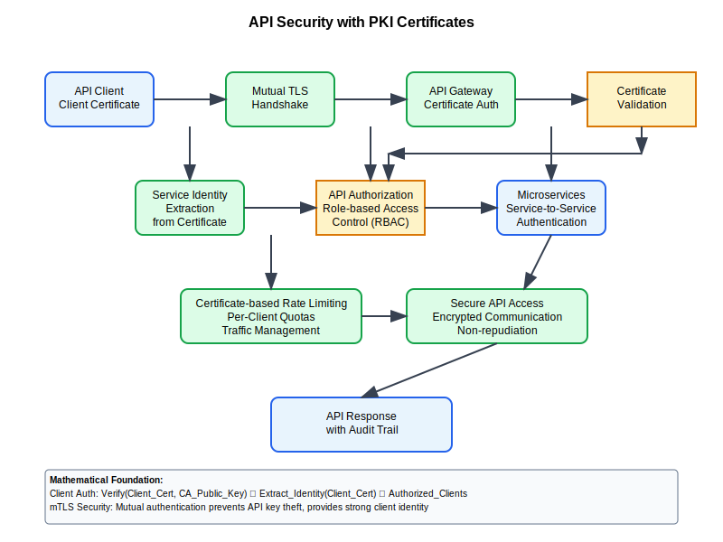

# API Security with PKI Certificates



## Scenario Overview

**Organization**: CloudTech microservices architecture  
**Challenge**: Secure API communication using mutual TLS and client certificates  
**Context**: Service-to-service authentication and API access control  
**Scale**: 200 microservices, 10,000+ API calls per second

## The Challenge

CloudTech needs to:
- Authenticate API clients using certificates instead of API keys
- Implement mutual TLS for service-to-service communication
- Manage certificate lifecycle for automated systems
- Integrate with service mesh and container orchestration
- Ensure API rate limiting and access control based on certificate identity
- Support certificate-based OAuth 2.0 flows

## Mathematical Foundation

API security with PKI involves high-frequency certificate validation and efficient authentication:

```
API Authentication Performance:
- Validation Rate: R = requests_per_second
- Certificate Validation Time: T_cert = signature_verification + chain_building + revocation_check
- System Throughput: Throughput = min(R, 1/T_cert)
- Cache Hit Rate: H = cached_validations / total_validations

Performance Optimization:
Effective_T_cert = T_cert × (1 - H) + T_cache × H

Where T_cache << T_cert for cached validations
```

## Step-by-Step Workflow

### Phase 1: API Certificate Authority Setup

```bash
# Create API-specific CA
api-ca-admin:~$ openssl genrsa -out api_ca_key.pem 4096
api-ca-admin:~$ openssl req -new -x509 -key api_ca_key.pem -out api_ca.pem \
    -subj "/CN=CloudTech API CA/O=CloudTech/OU=Platform/C=US" -days 3650

# Create API client certificate template
api-ca-admin:~$ cat > api_client.conf << EOF
[api_client]
basicConstraints = CA:false
keyUsage = digitalSignature, keyEncipherment
extendedKeyUsage = clientAuth
subjectAltName = @alt_names
[alt_names]
DNS.1 = \$ENV::SERVICE_NAME.cloudtech.internal
URI.1 = urn:service:\$ENV::SERVICE_NAME
EOF
```

### Phase 2: Automated Certificate Provisioning

```python
def api_certificate_provisioning():
    """
    Automated certificate provisioning for API services
    """
    provisioning_workflow = {
        "service_registration": {
            "discovery": "Kubernetes service discovery",
            "identity_validation": "Service account verification",
            "policy_check": "RBAC authorization"
        },
        "certificate_generation": {
            "key_generation": "Container startup automation",
            "csr_creation": "Service-specific subject names",
            "ca_signing": "Automated via SPIFFE/SPIRE"
        },
        "certificate_deployment": {
            "delivery": "Kubernetes secrets/HashiCorp Vault",
            "rotation": "Automated renewal via cert-manager",
            "distribution": "Service mesh sidecar injection"
        }
    }
    return provisioning_workflow

def generate_api_certificate(service_name, namespace):
    """Generate certificate for API service"""
    import subprocess
    
    # Generate private key
    subprocess.run([
        "openssl", "genrsa", "-out", f"{service_name}.key", "2048"
    ])
    
    # Create CSR with service-specific identity
    subprocess.run([
        "openssl", "req", "-new", 
        "-key", f"{service_name}.key",
        "-out", f"{service_name}.csr",
        "-subj", f"/CN={service_name}.{namespace}.svc.cluster.local/O=CloudTech"
    ])
    
    # Sign certificate (would integrate with actual CA)
    subprocess.run([
        "openssl", "x509", "-req",
        "-in", f"{service_name}.csr",
        "-CA", "api_ca.pem",
        "-CAkey", "api_ca_key.pem",
        "-out", f"{service_name}.crt",
        "-days", "30"  # Short-lived certificates
    ])
```

### Phase 3: Mutual TLS Implementation

```yaml
# Kubernetes service configuration with mTLS
apiVersion: v1
kind: Service
metadata:
  name: payment-service
  annotations:
    service.istio.io/secure-mode: "strict"
spec:
  selector:
    app: payment-service
  ports:
  - port: 8443
    name: https-api
---
apiVersion: security.istio.io/v1beta1
kind: PeerAuthentication
metadata:
  name: payment-service-mtls
spec:
  selector:
    matchLabels:
      app: payment-service
  mtls:
    mode: STRICT
---
apiVersion: security.istio.io/v1beta1
kind: AuthorizationPolicy
metadata:
  name: payment-service-authz
spec:
  selector:
    matchLabels:
      app: payment-service
  rules:
  - from:
    - source:
        principals: ["cluster.local/ns/default/sa/order-service"]
  - to:
    - operation:
        methods: ["POST"]
        paths: ["/api/v1/payments"]
```

### Phase 4: API Gateway Certificate Authentication

```python
def api_gateway_certificate_auth():
    """
    API Gateway integration for certificate-based authentication
    """
    import ssl
    import requests
    
    def authenticate_api_request(client_cert, client_key, ca_cert):
        """Authenticate API request using client certificate"""
        
        # Create SSL context for mutual TLS
        ssl_context = ssl.create_default_context(ssl.Purpose.SERVER_AUTH)
        ssl_context.load_verify_locations(ca_cert)
        ssl_context.load_cert_chain(client_cert, client_key)
        ssl_context.check_hostname = False  # Service mesh handles this
        
        # Make authenticated API call
        response = requests.get(
            'https://api.cloudtech.internal/v1/users',
            verify=ca_cert,
            cert=(client_cert, client_key),
            headers={'Content-Type': 'application/json'}
        )
        
        return response

def extract_certificate_identity(cert_pem):
    """Extract service identity from certificate"""
    from cryptography import x509
    from cryptography.hazmat.backends import default_backend
    
    cert = x509.load_pem_x509_certificate(cert_pem.encode(), default_backend())
    
    # Extract subject common name
    subject_cn = None
    for attribute in cert.subject:
        if attribute.oid == x509.oid.NameOID.COMMON_NAME:
            subject_cn = attribute.value
            break
    
    # Extract SAN for service identification
    try:
        san_extension = cert.extensions.get_extension_for_oid(x509.oid.ExtensionOID.SUBJECT_ALTERNATIVE_NAME)
        dns_names = san_extension.value.get_values_for_type(x509.DNSName)
        uris = san_extension.value.get_values_for_type(x509.UniformResourceIdentifier)
    except x509.ExtensionNotFound:
        dns_names = []
        uris = []
    
    return {
        "subject_cn": subject_cn,
        "dns_names": dns_names,
        "uris": uris,
        "serial_number": str(cert.serial_number),
        "issuer": cert.issuer.rfc4514_string()
    }
```

## Security Analysis

```python
def api_security_assessment():
    """
    Security assessment for API certificate authentication
    """
    security_model = {
        "authentication_strength": {
            "certificate_based": 0.9,  # Strong cryptographic identity
            "mutual_tls": 0.95,        # Bidirectional authentication
            "short_lived_certs": 0.85  # Reduced window of compromise
        },
        "threat_mitigation": {
            "api_key_leakage": "Eliminated - no shared secrets",
            "man_in_the_middle": "Mitigated by mTLS",
            "replay_attacks": "Mitigated by TLS sequence numbers",
            "service_impersonation": "Prevented by certificate validation"
        },
        "compliance_benefits": {
            "non_repudiation": "Cryptographic proof of API calls",
            "audit_trail": "Certificate-based request logging",
            "zero_trust": "Never trust, always verify principle"
        }
    }
    
    # Calculate overall security score
    auth_score = sum(security_model["authentication_strength"].values()) / 3
    
    return {
        "security_model": security_model,
        "overall_score": auth_score,
        "recommendations": [
            "Implement certificate pinning for critical services",
            "Use short certificate lifetimes (hours/days)",
            "Monitor certificate usage patterns for anomalies",
            "Implement certificate transparency logging"
        ]
    }
```

## Performance Optimization

```python
def api_performance_optimization():
    """
    Performance optimization for certificate-based API authentication
    """
    optimizations = {
        "certificate_validation_caching": {
            "cache_valid_certificates": 300,  # 5 minutes
            "cache_revocation_status": 60,    # 1 minute
            "cache_certificate_chains": 3600, # 1 hour
            "expected_hit_rate": 0.90
        },
        "tls_optimization": {
            "session_resumption": True,
            "tls_1_3_support": True,
            "certificate_compression": True,
            "ocsp_stapling": True
        },
        "service_mesh_optimization": {
            "connection_pooling": True,
            "circuit_breaker": True,
            "load_balancing": "round_robin",
            "timeout_configuration": "10s"
        }
    }
    
    # Performance impact calculation
    base_latency = 5.0  # milliseconds
    cache_hit_reduction = 0.8  # 80% reduction with cache hit
    
    effective_latency = base_latency * (1 - optimizations["certificate_validation_caching"]["expected_hit_rate"] * cache_hit_reduction)
    
    return {
        "optimizations": optimizations,
        "effective_latency_ms": effective_latency,
        "throughput_improvement": f"{1/effective_latency:.1f}x"
    }
```

## Integration Examples

### OAuth 2.0 Certificate-Bound Access Tokens

```python
def certificate_bound_oauth():
    """
    OAuth 2.0 with certificate-bound access tokens
    """
    oauth_flow = {
        "client_authentication": {
            "method": "client_certificate",
            "certificate_verification": "mTLS",
            "token_binding": "certificate_thumbprint"
        },
        "token_issuance": {
            "access_token": "JWT with certificate binding claim",
            "token_lifetime": 3600,  # 1 hour
            "refresh_token": "Certificate-bound refresh"
        },
        "token_validation": {
            "certificate_confirmation": "Verify cert matches token binding",
            "revocation_check": "Both certificate and token status",
            "scope_enforcement": "Certificate-based permissions"
        }
    }
    return oauth_flow

def validate_certificate_bound_token(access_token, client_certificate):
    """Validate certificate-bound access token"""
    import jwt
    import hashlib
    
    # Decode JWT token
    try:
        token_payload = jwt.decode(access_token, verify=False)  # Would use proper verification
        cert_thumbprint = token_payload.get('cnf', {}).get('x5t#S256')
        
        # Calculate certificate thumbprint
        cert_der = ssl.PEM_cert_to_DER_cert(client_certificate)
        calculated_thumbprint = hashlib.sha256(cert_der).hexdigest()
        
        # Verify binding
        if cert_thumbprint == calculated_thumbprint:
            return {"valid": True, "identity": token_payload.get('sub')}
        else:
            return {"valid": False, "reason": "Certificate thumbprint mismatch"}
            
    except jwt.InvalidTokenError as e:
        return {"valid": False, "reason": f"Token validation failed: {str(e)}"}
```

### Container Orchestration Integration

```yaml
# Kubernetes cert-manager integration
apiVersion: cert-manager.io/v1
kind: Certificate
metadata:
  name: api-service-cert
  namespace: production
spec:
  secretName: api-service-tls
  duration: 24h  # Short-lived certificate
  renewBefore: 8h  # Renew when 8 hours left
  isCA: false
  privateKey:
    algorithm: ECDSA
    size: 256
  dnsNames:
  - api-service.production.svc.cluster.local
  - api-service.cloudtech.internal
  issuerRef:
    name: api-ca-issuer
    kind: ClusterIssuer
---
apiVersion: apps/v1
kind: Deployment
metadata:
  name: api-service
spec:
  template:
    spec:
      containers:
      - name: api-service
        image: cloudtech/api-service:v1.0
        volumeMounts:
        - name: api-certs
          mountPath: /etc/ssl/certs
          readOnly: true
        env:
        - name: TLS_CERT_PATH
          value: /etc/ssl/certs/tls.crt
        - name: TLS_KEY_PATH
          value: /etc/ssl/certs/tls.key
      volumes:
      - name: api-certs
        secret:
          secretName: api-service-tls
```

## Monitoring and Operations

```python
def api_certificate_monitoring():
    """
    Monitoring and alerting for API certificate operations
    """
    monitoring_setup = {
        "certificate_metrics": [
            "certificate_expiration_days",
            "certificate_validation_errors", 
            "certificate_revocation_checks",
            "mutual_tls_handshake_failures"
        ],
        "performance_metrics": [
            "api_authentication_latency_p95",
            "certificate_cache_hit_rate",
            "tls_handshake_duration",
            "certificate_validation_rate"
        ],
        "security_metrics": [
            "invalid_certificate_attempts",
            "certificate_policy_violations",
            "suspicious_certificate_usage_patterns",
            "certificate_chain_validation_failures"
        ]
    }
    
    alerts = [
        {"metric": "certificate_expiration_days < 7", "severity": "critical"},
        {"metric": "certificate_validation_errors > 5%", "severity": "warning"},
        {"metric": "api_authentication_latency_p95 > 100ms", "severity": "warning"},
        {"metric": "invalid_certificate_attempts > 10/min", "severity": "high"}
    ]
    
    return {"monitoring": monitoring_setup, "alerts": alerts}
```

## Troubleshooting Guide

```bash
#!/bin/bash
# API Certificate troubleshooting toolkit

debug_api_certificate_auth() {
    local service_name="$1"
    local endpoint="$2"
    
    echo "=== API Certificate Authentication Debug ==="
    
    # Test certificate validity
    echo "1. Testing certificate validity..."
    openssl x509 -in "${service_name}.crt" -text -noout | grep -E "(Subject|Issuer|Not After)"
    
    # Test mTLS connection
    echo "2. Testing mTLS connection..."
    openssl s_client -connect "$endpoint" \
        -cert "${service_name}.crt" \
        -key "${service_name}.key" \
        -CAfile api_ca.pem \
        -verify_return_error < /dev/null
    
    # Test API endpoint with certificate
    echo "3. Testing API endpoint..."
    curl -v --cert "${service_name}.crt" \
         --key "${service_name}.key" \
         --cacert api_ca.pem \
         "https://${endpoint}/health"
    
    echo "Debug completed"
}

# Usage
debug_api_certificate_auth "payment-service" "api.cloudtech.internal:8443"
```

This API security implementation provides certificate-based authentication for microservices, enabling secure service-to-service communication with strong cryptographic identity verification and automated certificate lifecycle management.