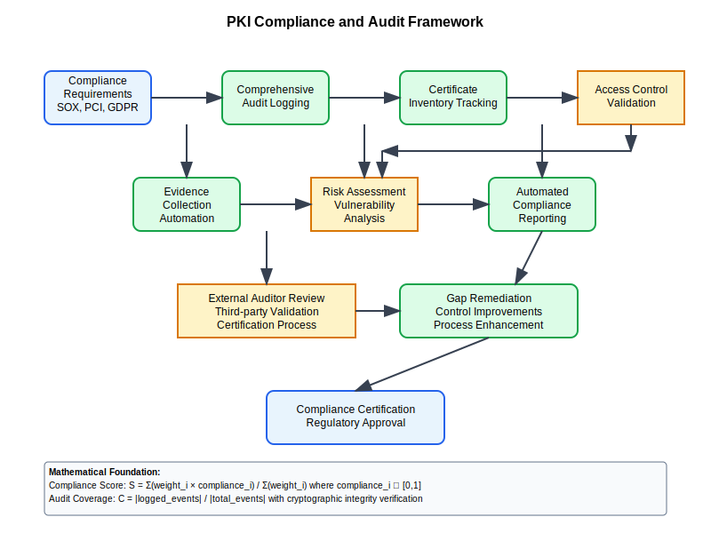

# PKI Compliance and Audit



## Scenario Overview

**Organization**: FinancialServ complying with SOX, PCI DSS, and GDPR  
**Challenge**: Comprehensive PKI audit trail and compliance reporting  
**Context**: Regulatory requirements for certificate lifecycle tracking  
**Scope**: Enterprise PKI with 50,000+ certificates across all business units

## The Challenge

FinancialServ must demonstrate:
- Complete certificate lifecycle audit trails
- Compliance with regulatory key management requirements
- Non-repudiation and digital signature validation
- Secure certificate storage and access controls
- Regular compliance assessments and reporting
- Incident response and certificate compromise procedures

## Mathematical Foundation

```
Audit Trail Completeness:
- Certificate Events: E = {issuance, renewal, revocation, usage}
- Audit Coverage: C = |logged_events| / |total_events|
- Compliance Score: S = Σ(weight_i × compliance_i) / Σ(weight_i)

Where compliance_i ∈ [0,1] for each requirement i

Risk Assessment:
Risk = Σ(Probability_i × Impact_i × Exposure_i)
```

## Step-by-Step Workflow

### Phase 1: Compliance Framework Setup

```python
def establish_compliance_framework():
    """Define compliance requirements and controls"""
    frameworks = {
        "SOX": {
            "requirements": [
                "Certificate access controls",
                "Segregation of duties in CA operations", 
                "Audit logging of all certificate operations",
                "Management oversight and approval processes"
            ],
            "controls": ["ITGC-01", "ITGC-02", "ITGC-03"]
        },
        "PCI_DSS": {
            "requirements": [
                "Strong cryptography (RSA-2048+ or ECC-256+)",
                "Secure key generation and management",
                "Certificate validation in payment processing",
                "Regular vulnerability assessments"
            ],
            "controls": ["3.4", "3.5", "3.6", "6.5.4"]
        },
        "GDPR": {
            "requirements": [
                "Pseudonymization using certificates",
                "Data protection by design",
                "Breach notification procedures",
                "Data subject rights regarding certificates"
            ],
            "controls": ["Art. 25", "Art. 32", "Art. 33", "Art. 17"]
        }
    }
    return frameworks
```

### Phase 2: Audit Logging Implementation

```bash
# Configure comprehensive audit logging
audit-admin:~$ cat > pki_audit.conf << EOF
# PKI Audit Configuration
[logging]
audit_file = /var/log/pki/pki_audit.log
log_level = INFO
log_rotation = daily
retention_period = 7_years

[events]
certificate_issuance = mandatory
certificate_renewal = mandatory
certificate_revocation = mandatory
key_generation = mandatory
ca_operations = mandatory
user_access = mandatory
configuration_changes = mandatory

[fields]
timestamp = ISO8601
user_id = required
source_ip = required
certificate_serial = required
operation_result = required
risk_level = calculated
EOF

# Implement audit event capture
#!/bin/bash
log_pki_event() {
    local event_type="$1"
    local user_id="$2" 
    local certificate_serial="$3"
    local result="$4"
    local risk_level="$5"
    
    timestamp=$(date --iso-8601=seconds)
    source_ip="${SSH_CLIENT%% *}"
    
    echo "{
        \"timestamp\": \"$timestamp\",
        \"event_type\": \"$event_type\",
        \"user_id\": \"$user_id\",
        \"source_ip\": \"$source_ip\",
        \"certificate_serial\": \"$certificate_serial\",
        \"result\": \"$result\",
        \"risk_level\": \"$risk_level\"
    }" >> /var/log/pki/pki_audit.log
}
```

### Phase 3: Certificate Lifecycle Tracking

```python
def certificate_lifecycle_tracker():
    """Track complete certificate lifecycle for compliance"""
    lifecycle_events = {
        "pre_issuance": {
            "events": ["request_submitted", "identity_verified", "approval_granted"],
            "compliance_requirements": ["segregation_of_duties", "authorization_controls"]
        },
        "issuance": {
            "events": ["key_generated", "certificate_signed", "certificate_delivered"],
            "compliance_requirements": ["secure_key_generation", "audit_logging", "delivery_confirmation"]
        },
        "active_usage": {
            "events": ["authentication", "digital_signature", "encryption", "validation"],
            "compliance_requirements": ["usage_monitoring", "performance_tracking", "security_validation"]
        },
        "maintenance": {
            "events": ["renewal_initiated", "renewal_completed", "revocation_checked"],
            "compliance_requirements": ["automated_renewal", "expiration_monitoring", "revocation_validation"]
        },
        "termination": {
            "events": ["revocation_requested", "certificate_revoked", "crl_updated"],
            "compliance_requirements": ["revocation_reasons", "notification_procedures", "cleanup_verification"]
        }
    }
    
    def calculate_compliance_score(lifecycle_stage):
        """Calculate compliance score for lifecycle stage"""
        stage_data = lifecycle_events[lifecycle_stage]
        completed_requirements = 0
        total_requirements = len(stage_data["compliance_requirements"])
        
        # Implementation would check actual compliance status
        # This is a framework for the calculation
        
        return completed_requirements / total_requirements
    
    return lifecycle_events
```

### Phase 4: Automated Compliance Reporting

```python
def generate_compliance_report():
    """Generate automated compliance reports"""
    import json
    from datetime import datetime, timedelta
    
    def sox_compliance_report():
        """SOX compliance assessment"""
        report = {
            "report_type": "SOX_Compliance",
            "period": "quarterly",
            "assessment_date": datetime.now().isoformat(),
            "controls": {
                "ITGC-01_access_controls": {
                    "status": "compliant",
                    "evidence": "Role-based access controls implemented",
                    "exceptions": 0,
                    "risk_rating": "low"
                },
                "ITGC-02_segregation_duties": {
                    "status": "compliant", 
                    "evidence": "CA operator and approval roles separated",
                    "exceptions": 0,
                    "risk_rating": "low"
                },
                "ITGC-03_change_management": {
                    "status": "minor_findings",
                    "evidence": "Change approval process documented",
                    "exceptions": 2,
                    "risk_rating": "medium"
                }
            },
            "overall_rating": "satisfactory",
            "action_items": [
                "Address change management exceptions by Q2",
                "Enhance documentation for emergency procedures"
            ]
        }
        return report
    
    def pci_dss_assessment():
        """PCI DSS compliance check"""
        cryptographic_standards = {
            "minimum_key_strength": "RSA-2048/ECC-256",
            "current_certificates": "100% compliant",
            "weak_algorithms": 0,
            "algorithm_review_date": "2024-01-15"
        }
        
        return {
            "requirement_3_4": "compliant",
            "requirement_3_5": "compliant", 
            "requirement_3_6": "compliant",
            "cryptographic_standards": cryptographic_standards,
            "quarterly_review_completed": True
        }
    
    return {
        "sox_report": sox_compliance_report(),
        "pci_dss_report": pci_dss_assessment(),
        "generation_timestamp": datetime.now().isoformat()
    }
```

## Security Analysis and Risk Assessment

```python
def comprehensive_risk_assessment():
    """Comprehensive PKI risk assessment for compliance"""
    risk_categories = {
        "operational_risks": {
            "ca_key_compromise": {"probability": 0.05, "impact": 0.9, "mitigation": "HSM, access controls"},
            "certificate_misuse": {"probability": 0.15, "impact": 0.6, "mitigation": "Monitoring, validation"},
            "process_failures": {"probability": 0.25, "impact": 0.4, "mitigation": "Automation, procedures"}
        },
        "compliance_risks": {
            "audit_failures": {"probability": 0.1, "impact": 0.7, "mitigation": "Comprehensive logging"},
            "regulatory_changes": {"probability": 0.3, "impact": 0.5, "mitigation": "Regular compliance review"},
            "documentation_gaps": {"probability": 0.2, "impact": 0.4, "mitigation": "Documentation management"}
        },
        "technical_risks": {
            "algorithm_weakening": {"probability": 0.4, "impact": 0.8, "mitigation": "Crypto agility"},
            "system_vulnerabilities": {"probability": 0.35, "impact": 0.6, "mitigation": "Regular updates"},
            "scalability_limits": {"probability": 0.2, "impact": 0.3, "mitigation": "Capacity planning"}
        }
    }
    
    def calculate_category_risk(category):
        """Calculate overall risk for a category"""
        total_risk = 0
        risk_items = risk_categories[category]
        
        for risk_item, metrics in risk_items.items():
            risk_score = metrics["probability"] * metrics["impact"]
            total_risk += risk_score
            
        return total_risk / len(risk_items)
    
    overall_risk = sum(calculate_category_risk(cat) for cat in risk_categories) / len(risk_categories)
    
    return {
        "risk_categories": risk_categories,
        "category_scores": {cat: calculate_category_risk(cat) for cat in risk_categories},
        "overall_risk_score": overall_risk,
        "risk_level": "medium" if overall_risk < 0.5 else "high"
    }
```

## Monitoring and Alerting

```bash
#!/bin/bash
# Compliance monitoring and alerting

compliance_monitor() {
    echo "=== PKI Compliance Monitoring ==="
    
    # Check audit log integrity
    if ! check_audit_log_integrity; then
        send_compliance_alert "CRITICAL" "Audit log integrity compromised"
    fi
    
    # Verify certificate compliance
    non_compliant_certs=$(check_certificate_compliance)
    if [ "$non_compliant_certs" -gt 0 ]; then
        send_compliance_alert "HIGH" "$non_compliant_certs non-compliant certificates found"
    fi
    
    # Check access control compliance  
    if ! verify_access_controls; then
        send_compliance_alert "MEDIUM" "Access control violations detected"
    fi
    
    # Validate backup and recovery procedures
    last_backup_test=$(get_last_backup_test_date)
    days_since_test=$(( ($(date +%s) - $(date -d "$last_backup_test" +%s)) / 86400 ))
    
    if [ "$days_since_test" -gt 90 ]; then
        send_compliance_alert "MEDIUM" "Backup/recovery test overdue: $days_since_test days"
    fi
}

check_certificate_compliance() {
    # Check for weak algorithms, expired certificates, etc.
    weak_certs=$(openssl x509 -in /path/to/certs/*.pem -text -noout | grep -c "RSA Public Key: (1024 bit)")
    echo "$weak_certs"
}

send_compliance_alert() {
    local severity="$1"
    local message="$2"
    local timestamp=$(date --iso-8601=seconds)
    
    # Log to compliance audit trail
    echo "$timestamp [$severity] $message" >> /var/log/pki/compliance_alerts.log
    
    # Send notification to compliance team
    mail -s "PKI Compliance Alert [$severity]" compliance@financialserv.com << EOF
Timestamp: $timestamp
Severity: $severity
Alert: $message

Please investigate and remediate as required per compliance procedures.
EOF
}
```

## Evidence Collection and Documentation

```python
def collect_compliance_evidence():
    """Collect evidence for compliance audits"""
    evidence_collection = {
        "certificate_inventory": {
            "active_certificates": "query_certificate_database()",
            "certificate_types": "categorize_certificates()",
            "expiration_analysis": "analyze_certificate_expiration()",
            "algorithm_distribution": "analyze_cryptographic_algorithms()"
        },
        "access_controls": {
            "user_access_matrix": "generate_access_matrix()",
            "privileged_access_log": "extract_privileged_operations()",
            "access_reviews": "compile_access_review_results()",
            "segregation_duties": "validate_role_separation()"
        },
        "operational_procedures": {
            "ca_operations_log": "extract_ca_operations()",
            "incident_response_records": "compile_incident_history()",
            "change_management": "extract_change_records()",
            "backup_recovery_tests": "compile_dr_test_results()"
        },
        "technical_controls": {
            "hsm_audit_logs": "extract_hsm_logs()",
            "certificate_validation_logs": "analyze_validation_patterns()",
            "revocation_effectiveness": "measure_revocation_propagation()",
            "performance_metrics": "compile_system_performance()"
        }
    }
    
    def generate_evidence_package():
        """Generate comprehensive evidence package"""
        package = {}
        
        for category, evidence_items in evidence_collection.items():
            package[category] = {}
            for item, collection_method in evidence_items.items():
                # In real implementation, would execute collection methods
                package[category][item] = f"Evidence collected via {collection_method}"
        
        package["collection_metadata"] = {
            "collection_date": datetime.now().isoformat(),
            "compliance_officer": "get_current_user()",
            "audit_period": "determine_audit_period()",
            "evidence_integrity_hash": "calculate_evidence_hash(package)"
        }
        
        return package
    
    return generate_evidence_package()
```

## Regulatory Reporting

```python
def generate_regulatory_reports():
    """Generate required regulatory reports"""
    
    def sox_quarterly_report():
        """SOX Section 404 IT General Controls Report"""
        return {
            "report_period": "Q4 2024",
            "scope": "PKI Infrastructure and Certificate Management",
            "control_testing_results": {
                "access_controls": {"tested": 15, "passed": 15, "failed": 0},
                "change_management": {"tested": 8, "passed": 7, "failed": 1},
                "segregation_duties": {"tested": 12, "passed": 12, "failed": 0},
                "monitoring_controls": {"tested": 6, "passed": 6, "failed": 0}
            },
            "management_assessment": "effective",
            "deficiencies": [
                {"control": "Change Management", "severity": "minor", "remediation": "Enhanced documentation"}
            ],
            "certification": "Management certifies effectiveness of PKI controls"
        }
    
    def pci_dss_annual_report():
        """PCI DSS Annual Assessment Report"""
        return {
            "assessment_date": "2024-12-31",
            "merchant_level": "Level 1",
            "requirements_tested": {
                "3.4_encryption": "compliant",
                "3.5_key_management": "compliant",
                "3.6_cryptographic_keys": "compliant",
                "6.5.4_secure_communications": "compliant"
            },
            "vulnerabilities": [],
            "compensating_controls": [],
            "attestation_of_compliance": "signed_by_qsa"
        }
    
    def gdpr_privacy_impact():
        """GDPR Privacy Impact Assessment for PKI"""
        return {
            "assessment_scope": "Certificate-based authentication and digital signatures",
            "data_processed": "Certificate subject information, usage logs",
            "legal_basis": "Legitimate interest for security",
            "privacy_risks": ["Certificate subject identification", "Usage pattern analysis"],
            "mitigation_measures": ["Data minimization", "Pseudonymization", "Access controls"],
            "dpo_review": "completed",
            "dpo_recommendation": "approved_with_conditions"
        }
    
    return {
        "sox_report": sox_quarterly_report(),
        "pci_dss_report": pci_dss_annual_report(), 
        "gdpr_assessment": gdpr_privacy_impact()
    }
```

## Incident Response and Remediation

```bash
#!/bin/bash
# PKI compliance incident response

handle_compliance_incident() {
    local incident_type="$1"
    local severity="$2"
    local description="$3"
    
    # Log incident
    incident_id="INC-$(date +%Y%m%d-%H%M%S)"
    echo "[$incident_id] $incident_type - $severity: $description" >> /var/log/pki/incidents.log
    
    case "$incident_type" in
        "certificate_compromise")
            echo "Initiating certificate revocation procedure..."
            revoke_compromised_certificate
            update_crl_immediately
            notify_stakeholders "certificate_compromise" "$incident_id"
            ;;
        "compliance_violation")
            echo "Documenting compliance violation..."
            document_violation "$incident_id" "$description"
            initiate_corrective_action
            notify_compliance_team "$incident_id"
            ;;
        "audit_log_tampering")
            echo "CRITICAL: Audit log integrity compromised"
            preserve_evidence "$incident_id"
            activate_backup_logging
            notify_security_team "IMMEDIATE" "$incident_id"
            ;;
    esac
    
    # Generate incident report
    generate_incident_report "$incident_id" "$incident_type" "$severity" "$description"
}

generate_compliance_dashboard() {
    cat > compliance_dashboard.html << EOF
<!DOCTYPE html>
<html>
<head><title>PKI Compliance Dashboard</title></head>
<body>
<h1>PKI Compliance Status</h1>
<div class="metrics">
    <div class="metric">
        <h3>SOX Compliance</h3>
        <div class="status green">COMPLIANT</div>
        <p>Last Assessment: $(date -d '30 days ago' +%Y-%m-%d)</p>
    </div>
    <div class="metric">
        <h3>PCI DSS Compliance</h3>
        <div class="status green">COMPLIANT</div>
        <p>Next Assessment: $(date -d '90 days' +%Y-%m-%d)</p>
    </div>
    <div class="metric">
        <h3>Certificate Health</h3>
        <div class="status yellow">98.5% COMPLIANT</div>
        <p>$(get_noncompliant_cert_count) certificates need attention</p>
    </div>
</div>
</body>
</html>
EOF
}
```

This comprehensive compliance and audit framework ensures regulatory adherence while maintaining operational efficiency and providing complete audit trails for PKI operations.