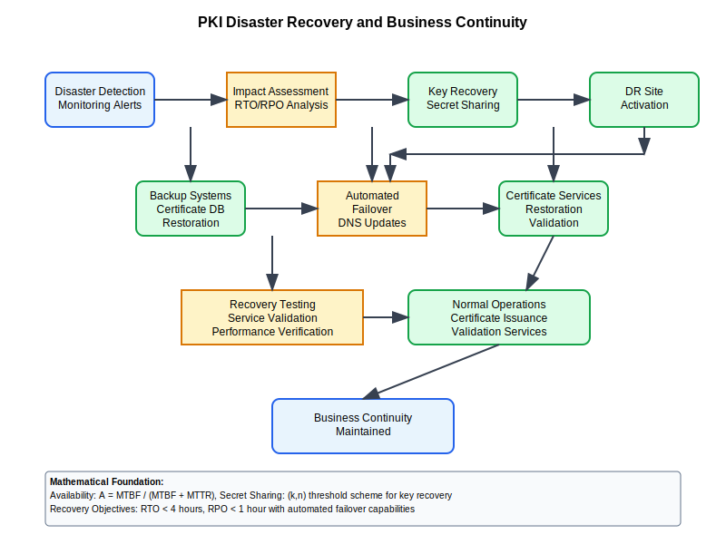

# PKI Disaster Recovery and Business Continuity



## Scenario Overview

**Organization**: SecureTech implementing comprehensive PKI disaster recovery  
**Challenge**: Ensure PKI availability during disasters and system failures  
**Context**: Multi-site PKI with hot/cold standby and automated failover  
**RTO/RPO**: Recovery Time Objective < 4 hours, Recovery Point Objective < 1 hour

## The Challenge

SecureTech needs to:
- Maintain PKI operations during disasters and outages
- Protect CA private keys with secure backup and recovery
- Implement automated failover between data centers
- Ensure certificate validation continues during outages
- Test disaster recovery procedures regularly
- Meet business continuity requirements for critical services

## Mathematical Foundation

```
Availability Mathematics:
- System Availability: A = MTBF / (MTBF + MTTR)
- PKI Availability: A_pki = Π(A_component_i) for critical components
- Recovery Time: RTO = detection_time + decision_time + recovery_time + testing_time
- Data Loss: RPO = backup_frequency + replication_lag

Reliability Model:
Reliability(t) = e^(-λt) where λ = failure_rate

Multi-Site Redundancy:
P(total_failure) = Π P(site_failure_i) assuming independence
```

## Step-by-Step Workflow

### Phase 1: Risk Assessment and Planning

```python
def disaster_recovery_risk_assessment():
    """Comprehensive risk assessment for PKI disaster recovery"""
    risk_scenarios = {
        "data_center_failure": {
            "probability": 0.02,  # 2% annually
            "impact": 0.9,        # High business impact
            "rto_requirement": 4,  # hours
            "rpo_requirement": 1   # hours
        },
        "ca_key_compromise": {
            "probability": 0.001, # 0.1% annually
            "impact": 1.0,        # Maximum impact
            "rto_requirement": 24, # hours
            "rpo_requirement": 0   # No data loss acceptable
        },
        "natural_disaster": {
            "probability": 0.05,  # 5% annually (location dependent)
            "impact": 0.8,        # High impact
            "rto_requirement": 8,  # hours
            "rpo_requirement": 2   # hours
        },
        "cyber_attack": {
            "probability": 0.15,  # 15% annually
            "impact": 0.7,        # Moderate to high impact
            "rto_requirement": 2,  # hours
            "rpo_requirement": 0.5 # 30 minutes
        }
    }
    
    def calculate_annual_loss_expectancy(scenario):
        """Calculate ALE for each disaster scenario"""
        probability = risk_scenarios[scenario]["probability"]
        impact = risk_scenarios[scenario]["impact"]
        business_value = 10000000  # $10M annual PKI business value
        
        ale = probability * impact * business_value
        return ale
    
    total_ale = sum(calculate_annual_loss_expectancy(scenario) for scenario in risk_scenarios)
    
    return {
        "risk_scenarios": risk_scenarios,
        "annual_loss_expectancy": total_ale,
        "risk_level": "high" if total_ale > 500000 else "medium"
    }
```

### Phase 2: Infrastructure Design

```bash
# Primary Site (Site A) - Production PKI
site-a-admin:~$ cat > primary_site_config.yaml << EOF
site_config:
  name: "Primary_Site_A"
  role: "active"
  components:
    - root_ca: "active"
    - intermediate_ca: "active" 
    - ocsp_responder: "active"
    - crl_distribution: "active"
    - certificate_database: "active"
  
backup_schedule:
  ca_keys: "continuous_to_hsm_cluster"
  certificate_db: "hourly_to_site_b"
  configuration: "daily_to_site_b"
  
monitoring:
  health_check_interval: "30_seconds"
  failover_threshold: "3_consecutive_failures"
EOF

# Disaster Recovery Site (Site B) - Standby
site-b-admin:~$ cat > dr_site_config.yaml << EOF
site_config:
  name: "DR_Site_B"
  role: "standby"
  components:
    - root_ca: "standby_encrypted"
    - intermediate_ca: "standby_ready"
    - ocsp_responder: "active_secondary"
    - crl_distribution: "active_mirror"
    - certificate_database: "replica"

failover_config:
  automatic_failover: true
  manual_override: true
  activation_time_target: "15_minutes"
  dns_failover: "automatic"
EOF
```

### Phase 3: Key Protection and Secret Sharing

```python
def implement_secret_sharing():
    """Implement Shamir's Secret Sharing for CA private keys"""
    
    def shamirs_secret_sharing(secret, n_shares, threshold):
        """
        Shamir's Secret Sharing implementation framework
        secret: The CA private key to split
        n_shares: Total number of shares to create
        threshold: Minimum shares needed to reconstruct
        """
        import secrets
        import random
        
        # Polynomial coefficients (simplified representation)
        coefficients = [secret] + [secrets.randbelow(2**256) for _ in range(threshold-1)]
        
        shares = []
        for i in range(1, n_shares + 1):
            # Evaluate polynomial at point i
            share_value = sum(coeff * (i ** power) for power, coeff in enumerate(coefficients))
            shares.append((i, share_value % (2**256)))  # Simplified modular arithmetic
        
        return shares
    
    # Example: Split root CA key into 7 shares, require 4 to reconstruct
    ca_key_shares = shamirs_secret_sharing("ROOT_CA_PRIVATE_KEY", 7, 4)
    
    key_custodian_assignment = {
        "share_1": {"custodian": "CISO", "location": "HQ_Safe"},
        "share_2": {"custodian": "PKI_Manager", "location": "DR_Site_Safe"},
        "share_3": {"custodian": "Security_Architect", "location": "Cloud_HSM"},
        "share_4": {"custodian": "IT_Director", "location": "Bank_Safety_Deposit"},
        "share_5": {"custodian": "External_Auditor", "location": "Third_Party_Escrow"},
        "share_6": {"custodian": "Board_Member", "location": "Executive_Safe"},
        "share_7": {"custodian": "Legal_Counsel", "location": "Legal_Vault"}
    }
    
    return {
        "shares": ca_key_shares,
        "custodian_assignment": key_custodian_assignment,
        "reconstruction_threshold": 4,
        "security_level": "military_grade"
    }

def key_reconstruction_ceremony():
    """Formal key reconstruction ceremony procedures"""
    ceremony_procedures = {
        "pre_ceremony": [
            "Verify disaster declaration by authorized personnel",
            "Assemble minimum required custodians (4 of 7)",
            "Establish secure communication channels",
            "Prepare clean room environment"
        ],
        "during_ceremony": [
            "Verify custodian identities (dual control)",
            "Combine key shares using secure ceremony workstation",
            "Reconstruct private key in HSM secure boundary",
            "Test reconstructed key with known certificate",
            "Document all participants and actions"
        ],
        "post_ceremony": [
            "Activate standby CA systems",
            "Update DNS records for failover",
            "Notify dependent systems of failover",
            "Begin normal PKI operations from DR site"
        ]
    }
    return ceremony_procedures
```

### Phase 4: Automated Failover Implementation

```bash
#!/bin/bash
# PKI Disaster Recovery Automation

DR_CONFIG="/etc/pki/disaster_recovery.conf"
LOG_FILE="/var/log/pki/disaster_recovery.log"

source "$DR_CONFIG"

pki_health_monitor() {
    while true; do
        # Check primary site health
        if ! check_primary_site_health; then
            FAILURE_COUNT=$((FAILURE_COUNT + 1))
            log_event "WARNING" "Primary site health check failed ($FAILURE_COUNT/$FAILURE_THRESHOLD)"
            
            if [ "$FAILURE_COUNT" -ge "$FAILURE_THRESHOLD" ]; then
                log_event "CRITICAL" "Primary site failure threshold reached - initiating failover"
                initiate_automated_failover
            fi
        else
            FAILURE_COUNT=0
        fi
        
        sleep "$HEALTH_CHECK_INTERVAL"
    done
}

check_primary_site_health() {
    # Check CA service availability
    if ! curl -f --max-time 10 "https://ca.securetech.com/health" >/dev/null 2>&1; then
        return 1
    fi
    
    # Check OCSP responder
    if ! openssl ocsp -url "http://ocsp.securetech.com" -nonce >/dev/null 2>&1; then
        return 1
    fi
    
    # Check CRL accessibility
    if ! curl -f --max-time 5 "http://crl.securetech.com/ca.crl" >/dev/null 2>&1; then
        return 1
    fi
    
    return 0
}

initiate_automated_failover() {
    log_event "INFO" "Starting automated failover procedure"
    
    # Step 1: Activate DR site services
    activate_dr_site_services
    
    # Step 2: Update DNS records
    update_dns_failover
    
    # Step 3: Notify monitoring systems
    send_failover_notifications
    
    # Step 4: Update load balancer configuration
    redirect_traffic_to_dr
    
    log_event "INFO" "Automated failover completed successfully"
}

activate_dr_site_services() {
    log_event "INFO" "Activating disaster recovery site services"
    
    # Start PKI services on DR site
    ssh dr-pki-server "systemctl start pki-ca-service"
    ssh dr-ocsp-server "systemctl start ocsp-responder"
    ssh dr-crl-server "systemctl start crl-publisher"
    
    # Verify services are operational
    sleep 30
    if check_dr_site_health; then
        log_event "INFO" "DR site services activated successfully"
    else
        log_event "ERROR" "Failed to activate DR site services"
        send_alert "CRITICAL" "DR site activation failed"
    fi
}

update_dns_failover() {
    log_event "INFO" "Updating DNS records for failover"
    
    # Update DNS to point to DR site
    aws route53 change-resource-record-sets --hosted-zone-id "$HOSTED_ZONE_ID" --change-batch '{
        "Changes": [{
            "Action": "UPSERT",
            "ResourceRecordSet": {
                "Name": "ca.securetech.com",
                "Type": "A",
                "TTL": 60,
                "ResourceRecords": [{"Value": "'$DR_SITE_CA_IP'"}]
            }
        }]
    }'
}
```

## Recovery Testing and Validation

```python
def disaster_recovery_testing():
    """Comprehensive DR testing framework"""
    test_scenarios = {
        "planned_failover_test": {
            "frequency": "quarterly",
            "duration": "4_hours",
            "scope": "full_failover_test",
            "success_criteria": ["RTO < 4h", "RPO < 1h", "All services operational"]
        },
        "network_partition_test": {
            "frequency": "monthly", 
            "duration": "2_hours",
            "scope": "connectivity_failure_simulation",
            "success_criteria": ["Automatic failover", "Certificate validation continues"]
        },
        "key_reconstruction_drill": {
            "frequency": "bi_annually",
            "duration": "8_hours", 
            "scope": "full_key_recovery_ceremony",
            "success_criteria": ["Key reconstructed", "CA operations restored", "All custodians participated"]
        },
        "cyber_incident_response": {
            "frequency": "annually",
            "duration": "24_hours",
            "scope": "security_incident_simulation", 
            "success_criteria": ["Incident contained", "Forensics preserved", "Operations restored"]
        }
    }
    
    def execute_dr_test(test_type):
        """Execute disaster recovery test"""
        test_config = test_scenarios[test_type]
        
        test_results = {
            "test_type": test_type,
            "start_time": "get_current_timestamp()",
            "planned_duration": test_config["duration"],
            "test_steps": [],
            "success_criteria_met": [],
            "issues_identified": [],
            "lessons_learned": []
        }
        
        # Test execution framework would go here
        # This is a structure for comprehensive testing
        
        return test_results
    
    return test_scenarios
```

## Business Continuity Integration

```python
def business_continuity_planning():
    """Integrate PKI DR with overall business continuity"""
    continuity_plan = {
        "critical_business_processes": {
            "customer_authentication": {
                "pki_dependency": "client_certificates", 
                "impact_without_pki": "service_unavailable",
                "workaround": "temporary_password_authentication",
                "max_downtime_tolerance": "2_hours"
            },
            "secure_communications": {
                "pki_dependency": "server_certificates",
                "impact_without_pki": "insecure_connections",
                "workaround": "self_signed_certificates_with_warnings",
                "max_downtime_tolerance": "30_minutes"
            },
            "digital_signatures": {
                "pki_dependency": "signing_certificates",
                "impact_without_pki": "cannot_sign_documents",
                "workaround": "manual_signature_process",
                "max_downtime_tolerance": "4_hours"
            },
            "api_security": {
                "pki_dependency": "api_client_certificates",
                "impact_without_pki": "api_access_denied",
                "workaround": "temporary_api_keys",
                "max_downtime_tolerance": "1_hour"
            }
        },
        
        "recovery_priorities": [
            {"priority": 1, "service": "certificate_validation", "target_rto": "15_minutes"},
            {"priority": 2, "service": "certificate_issuance", "target_rto": "2_hours"},
            {"priority": 3, "service": "certificate_renewal", "target_rto": "4_hours"},
            {"priority": 4, "service": "certificate_revocation", "target_rto": "1_hour"}
        ],
        
        "stakeholder_communication": {
            "internal_teams": ["IT_Operations", "Security_Team", "Application_Owners"],
            "external_parties": ["Certificate_Subscribers", "Relying_Parties", "Auditors"],
            "communication_methods": ["email", "sms", "status_page", "direct_phone"],
            "escalation_matrix": "defined_in_incident_response_plan"
        }
    }
    
    return continuity_plan
```

## Monitoring and Alerting

```bash
#!/bin/bash
# DR Monitoring and Metrics

collect_dr_metrics() {
    cat > dr_metrics_collector.sh << 'EOF'
#!/bin/bash

# Collect disaster recovery metrics
DR_METRICS_FILE="/var/log/pki/dr_metrics.json"

{
    echo "{"
    echo "  \"timestamp\": \"$(date --iso-8601=seconds)\","
    echo "  \"site_status\": {"
    echo "    \"primary\": \"$(get_site_status primary)\","  
    echo "    \"dr\": \"$(get_site_status dr)\""
    echo "  },"
    echo "  \"replication_lag\": {"
    echo "    \"certificate_db\": $(get_replication_lag cert_db),"
    echo "    \"configuration\": $(get_replication_lag config)"
    echo "  },"
    echo "  \"backup_status\": {"
    echo "    \"last_ca_key_backup\": \"$(get_last_backup_time ca_keys)\","
    echo "    \"last_db_backup\": \"$(get_last_backup_time database)\","
    echo "    \"backup_verification\": \"$(verify_backup_integrity)\""
    echo "  },"
    echo "  \"rto_rpo_tracking\": {"
    echo "    \"current_rto_estimate\": \"$(calculate_current_rto)\","
    echo "    \"current_rpo_risk\": \"$(calculate_current_rpo)\""
    echo "  }"
    echo "}"
} > "$DR_METRICS_FILE"
EOF

chmod +x dr_metrics_collector.sh
}

# Dashboard for DR status
generate_dr_dashboard() {
    cat > dr_dashboard.html << EOF
<!DOCTYPE html>
<html>
<head>
    <title>PKI Disaster Recovery Dashboard</title>
    <meta http-equiv="refresh" content="30">
</head>
<body>
<h1>PKI Disaster Recovery Status</h1>
<div class="status-grid">
    <div class="status-card primary-site">
        <h3>Primary Site</h3>
        <div class="status $(get_site_css_class primary)">$(get_site_status primary)</div>
        <p>Last Health Check: $(date)</p>
    </div>
    <div class="status-card dr-site">
        <h3>DR Site</h3>
        <div class="status $(get_site_css_class dr)">$(get_site_status dr)</div>
        <p>Replication Lag: $(get_replication_lag cert_db)s</p>
    </div>
    <div class="status-card rto-rpo">
        <h3>Recovery Objectives</h3>
        <p>Current RTO Estimate: $(calculate_current_rto)</p>
        <p>Current RPO Risk: $(calculate_current_rpo)</p>
    </div>
</div>
</body>
</html>
EOF
}
```

## Recovery Procedures Documentation

```python
def generate_recovery_procedures():
    """Generate comprehensive recovery procedures documentation"""
    procedures = {
        "immediate_response": {
            "disaster_declaration": [
                "Assess situation severity",
                "Declare disaster if RTO/RPO at risk", 
                "Activate incident response team",
                "Begin communication procedures"
            ],
            "initial_assessment": [
                "Determine scope of impact",
                "Identify affected PKI components",
                "Estimate recovery time requirements", 
                "Activate appropriate recovery procedures"
            ]
        },
        
        "recovery_execution": {
            "automated_failover": [
                "Monitor automated failover progress",
                "Verify DR site activation",
                "Confirm service availability",
                "Update stakeholder communications"
            ],
            "manual_recovery": [
                "Assemble key custodians if needed",
                "Execute key reconstruction ceremony",
                "Manually activate DR services",
                "Perform service validation testing"
            ]
        },
        
        "post_recovery": {
            "service_validation": [
                "Test certificate issuance",
                "Verify certificate validation",
                "Check revocation services",
                "Validate integrated applications"
            ],
            "documentation": [
                "Document recovery actions taken",
                "Record lessons learned",
                "Update recovery procedures",
                "Schedule post-incident review"
            ]
        }
    }
    
    return procedures
```

This comprehensive disaster recovery framework ensures PKI business continuity through automated failover, secure key protection using secret sharing, and rigorous testing procedures to meet strict RTO/RPO requirements.