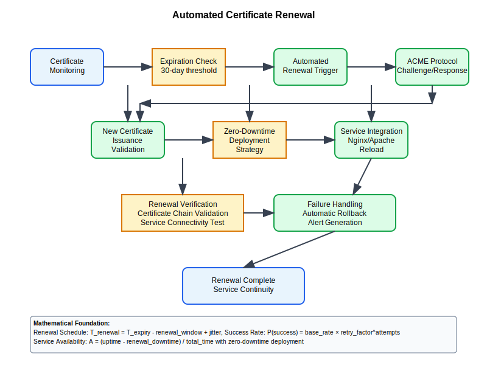

# Automated Certificate Renewal



## Scenario Overview

**Organization**: AutoTech implementing automated certificate lifecycle management  
**Challenge**: Seamless certificate renewal without service interruption  
**Context**: 100,000+ certificates across web services, APIs, and devices  
**Goal**: Zero-downtime certificate renewal with 99.99% automation success rate

## The Challenge

AutoTech needs to:
- Automate certificate renewal before expiration
- Minimize service downtime during certificate updates
- Handle renewal failures gracefully with fallback procedures
- Integrate with ACME protocol and Let's Encrypt
- Support enterprise CA renewal workflows
- Monitor and alert on renewal status across all certificates

## Mathematical Foundation

```
Certificate Renewal Optimization:
- Renewal Window: R = validity_period - safety_margin
- Renewal Probability: P(success) = base_success_rate × retry_factor^attempts
- Optimal Renewal Time: T_optimal = expiration_time - (2 × renewal_process_time)
- Service Availability: A = (uptime - renewal_downtime) / total_time

Renewal Scheduling:
- Jitter Factor: j = random(0, jitter_window) to distribute load
- Renewal Schedule: T_renewal = T_expiry - renewal_window + j
```

## Step-by-Step Workflow

### Phase 1: Certificate Discovery and Inventory

```python
def certificate_discovery_system():
    """Automated certificate discovery and inventory management"""
    
    discovery_methods = {
        "network_scanning": {
            "tls_port_scan": "Scan common TLS ports (443, 993, 995, etc.)",
            "certificate_extraction": "Extract certificates from TLS handshakes",
            "validity_analysis": "Parse certificate validity periods"
        },
        "configuration_parsing": {
            "web_server_configs": "Parse Apache/Nginx configurations",
            "load_balancer_configs": "Extract certificate paths from configs",
            "application_configs": "Find certificate references in app configs"
        },
        "certificate_store_scanning": {
            "system_stores": "Scan OS certificate stores",
            "java_keystores": "Extract from Java KeyStore files",
            "hardware_security_modules": "Query HSM certificate inventory"
        },
        "api_integration": {
            "certificate_manager_apis": "Integrate with cert-manager, Vault",
            "cloud_certificate_services": "AWS ACM, Azure Key Vault, GCP Certificate Manager",
            "pki_management_systems": "Enterprise PKI management platforms"
        }
    }
    
    def build_certificate_inventory():
        """Build comprehensive certificate inventory"""
        inventory = {
            "certificate_id": "unique_identifier",
            "common_name": "certificate_subject_cn",
            "subject_alt_names": ["dns_names_list"],
            "issuer": "certificate_issuer_dn",
            "serial_number": "certificate_serial",
            "not_before": "validity_start_date",
            "not_after": "validity_end_date",
            "key_algorithm": "RSA_2048_or_ECDSA_P256",
            "signature_algorithm": "SHA256withRSA",
            "deployment_locations": ["server_locations"],
            "renewal_method": "ACME_or_manual_or_api",
            "criticality": "high_medium_low",
            "owner": "responsible_team",
            "monitoring_status": "active_passive_disabled"
        }
        return inventory
    
    return discovery_methods, build_certificate_inventory()
```

### Phase 2: ACME Integration and Automation

```bash
# ACME client configuration for automated renewal
acme-admin:~$ cat > acme_renewal.conf << EOF
[global]
acme_directory_url = https://acme-v02.api.letsencrypt.org/directory
account_key_path = /etc/ssl/acme/account.key
challenge_type = http-01
renewal_margin = 30d
retry_attempts = 3
retry_delay = 3600

[certificate_domains]
api.autotech.com = /var/www/html/.well-known/acme-challenge/
app.autotech.com = /var/www/html/.well-known/acme-challenge/
secure.autotech.com = /var/www/html/.well-known/acme-challenge/

[renewal_hooks]
pre_hook = /etc/ssl/scripts/pre_renewal.sh
post_hook = /etc/ssl/scripts/post_renewal.sh
deploy_hook = /etc/ssl/scripts/deploy_certificate.sh
EOF

# Automated renewal script
acme-admin:~$ cat > /etc/ssl/scripts/automated_renewal.sh << 'EOF'
#!/bin/bash

ACME_CONFIG="/etc/ssl/acme_renewal.conf"
LOG_FILE="/var/log/ssl/certificate_renewal.log"

source "$ACME_CONFIG"

renew_certificate() {
    local domain="$1"
    local webroot="$2"
    
    log_event "INFO" "Starting renewal for domain: $domain"
    
    # Execute pre-renewal hook
    if [ -x "$pre_hook" ]; then
        "$pre_hook" "$domain"
    fi
    
    # Request new certificate using ACME
    acme.sh --renew \
        --domain "$domain" \
        --webroot "$webroot" \
        --key-file "/etc/ssl/private/${domain}.key" \
        --cert-file "/etc/ssl/certs/${domain}.crt" \
        --ca-file "/etc/ssl/certs/${domain}_ca.crt" \
        --fullchain-file "/etc/ssl/certs/${domain}_fullchain.crt"
    
    if [ $? -eq 0 ]; then
        log_event "SUCCESS" "Certificate renewal completed for $domain"
        
        # Execute post-renewal hook
        if [ -x "$post_hook" ]; then
            "$post_hook" "$domain"
        fi
        
        # Deploy certificate to services
        if [ -x "$deploy_hook" ]; then
            "$deploy_hook" "$domain"
        fi
        
        return 0
    else
        log_event "ERROR" "Certificate renewal failed for $domain"
        return 1
    fi
}

log_event() {
    local level="$1"
    local message="$2"
    local timestamp=$(date --iso-8601=seconds)
    
    echo "$timestamp [$level] $message" >> "$LOG_FILE"
}
EOF

chmod +x /etc/ssl/scripts/automated_renewal.sh
```

### Phase 3: Enterprise PKI Renewal Integration

```python
def enterprise_pki_renewal():
    """Integration with enterprise PKI for certificate renewal"""
    
    renewal_workflows = {
        "microsoft_adcs": {
            "renewal_method": "certreq_autoenroll",
            "template_configuration": "WebServer_AutoRenewal_v2",
            "group_policy": "Certificate_Services_Client_AutoEnrollment",
            "renewal_threshold": "60_days_before_expiry"
        },
        "hashicorp_vault": {
            "renewal_method": "vault_api",
            "pki_mount": "pki_production",
            "role": "web_server_role",
            "ttl": "90d",
            "auto_renewal": "vault_agent_template"
        },
        "venafi_tpp": {
            "renewal_method": "venafi_api",
            "policy_folder": "\\VED\\Policy\\Certificates\\WebServers",
            "workflow": "automatic_renewal_workflow",
            "approval_required": False
        },
        "openssl_ca": {
            "renewal_method": "custom_api",
            "ca_endpoint": "https://ca.autotech.internal/api/v1",
            "authentication": "mutual_tls",
            "renewal_policy": "automatic_for_servers"
        }
    }
    
    def execute_enterprise_renewal(certificate_info, pki_system):
        """Execute renewal through enterprise PKI"""
        workflow = renewal_workflows[pki_system]
        
        renewal_request = {
            "certificate_id": certificate_info["serial_number"],
            "subject": certificate_info["subject"],
            "san_list": certificate_info["subject_alt_names"],
            "key_algorithm": certificate_info["key_algorithm"],
            "validity_period": "1_year",
            "renewal_reason": "approaching_expiry",
            "requestor": "automated_renewal_system"
        }
        
        # Implementation would vary by PKI system
        # This provides the framework structure
        
        return {
            "status": "success",
            "new_certificate": "certificate_pem_data",
            "certificate_chain": "full_chain_pem_data",
            "expiration_date": "new_expiry_date"
        }
    
    return renewal_workflows, execute_enterprise_renewal
```

### Phase 4: Service Integration and Zero-Downtime Deployment

```bash
#!/bin/bash
# Zero-downtime certificate deployment

deploy_certificate_zero_downtime() {
    local domain="$1"
    local new_cert_path="$2"
    local new_key_path="$3"
    
    echo "=== Zero-Downtime Certificate Deployment for $domain ==="
    
    # Validate new certificate
    if ! validate_certificate_and_key "$new_cert_path" "$new_key_path"; then
        echo "ERROR: Certificate validation failed"
        return 1
    fi
    
    # Identify services using this certificate
    services=$(get_services_using_certificate "$domain")
    
    for service in $services; do
        echo "Deploying to service: $service"
        
        case "$service" in
            "nginx")
                deploy_to_nginx "$domain" "$new_cert_path" "$new_key_path"
                ;;
            "apache")
                deploy_to_apache "$domain" "$new_cert_path" "$new_key_path"
                ;;
            "haproxy")
                deploy_to_haproxy "$domain" "$new_cert_path" "$new_key_path"
                ;;
            "kubernetes")
                deploy_to_kubernetes "$domain" "$new_cert_path" "$new_key_path"
                ;;
            *)
                echo "WARNING: Unknown service type: $service"
                ;;
        esac
    done
    
    # Verify deployment success
    if verify_certificate_deployment "$domain"; then
        echo "SUCCESS: Certificate deployment completed"
        cleanup_old_certificates "$domain"
    else
        echo "ERROR: Certificate deployment failed"
        rollback_certificate_deployment "$domain"
        return 1
    fi
}

deploy_to_nginx() {
    local domain="$1"
    local cert_path="$2"
    local key_path="$3"
    
    # Copy new certificate files
    cp "$cert_path" "/etc/nginx/ssl/${domain}.crt.new"
    cp "$key_path" "/etc/nginx/ssl/${domain}.key.new"
    
    # Update nginx configuration atomically
    sed -i.bak "s|${domain}.crt|${domain}.crt.new|g" /etc/nginx/sites-enabled/"$domain"
    sed -i "s|${domain}.key|${domain}.key.new|g" /etc/nginx/sites-enabled/"$domain"
    
    # Test nginx configuration
    if nginx -t; then
        # Reload nginx gracefully (zero downtime)
        nginx -s reload
        
        # Rename new certificates to active
        mv "/etc/nginx/ssl/${domain}.crt.new" "/etc/nginx/ssl/${domain}.crt"
        mv "/etc/nginx/ssl/${domain}.key.new" "/etc/nginx/ssl/${domain}.key"
        
        # Update config back to original names
        sed -i "s|${domain}.crt.new|${domain}.crt|g" /etc/nginx/sites-enabled/"$domain"
        sed -i "s|${domain}.key.new|${domain}.key|g" /etc/nginx/sites-enabled/"$domain"
        
        echo "SUCCESS: Nginx certificate updated"
    else
        # Rollback configuration
        mv /etc/nginx/sites-enabled/"$domain".bak /etc/nginx/sites-enabled/"$domain"
        rm "/etc/nginx/ssl/${domain}.crt.new" "/etc/nginx/ssl/${domain}.key.new"
        echo "ERROR: Nginx configuration test failed"
        return 1
    fi
}

validate_certificate_and_key() {
    local cert_path="$1"
    local key_path="$2"
    
    # Verify certificate file format
    if ! openssl x509 -in "$cert_path" -text -noout >/dev/null 2>&1; then
        echo "ERROR: Invalid certificate format"
        return 1
    fi
    
    # Verify private key format
    if ! openssl pkey -in "$key_path" -text -noout >/dev/null 2>&1; then
        echo "ERROR: Invalid private key format"
        return 1
    fi
    
    # Verify certificate and key match
    cert_modulus=$(openssl x509 -in "$cert_path" -modulus -noout)
    key_modulus=$(openssl pkey -in "$key_path" -pubout | openssl pkey -pubin -modulus -noout)
    
    if [ "$cert_modulus" != "$key_modulus" ]; then
        echo "ERROR: Certificate and private key do not match"
        return 1
    fi
    
    # Check certificate validity
    if ! openssl x509 -in "$cert_path" -checkend 86400 >/dev/null 2>&1; then
        echo "ERROR: Certificate expires within 24 hours"
        return 1
    fi
    
    echo "SUCCESS: Certificate and key validation passed"
    return 0
}
```

## Monitoring and Alerting

```python
def certificate_renewal_monitoring():
    """Comprehensive monitoring for certificate renewal operations"""
    
    monitoring_metrics = {
        "renewal_success_rate": {
            "target": 99.9,
            "measurement_period": "30_days",
            "alert_threshold": 95.0
        },
        "renewal_lead_time": {
            "target": "30_days_before_expiry",
            "measurement": "days_between_renewal_and_expiry",
            "alert_threshold": "7_days_before_expiry"
        },
        "deployment_time": {
            "target": "5_minutes",
            "measurement": "time_from_cert_issuance_to_service_deployment",
            "alert_threshold": "15_minutes"
        },
        "failure_recovery_time": {
            "target": "1_hour",
            "measurement": "time_from_failure_detection_to_resolution",
            "alert_threshold": "4_hours"
        }
    }
    
    def generate_renewal_alerts():
        """Generate alerts for certificate renewal issues"""
        alert_conditions = [
            {
                "condition": "certificate_expires_in_7_days",
                "severity": "CRITICAL",
                "message": "Certificate approaching expiration",
                "action": "immediate_manual_renewal"
            },
            {
                "condition": "renewal_failure_count > 3",
                "severity": "HIGH", 
                "message": "Multiple renewal failures detected",
                "action": "escalate_to_pki_team"
            },
            {
                "condition": "service_deployment_failed",
                "severity": "MEDIUM",
                "message": "Certificate renewed but deployment failed",
                "action": "retry_deployment_with_manual_fallback"
            },
            {
                "condition": "acme_rate_limit_exceeded",
                "severity": "MEDIUM",
                "message": "ACME rate limit reached",
                "action": "switch_to_alternative_ca_or_wait"
            }
        ]
        return alert_conditions
    
    return monitoring_metrics, generate_renewal_alerts()
```

## Performance Optimization

```python
def renewal_performance_optimization():
    """Optimize certificate renewal performance and reliability"""
    
    optimization_strategies = {
        "batch_processing": {
            "description": "Group renewals to reduce API calls",
            "batch_size": 50,
            "processing_interval": "hourly",
            "performance_gain": "60% reduction in API overhead"
        },
        "intelligent_scheduling": {
            "description": "Distribute renewals to avoid peak times",
            "jitter_window": "7_days",
            "peak_avoidance": "business_hours_exclusion",
            "load_balancing": "distribute_across_renewal_window"
        },
        "certificate_caching": {
            "description": "Cache frequently requested certificates",
            "cache_duration": "24_hours",
            "cache_size": "1000_certificates",
            "hit_rate_target": "85%"
        },
        "parallel_processing": {
            "description": "Process multiple renewals simultaneously",
            "max_concurrent_renewals": 10,
            "thread_pool_size": 20,
            "timeout_per_renewal": "300_seconds"
        }
    }
    
    def calculate_renewal_schedule(certificates):
        """Calculate optimal renewal schedule for certificate list"""
        import random
        from datetime import datetime, timedelta
        
        scheduled_renewals = []
        
        for cert in certificates:
            # Calculate base renewal time (30 days before expiry)
            expiry_date = cert["not_after"]
            base_renewal_time = expiry_date - timedelta(days=30)
            
            # Add jitter to distribute load
            jitter_hours = random.randint(-168, 168)  # ±7 days in hours
            actual_renewal_time = base_renewal_time + timedelta(hours=jitter_hours)
            
            # Avoid peak business hours (9 AM - 5 PM weekdays)
            if actual_renewal_time.weekday() < 5:  # Monday-Friday
                if 9 <= actual_renewal_time.hour <= 17:
                    # Shift to off-hours (2 AM - 6 AM)
                    actual_renewal_time = actual_renewal_time.replace(
                        hour=random.randint(2, 6)
                    )
            
            scheduled_renewals.append({
                "certificate_id": cert["certificate_id"],
                "domain": cert["common_name"],
                "current_expiry": expiry_date,
                "scheduled_renewal": actual_renewal_time,
                "priority": cert["criticality"]
            })
        
        # Sort by scheduled time
        scheduled_renewals.sort(key=lambda x: x["scheduled_renewal"])
        
        return scheduled_renewals
    
    return optimization_strategies, calculate_renewal_schedule
```

## Troubleshooting and Recovery

```bash
#!/bin/bash
# Certificate renewal troubleshooting toolkit

diagnose_renewal_failure() {
    local domain="$1"
    local failure_type="$2"
    
    echo "=== Certificate Renewal Failure Diagnosis for $domain ==="
    
    case "$failure_type" in
        "acme_challenge_failed")
            diagnose_acme_challenge_failure "$domain"
            ;;
        "certificate_validation_failed")
            diagnose_certificate_validation "$domain"
            ;;
        "service_deployment_failed")
            diagnose_service_deployment "$domain"
            ;;
        "rate_limit_exceeded")
            diagnose_rate_limits "$domain"
            ;;
        *)
            echo "Generic renewal failure diagnosis"
            check_network_connectivity "$domain"
            check_acme_account_status
            check_domain_validation "$domain"
            ;;
    esac
}

diagnose_acme_challenge_failure() {
    local domain="$1"
    
    echo "Diagnosing ACME challenge failure for $domain"
    
    # Check HTTP challenge accessibility
    challenge_url="http://$domain/.well-known/acme-challenge/test"
    if curl -f --max-time 10 "$challenge_url" >/dev/null 2>&1; then
        echo "✓ ACME challenge directory is accessible"
    else
        echo "✗ ACME challenge directory is NOT accessible"
        echo "  - Check web server configuration"
        echo "  - Verify firewall rules"
        echo "  - Confirm DNS resolution"
    fi
    
    # Check DNS resolution
    if nslookup "$domain" >/dev/null 2>&1; then
        echo "✓ DNS resolution working for $domain"
    else
        echo "✗ DNS resolution failed for $domain"
        echo "  - Check DNS configuration"
        echo "  - Verify domain registration"
    fi
    
    # Check web server permissions
    webroot="/var/www/html"
    if [ -w "$webroot/.well-known/acme-challenge/" ]; then
        echo "✓ Web server can write to challenge directory"
    else
        echo "✗ Web server cannot write to challenge directory"
        echo "  - Check directory permissions"
        echo "  - Verify web server user access"
    fi
}

emergency_certificate_renewal() {
    local domain="$1"
    
    echo "=== Emergency Certificate Renewal for $domain ==="
    
    # Try multiple renewal methods in priority order
    renewal_methods=("acme_http" "acme_dns" "manual_csr" "emergency_selfsigned")
    
    for method in "${renewal_methods[@]}"; do
        echo "Attempting renewal method: $method"
        
        case "$method" in
            "acme_http")
                if attempt_acme_http_renewal "$domain"; then
                    echo "SUCCESS: ACME HTTP renewal completed"
                    return 0
                fi
                ;;
            "acme_dns")
                if attempt_acme_dns_renewal "$domain"; then
                    echo "SUCCESS: ACME DNS renewal completed"
                    return 0
                fi
                ;;
            "manual_csr")
                if attempt_manual_csr_renewal "$domain"; then
                    echo "SUCCESS: Manual CSR renewal completed"
                    return 0
                fi
                ;;
            "emergency_selfsigned")
                echo "WARNING: Creating emergency self-signed certificate"
                create_emergency_selfsigned_cert "$domain"
                echo "TEMPORARY: Self-signed certificate deployed"
                echo "ACTION REQUIRED: Obtain proper certificate ASAP"
                return 0
                ;;
        esac
    done
    
    echo "ERROR: All renewal methods failed"
    return 1
}
```

This comprehensive certificate renewal system ensures automated, zero-downtime certificate lifecycle management with robust monitoring, failure recovery, and integration capabilities for both ACME and enterprise PKI environments.