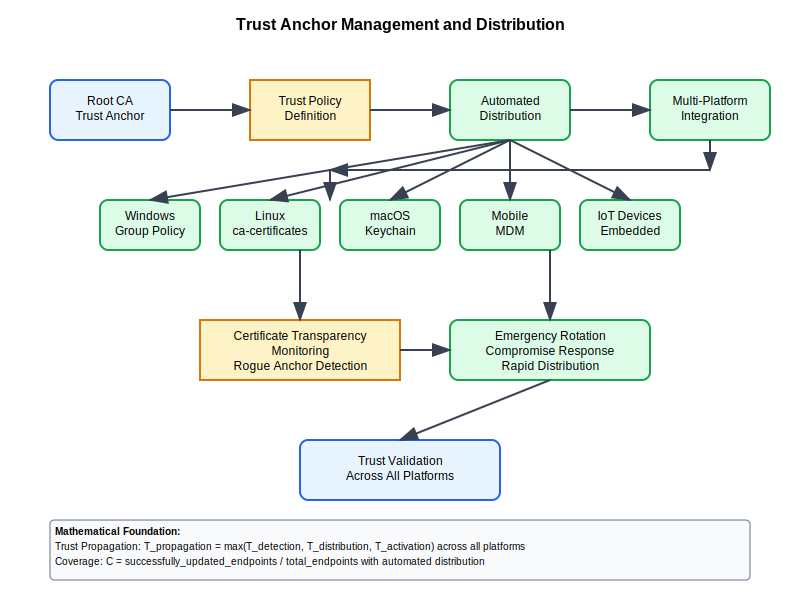

# Trust Anchor Management



## Scenario Overview

**Organization**: GlobalCorp managing enterprise trust infrastructure  
**Challenge**: Secure distribution and rotation of root certificates and trust anchors  
**Context**: Multi-platform environment requiring consistent trust policy enforcement  
**Scale**: 500,000+ endpoints across Windows, Linux, macOS, mobile, and IoT devices

## The Challenge

GlobalCorp needs to:
- Securely distribute trusted root certificates to all endpoints
- Implement automated trust anchor updates and rotation
- Maintain trust policy consistency across heterogeneous platforms
- Handle emergency trust anchor revocation and replacement
- Monitor trust anchor deployment status enterprise-wide
- Support certificate transparency and public key pinning

## Mathematical Foundation

```
Trust Propagation Model:
- Trust Transitivity: Trust(A,C) = Trust(A,B) ∧ Trust(B,C) 
- Trust Network: G = (V,E) where V = trust anchors, E = trust relationships
- Propagation Time: T_propagation = max(T_detection, T_distribution, T_activation)
- Coverage: C = successfully_updated_endpoints / total_endpoints

Trust Anchor Validation:
Valid_TA(anchor) = Verify_Self_Signature(anchor) ∧ 
                   Check_Validity_Period(anchor) ∧
                   Validate_Key_Usage(anchor) ∧
                   Confirm_Policy_Constraints(anchor)
```

## Step-by-Step Workflow

### Phase 1: Trust Store Architecture Design

```python
def trust_store_architecture():
    """Design comprehensive trust store management architecture"""
    
    trust_store_locations = {
        "windows": {
            "system_stores": [
                "Trusted Root Certification Authorities",
                "Intermediate Certification Authorities", 
                "Trusted Publishers",
                "Disallowed Certificates"
            ],
            "management_tools": ["certlm.msc", "PowerShell", "Group Policy"],
            "automatic_updates": "Windows Update, WSUS"
        },
        "linux": {
            "system_stores": [
                "/etc/ssl/certs/ca-certificates.crt",
                "/etc/pki/tls/certs/ca-bundle.crt",
                "/usr/local/share/ca-certificates/"
            ],
            "management_tools": ["update-ca-certificates", "ca-certificates package"],
            "automatic_updates": "Package manager integration"
        },
        "macos": {
            "system_stores": [
                "System Keychain",
                "System Roots Keychain",
                "Login Keychain"
            ],
            "management_tools": ["security", "Keychain Access", "Configuration Profiles"],
            "automatic_updates": "Software Update, MDM"
        },
        "mobile": {
            "ios": {
                "system_stores": ["iOS Trust Store"],
                "management_tools": ["MDM Configuration Profiles"],
                "automatic_updates": "iOS Software Updates"
            },
            "android": {
                "system_stores": ["/system/etc/security/cacerts/"],
                "management_tools": ["Device Admin API", "EMM"],
                "automatic_updates": "Android Security Updates"
            }
        }
    }
    
    def calculate_trust_coverage():
        """Calculate trust anchor deployment coverage"""
        platform_coverage = {}
        
        for platform, config in trust_store_locations.items():
            if isinstance(config, dict) and "system_stores" in config:
                # Simplified coverage calculation
                management_sophistication = len(config["management_tools"])
                auto_update_support = 1 if config["automatic_updates"] else 0
                
                coverage_score = min(1.0, (management_sophistication * 0.3) + (auto_update_support * 0.7))
                platform_coverage[platform] = coverage_score
        
        overall_coverage = sum(platform_coverage.values()) / len(platform_coverage)
        
        return {
            "platform_coverage": platform_coverage,
            "overall_coverage": overall_coverage,
            "recommendations": generate_coverage_recommendations(platform_coverage)
        }
    
    return trust_store_locations, calculate_trust_coverage()

def generate_coverage_recommendations(coverage_data):
    """Generate recommendations for improving trust coverage"""
    recommendations = []
    
    for platform, score in coverage_data.items():
        if score < 0.7:
            recommendations.append(f"Improve {platform} trust management with automated deployment")
        elif score < 0.9:
            recommendations.append(f"Enhance {platform} monitoring and validation capabilities")
    
    return recommendations
```

### Phase 2: Automated Trust Anchor Distribution

```bash
#!/bin/bash
# Trust anchor distribution system

TRUST_CONFIG="/etc/pki/trust_management.conf"
LOG_FILE="/var/log/pki/trust_anchor_management.log"

distribute_trust_anchors() {
    echo "=== Trust Anchor Distribution Process ==="
    
    # Load configuration
    source "$TRUST_CONFIG"
    
    # Validate new trust anchors before distribution
    for anchor in "${NEW_TRUST_ANCHORS[@]}"; do
        if validate_trust_anchor "$anchor"; then
            log_event "INFO" "Trust anchor validated: $(basename "$anchor")"
            distribute_to_platforms "$anchor"
        else
            log_event "ERROR" "Trust anchor validation failed: $(basename "$anchor")"
        fi
    done
    
    # Generate distribution report
    generate_distribution_report
}

validate_trust_anchor() {
    local anchor_file="$1"
    
    echo "Validating trust anchor: $anchor_file"
    
    # Check certificate format
    if ! openssl x509 -in "$anchor_file" -text -noout >/dev/null 2>&1; then
        echo "ERROR: Invalid X.509 certificate format"
        return 1
    fi
    
    # Verify self-signature (root certificate)
    if ! openssl verify -CAfile "$anchor_file" "$anchor_file" >/dev/null 2>&1; then
        echo "ERROR: Self-signature verification failed"
        return 1
    fi
    
    # Check key usage constraints
    key_usage=$(openssl x509 -in "$anchor_file" -text -noout | grep -A1 "Key Usage:")
    if ! echo "$key_usage" | grep -q "Certificate Sign"; then
        echo "ERROR: Certificate lacks Certificate Sign key usage"
        return 1
    fi
    
    # Verify basic constraints (CA:TRUE)
    basic_constraints=$(openssl x509 -in "$anchor_file" -text -noout | grep -A1 "Basic Constraints:")
    if ! echo "$basic_constraints" | grep -q "CA:TRUE"; then
        echo "ERROR: Certificate is not marked as CA"
        return 1
    fi
    
    # Check validity period
    if ! openssl x509 -in "$anchor_file" -checkend 86400 >/dev/null 2>&1; then
        echo "WARNING: Certificate expires within 24 hours"
    fi
    
    echo "SUCCESS: Trust anchor validation passed"
    return 0
}

distribute_to_platforms() {
    local anchor_file="$1"
    local anchor_name=$(basename "$anchor_file" .pem)
    
    echo "Distributing trust anchor to all platforms: $anchor_name"
    
    # Windows distribution via Group Policy
    if command -v samba-tool >/dev/null 2>&1; then
        distribute_windows_gpo "$anchor_file"
    fi
    
    # Linux distribution via configuration management
    distribute_linux_ca_certificates "$anchor_file"
    
    # macOS distribution via MDM
    if [ "$MACOS_MDM_ENABLED" = "true" ]; then
        distribute_macos_mdm "$anchor_file"
    fi
    
    # Mobile device distribution
    if [ "$MOBILE_MDM_ENABLED" = "true" ]; then
        distribute_mobile_mdm "$anchor_file"
    fi
    
    log_event "INFO" "Trust anchor distributed to all configured platforms: $anchor_name"
}

distribute_linux_ca_certificates() {
    local anchor_file="$1"
    local anchor_name=$(basename "$anchor_file" .pem)
    
    # Copy to system certificate directory
    cp "$anchor_file" "/usr/local/share/ca-certificates/${anchor_name}.crt"
    
    # Update CA certificate bundle
    update-ca-certificates
    
    # Distribute via configuration management (Ansible example)
    if command -v ansible-playbook >/dev/null 2>&1; then
        ansible-playbook -i "$ANSIBLE_INVENTORY" distribute_ca_certs.yml \
            --extra-vars "cert_file=${anchor_file} cert_name=${anchor_name}"
    fi
    
    log_event "INFO" "Linux CA certificate distribution completed: $anchor_name"
}
```

### Phase 3: Trust Anchor Rotation and Emergency Response

```python
def trust_anchor_rotation_management():
    """Manage trust anchor rotation and emergency procedures"""
    
    rotation_scenarios = {
        "scheduled_rotation": {
            "trigger": "certificate_approaching_expiry",
            "lead_time": "90_days_before_expiry",
            "process": "gradual_rollout_with_overlap",
            "rollback_capability": "maintain_old_anchor_during_transition"
        },
        "security_incident": {
            "trigger": "trust_anchor_compromise_detected",
            "response_time": "immediate_emergency_response",
            "process": "emergency_revocation_and_replacement",
            "communication": "security_bulletin_to_all_stakeholders"
        },
        "algorithm_migration": {
            "trigger": "cryptographic_algorithm_deprecation",
            "lead_time": "12_months_advance_notice",
            "process": "phased_migration_with_dual_support",
            "validation": "comprehensive_compatibility_testing"
        },
        "policy_update": {
            "trigger": "trust_policy_changes",
            "lead_time": "30_days_advance_notice", 
            "process": "coordinated_policy_enforcement_update",
            "monitoring": "compliance_validation_across_platforms"
        }
    }
    
    def execute_emergency_rotation(compromised_anchor_id, replacement_anchor):
        """Execute emergency trust anchor rotation"""
        
        emergency_steps = [
            {
                "step": "incident_declaration",
                "action": "declare_security_incident",
                "timeline": "immediate",
                "stakeholders": ["security_team", "pki_team", "operations"]
            },
            {
                "step": "impact_assessment", 
                "action": "analyze_affected_systems_and_certificates",
                "timeline": "within_1_hour",
                "deliverable": "impact_assessment_report"
            },
            {
                "step": "emergency_communication",
                "action": "notify_all_certificate_subscribers",
                "timeline": "within_2_hours",
                "channels": ["email", "security_bulletin", "api_notifications"]
            },
            {
                "step": "anchor_revocation",
                "action": "add_to_certificate_blocklist",
                "timeline": "within_4_hours",
                "distribution": "all_trust_stores_globally"
            },
            {
                "step": "replacement_deployment",
                "action": "deploy_new_trust_anchor",
                "timeline": "within_8_hours", 
                "validation": "verify_deployment_on_critical_systems"
            },
            {
                "step": "verification_and_cleanup",
                "action": "validate_rotation_success",
                "timeline": "within_24_hours",
                "metrics": ["deployment_coverage", "service_availability", "error_rates"]
            }
        ]
        
        return {
            "incident_id": f"TA_EMERGENCY_{compromised_anchor_id}_{get_timestamp()}",
            "rotation_plan": emergency_steps,
            "estimated_completion": "24_hours",
            "risk_level": "critical",
            "automated_actions": ["revocation_list_update", "monitoring_alerts"],
            "manual_actions": ["stakeholder_communication", "impact_validation"]
        }
    
    return rotation_scenarios, execute_emergency_rotation
```

### Phase 4: Certificate Transparency and Monitoring

```python
def certificate_transparency_integration():
    """Integrate trust anchor management with Certificate Transparency"""
    
    ct_monitoring_config = {
        "monitored_logs": [
            "Google Argon 2024",
            "Google Xenon 2024", 
            "Cloudflare Nimbus 2024",
            "DigiCert Log Server",
            "Let's Encrypt Oak 2024"
        ],
        "monitoring_scope": {
            "trust_anchor_changes": True,
            "intermediate_ca_certificates": True,
            "end_entity_certificates": False,  # Too high volume
            "precertificates": True
        },
        "alert_conditions": [
            "new_trust_anchor_logged",
            "trust_anchor_revocation_logged",
            "suspicious_intermediate_ca_activity",
            "certificate_misissuance_detected"
        ]
    }
    
    def monitor_ct_logs_for_trust_changes():
        """Monitor CT logs for trust anchor related changes"""
        
        monitoring_queries = {
            "new_root_cas": {
                "query": "C=* AND basicConstraints:CA:TRUE AND pathlen:absent",
                "description": "New root CA certificates",
                "alert_priority": "high"
            },
            "ca_key_changes": {
                "query": "subject:* AND publicKeyAlgorithm:* AND basicConstraints:CA:TRUE",
                "description": "CA certificates with key changes",
                "alert_priority": "medium"
            },
            "policy_violations": {
                "query": "certificatePolicies:* AND policyConstraints:*",
                "description": "Certificates with policy constraint violations",
                "alert_priority": "low"
            }
        }
        
        def process_ct_log_entry(log_entry):
            """Process CT log entry for trust anchor relevance"""
            
            analysis_result = {
                "entry_id": log_entry.get("leaf_index"),
                "certificate_der": log_entry.get("cert_der"),
                "timestamp": log_entry.get("timestamp"),
                "log_source": log_entry.get("ct_log_url"),
                "trust_relevance": "unknown"
            }
            
            # Parse certificate from DER
            try:
                cert = parse_certificate_der(log_entry["cert_der"])
                
                if cert.basic_constraints and cert.basic_constraints.ca:
                    if cert.path_length_constraint is None:  # Root CA
                        analysis_result["trust_relevance"] = "root_ca_detected"
                        analysis_result["alert_priority"] = "high"
                    else:  # Intermediate CA
                        analysis_result["trust_relevance"] = "intermediate_ca_detected"
                        analysis_result["alert_priority"] = "medium"
                        
                # Check against known trust anchors
                if cert.public_key_hash in known_trust_anchor_hashes:
                    analysis_result["trust_relevance"] = "known_trust_anchor"
                    analysis_result["alert_priority"] = "low"
                elif cert.issuer_hash in known_trust_anchor_hashes:
                    analysis_result["trust_relevance"] = "issued_by_known_ta"
                    analysis_result["alert_priority"] = "low"
                    
            except Exception as e:
                analysis_result["parsing_error"] = str(e)
                analysis_result["alert_priority"] = "error"
            
            return analysis_result
        
        return monitoring_queries, process_ct_log_entry
    
    return ct_monitoring_config, monitor_ct_logs_for_trust_changes()
```

## Platform-Specific Implementation

### Windows Group Policy Deployment

```powershell
# PowerShell script for Windows trust anchor management
function Deploy-TrustAnchorGPO {
    param(
        [Parameter(Mandatory=$true)]
        [string]$CertificatePath,
        
        [Parameter(Mandatory=$true)]
        [string]$GPOName
    )
    
    Write-Host "Deploying trust anchor via Group Policy: $GPOName"
    
    # Import certificate to local store first
    $cert = Import-Certificate -FilePath $CertificatePath -CertStoreLocation "Cert:\LocalMachine\Root"
    
    # Create or update Group Policy Object
    $gpo = Get-GPO -Name $GPOName -ErrorAction SilentlyContinue
    if (-not $gpo) {
        $gpo = New-GPO -Name $GPOName -Comment "Trust Anchor Distribution"
    }
    
    # Configure certificate deployment via GPO
    $regKeyPath = "HKLM\Software\Policies\Microsoft\SystemCertificates\Root\Certificates\$($cert.Thumbprint)"
    
    Set-GPRegistryValue -Name $GPOName -Key $regKeyPath -ValueName "Blob" -Type Binary -Value $cert.RawData
    
    # Link GPO to organizational units
    $targetOUs = @("OU=Workstations,DC=globalcorp,DC=com", "OU=Servers,DC=globalcorp,DC=com")
    
    foreach ($ou in $targetOUs) {
        New-GPLink -Name $GPOName -Target $ou -LinkEnabled Yes -Order 1
        Write-Host "GPO linked to: $ou"
    }
    
    # Force Group Policy update on domain controllers
    Invoke-GPUpdate -Computer (Get-ADDomainController -Filter *).Name -RandomDelayInMinutes 0
    
    Write-Host "Trust anchor deployment completed via Group Policy"
}
```

### Mobile Device Management Integration

```bash
#!/bin/bash
# MDM integration for mobile trust anchor deployment

deploy_mobile_trust_anchor() {
    local cert_file="$1"
    local mdm_system="$2"
    
    case "$mdm_system" in
        "microsoft_intune")
            deploy_intune_trust_anchor "$cert_file"
            ;;
        "vmware_workspace_one")
            deploy_workspace_one_trust_anchor "$cert_file"
            ;;
        "jamf_pro")
            deploy_jamf_trust_anchor "$cert_file"
            ;;
        "mobileiron")
            deploy_mobileiron_trust_anchor "$cert_file"
            ;;
    esac
}

deploy_intune_trust_anchor() {
    local cert_file="$1"
    
    # Convert certificate to base64 for Intune API
    cert_base64=$(base64 -w 0 "$cert_file")
    
    # Create Intune configuration profile
    cat > intune_trust_profile.json << EOF
{
    "displayName": "Enterprise Trust Anchor - $(basename "$cert_file")",
    "description": "Deploys enterprise trust anchor certificate",
    "targetPlatform": "androidForWork,iOS",
    "settings": {
        "trustedRootCertificate": {
            "trustedRootCertificate": "$cert_base64",
            "certFileName": "$(basename "$cert_file")"
        }
    }
}
EOF
    
    # Deploy via Microsoft Graph API
    curl -X POST \
        -H "Authorization: Bearer $INTUNE_ACCESS_TOKEN" \
        -H "Content-Type: application/json" \
        -d @intune_trust_profile.json \
        "https://graph.microsoft.com/v1.0/deviceManagement/deviceConfigurations"
    
    echo "Trust anchor deployed to Microsoft Intune"
}
```

## Monitoring and Compliance

```python
def trust_anchor_monitoring_system():
    """Comprehensive monitoring for trust anchor deployment and health"""
    
    monitoring_framework = {
        "deployment_metrics": {
            "coverage_percentage": "endpoints_with_anchor / total_endpoints * 100",
            "deployment_success_rate": "successful_deployments / attempted_deployments * 100",
            "time_to_full_deployment": "max_deployment_time - start_time",
            "rollback_incidents": "count of deployment rollbacks"
        },
        "health_metrics": {
            "trust_validation_success_rate": "valid_trust_paths / total_validations * 100",
            "certificate_chain_build_success": "successful_chain_builds / attempted_builds * 100",
            "trust_anchor_accessibility": "reachable_trust_stores / total_trust_stores * 100"
        },
        "security_metrics": {
            "unauthorized_trust_anchor_additions": "detected_rogue_anchors",
            "trust_policy_violations": "policy_violation_incidents",
            "certificate_transparency_coverage": "monitored_logs / total_ct_logs * 100"
        }
    }
    
    def generate_trust_anchor_health_report():
        """Generate comprehensive health report for trust infrastructure"""
        
        report = {
            "report_date": "get_current_timestamp()",
            "trust_anchor_inventory": {
                "total_trust_anchors": "count_active_trust_anchors()",
                "expiring_within_90_days": "count_expiring_anchors(90)",
                "algorithm_distribution": "analyze_algorithm_usage()",
                "platform_coverage": "calculate_platform_coverage()"
            },
            "deployment_status": {
                "successful_deployments": "count_successful_deployments()",
                "failed_deployments": "count_failed_deployments()",
                "pending_deployments": "count_pending_deployments()",
                "deployment_errors": "categorize_deployment_errors()"
            },
            "security_assessment": {
                "trust_policy_compliance": "assess_policy_compliance()",
                "unauthorized_modifications": "detect_unauthorized_changes()",
                "certificate_transparency_monitoring": "analyze_ct_log_coverage()",
                "threat_intelligence_integration": "check_threat_indicators()"
            }
        }
        
        return report
    
    return monitoring_framework, generate_trust_anchor_health_report()
```

This comprehensive trust anchor management system ensures secure, automated distribution and monitoring of root certificates across diverse enterprise environments while maintaining strong security controls and compliance visibility.