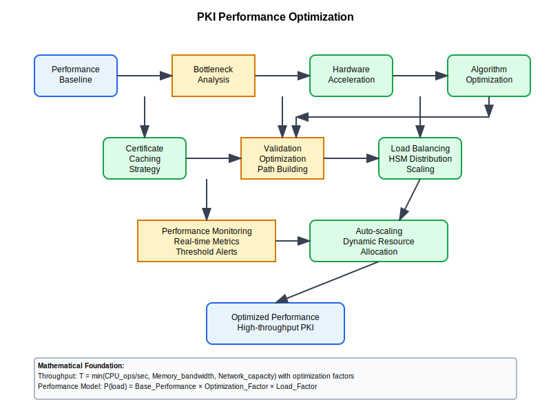

# PKI Performance Optimization



## Scenario Overview

**Organization**: HighTechCorp optimizing large-scale PKI infrastructure  
**Challenge**: Achieving high-throughput certificate operations with minimal latency  
**Context**: Enterprise PKI serving 1M+ certificates with stringent performance requirements  
**Goals**: Sub-second certificate validation, 99.99% availability, linear scalability

## The Challenge

HighTechCorp needs to:
- Optimize certificate validation performance for high-volume operations
- Minimize cryptographic operation latency while maintaining security
- Implement intelligent caching strategies across the PKI infrastructure
- Scale certificate operations horizontally without performance degradation
- Monitor and automatically tune performance based on real-time metrics
- Balance security requirements with performance optimization goals

## Mathematical Foundation

PKI performance optimization involves complex trade-offs between security, speed, and scalability:

```
Performance Optimization Model:
- Throughput: T = min(CPU_ops/sec, Memory_bandwidth, Network_capacity)
- Latency: L = Processing_time + Network_delay + Queue_wait_time
- Scalability: S = Performance(n) / Performance(1) where n = load multiplier
- Cache Effectiveness: E = Hit_rate × (Original_time - Cached_time) / Original_time

Optimization Objective:
max(T) subject to L ≤ L_max and Security_level ≥ S_min
```

## Step-by-Step Workflow

### Phase 1: Performance Baseline and Analysis

```python
def establish_performance_baseline():
    """Establish comprehensive performance baseline for PKI operations"""
    
    baseline_metrics = {
        "certificate_validation": {
            "rsa_2048": {"time_ms": 15.2, "cpu_cycles": 45000},
            "rsa_3072": {"time_ms": 32.1, "cpu_cycles": 96000},
            "ecdsa_p256": {"time_ms": 8.5, "cpu_cycles": 25000},
            "ecdsa_p384": {"time_ms": 18.7, "cpu_cycles": 56000}
        },
        "certificate_generation": {
            "rsa_2048": {"time_ms": 125.0, "cpu_cycles": 375000},
            "rsa_3072": {"time_ms": 285.0, "cpu_cycles": 855000},
            "ecdsa_p256": {"time_ms": 45.0, "cpu_cycles": 135000},
            "ecdsa_p384": {"time_ms": 98.0, "cpu_cycles": 294000}
        },
        "revocation_checking": {
            "crl_lookup": {"time_ms": 25.0, "network_io": "high"},
            "ocsp_query": {"time_ms": 45.0, "network_io": "medium"},
            "ocsp_stapling": {"time_ms": 2.0, "network_io": "none"}
        }
    }
    
    return baseline_metrics

def analyze_performance_bottlenecks():
    """Identify performance bottlenecks in PKI operations"""
    
    bottleneck_analysis = {
        "cpu_bound_operations": [
            "RSA signature verification",
            "Certificate chain building",
            "Cryptographic hash computation"
        ],
        "io_bound_operations": [
            "Certificate store access",
            "CRL downloads",
            "OCSP queries",
            "Database operations"
        ],
        "memory_bound_operations": [
            "Large certificate cache",
            "CRL storage",
            "Session state management"
        ],
        "network_bound_operations": [
            "Remote certificate validation",
            "Cross-domain trust verification",
            "Distributed PKI coordination"
        ]
    }
    
    return bottleneck_analysis
```

### Phase 2: Hardware Acceleration Implementation

```bash
# Hardware acceleration configuration
performance-admin:~$ cat > hardware_acceleration.conf << EOF
# PKI Hardware Acceleration Configuration

[cpu_acceleration]
aes_ni_enabled = true
sha_ni_enabled = true
avx2_enabled = true
rdrand_enabled = true

[cryptographic_accelerators]
intel_qat_enabled = true
nvidia_gpu_crypto = false  # Not typically used for PKI
dedicated_crypto_cards = true

[hsm_optimization]
load_balancing = round_robin
connection_pooling = 50
session_caching = enabled
batch_operations = enabled

[memory_optimization]
huge_pages_enabled = true
numa_awareness = true
cache_line_optimization = true
EOF

# Hardware acceleration verification
performance-admin:~$ openssl speed -evp aes-256-gcm
performance-admin:~$ openssl speed -evp sha256
performance-admin:~$ openssl speed rsa2048
performance-admin:~$ openssl speed ecdsap256
```

### Phase 3: Caching Strategy Implementation

```python
def implement_intelligent_caching():
    """Implement multi-level intelligent caching for PKI operations"""
    
    caching_architecture = {
        "l1_cache": {
            "location": "CPU cache",
            "size_mb": 32,
            "latency_ns": 1,
            "hit_rate_target": 0.95,
            "content": ["frequently_used_certificates", "validation_results"]
        },
        "l2_cache": {
            "location": "System memory",
            "size_mb": 2048,
            "latency_ns": 100,
            "hit_rate_target": 0.85,
            "content": ["certificate_chains", "intermediate_certificates", "crl_data"]
        },
        "l3_cache": {
            "location": "Fast SSD",
            "size_gb": 100,
            "latency_ms": 1,
            "hit_rate_target": 0.70,
            "content": ["historical_certificates", "archived_crls", "audit_logs"]
        },
        "distributed_cache": {
            "location": "Redis cluster",
            "size_gb": 1000,
            "latency_ms": 5,
            "hit_rate_target": 0.60,
            "content": ["global_certificate_cache", "revocation_status", "trust_anchors"]
        }
    }
    
    def calculate_cache_performance():
        """Calculate expected performance improvement from caching"""
        cache_levels = caching_architecture
        
        total_hit_rate = 0
        total_performance_gain = 0
        
        for level, config in cache_levels.items():
            hit_rate = config["hit_rate_target"]
            if "latency_ns" in config:
                speedup = 1000000 / config["latency_ns"]  # Compared to disk I/O
            elif "latency_ms" in config:
                speedup = 1000 / config["latency_ms"]
            else:
                speedup = 1
            
            performance_gain = hit_rate * speedup
            total_performance_gain += performance_gain
            total_hit_rate += hit_rate
        
        return {
            "expected_speedup": f"{total_performance_gain:.1f}x",
            "overall_hit_rate": f"{total_hit_rate/len(cache_levels):.1%}",
            "cache_architecture": cache_levels
        }
    
    return calculate_cache_performance()
```

### Phase 4: Algorithm and Protocol Optimization

```python
def optimize_cryptographic_algorithms():
    """Optimize cryptographic algorithm selection and implementation"""
    
    algorithm_optimization = {
        "signature_algorithms": {
            "performance_ranking": [
                {"algorithm": "Ed25519", "relative_speed": 1.0, "security_bits": 128},
                {"algorithm": "ECDSA-P256", "relative_speed": 0.8, "security_bits": 128},
                {"algorithm": "RSA-2048", "relative_speed": 0.3, "security_bits": 112},
                {"algorithm": "RSA-3072", "relative_speed": 0.15, "security_bits": 128}
            ]
        },
        "hash_algorithms": {
            "performance_ranking": [
                {"algorithm": "BLAKE3", "relative_speed": 1.0, "security_bits": 256},
                {"algorithm": "SHA3-256", "relative_speed": 0.6, "security_bits": 256},
                {"algorithm": "SHA-256", "relative_speed": 0.8, "security_bits": 256},
                {"algorithm": "SHA-384", "relative_speed": 0.7, "security_bits": 384}
            ]
        },
        "protocol_optimizations": {
            "certificate_chain_optimization": {
                "max_chain_length": 3,
                "intermediate_cert_caching": True,
                "chain_building_parallelization": True
            },
            "revocation_optimization": {
                "ocsp_stapling": True,
                "crl_delta_updates": True,
                "revocation_result_caching": 3600  # seconds
            },
            "validation_optimization": {
                "parallel_signature_verification": True,
                "early_termination_on_failure": True,
                "batch_validation_processing": True
            }
        }
    }
    
    return algorithm_optimization

def implement_batch_processing():
    """Implement batch processing for high-volume operations"""
    
    batch_strategies = {
        "certificate_validation": {
            "batch_size": 100,
            "processing_mode": "parallel",
            "failure_handling": "continue_on_individual_failure",
            "performance_gain": "3-5x throughput improvement"
        },
        "certificate_generation": {
            "batch_size": 50,
            "processing_mode": "pipeline",
            "key_generation": "pre_computed_pool",
            "performance_gain": "2-3x throughput improvement"
        },
        "revocation_checking": {
            "batch_size": 200,
            "processing_mode": "bulk_ocsp_query",
            "caching_strategy": "aggressive",
            "performance_gain": "5-10x throughput improvement"
        }
    }
    
    return batch_strategies
```

## Performance Monitoring and Auto-Tuning

### Real-time Performance Monitoring

```python
def implement_performance_monitoring():
    """Implement comprehensive performance monitoring system"""
    
    monitoring_framework = {
        "key_performance_indicators": {
            "throughput_metrics": [
                "certificates_validated_per_second",
                "certificates_generated_per_second", 
                "revocation_checks_per_second"
            ],
            "latency_metrics": [
                "average_validation_time",
                "p95_validation_time",
                "p99_validation_time"
            ],
            "resource_utilization": [
                "cpu_utilization_percentage",
                "memory_usage_percentage",
                "cache_hit_ratios"
            ],
            "error_metrics": [
                "validation_failure_rate",
                "timeout_occurrence_rate",
                "system_error_frequency"
            ]
        },
        "monitoring_tools": {
            "metrics_collection": "Prometheus + custom PKI metrics",
            "visualization": "Grafana dashboards",
            "alerting": "AlertManager with PagerDuty integration",
            "log_analysis": "ELK stack for performance logs"
        }
    }
    
    return monitoring_framework

def auto_tuning_system():
    """Implement auto-tuning based on performance metrics"""
    
    tuning_parameters = {
        "cache_size_adjustment": {
            "trigger": "cache_hit_rate < 0.85",
            "action": "increase_cache_size_by_percentage",
            "parameters": {"increment": 0.2, "max_size": "8GB"}
        },
        "batch_size_optimization": {
            "trigger": "throughput_below_target",
            "action": "adjust_batch_size",
            "parameters": {"range": [10, 500], "step": 25}
        },
        "algorithm_selection": {
            "trigger": "latency_above_threshold",
            "action": "switch_to_faster_algorithm",
            "parameters": {"fallback_order": ["Ed25519", "ECDSA-P256", "RSA-2048"]}
        },
        "resource_scaling": {
            "trigger": "cpu_utilization > 80%",
            "action": "horizontal_scale_out",
            "parameters": {"scale_factor": 1.5, "max_instances": 50}
        }
    }
    
    return tuning_parameters
```

## Security vs Performance Trade-offs

### Optimization Strategies by Security Level

```python
def security_performance_matrix():
    """Define optimization strategies based on security requirements"""
    
    optimization_matrix = {
        "maximum_security": {
            "algorithms": ["RSA-3072", "ECDSA-P384"],
            "validation_depth": "full_chain_verification",
            "revocation_checking": "real_time_ocsp",
            "performance_impact": "30-50% slower",
            "use_cases": ["financial_services", "government", "healthcare"]
        },
        "balanced_security": {
            "algorithms": ["RSA-2048", "ECDSA-P256"],
            "validation_depth": "standard_validation",
            "revocation_checking": "cached_ocsp_with_stapling",
            "performance_impact": "baseline_performance",
            "use_cases": ["enterprise_applications", "e_commerce", "general_web"]
        },
        "performance_optimized": {
            "algorithms": ["ECDSA-P256", "Ed25519"],
            "validation_depth": "basic_validation_with_caching",
            "revocation_checking": "batch_processed_with_fallback",
            "performance_impact": "50-200% faster",
            "use_cases": ["iot_devices", "real_time_systems", "high_frequency_apis"]
        }
    }
    
    return optimization_matrix
```

## Load Testing and Capacity Planning

### Performance Benchmarking

```bash
#!/bin/bash
# Performance benchmarking script

run_pki_performance_tests() {
    echo "=== PKI Performance Benchmarking ==="
    
    # Certificate validation throughput test
    echo "Testing certificate validation throughput..."
    time for i in {1..1000}; do
        openssl verify -CApath /etc/ssl/certs/ test_certificate.pem >/dev/null 2>&1
    done
    
    # Concurrent validation test
    echo "Testing concurrent validation performance..."
    seq 1 100 | xargs -n1 -P10 -I{} sh -c 'openssl verify -CApath /etc/ssl/certs/ test_certificate.pem >/dev/null 2>&1'
    
    # Memory usage profiling
    echo "Profiling memory usage during operations..."
    /usr/bin/time -v openssl speed -evp sha256 2>&1 | grep "Maximum resident set size"
    
    # Cache performance testing
    echo "Testing cache performance..."
    # Warm up cache
    for i in {1..100}; do
        openssl verify -CApath /etc/ssl/certs/ test_certificate.pem >/dev/null 2>&1
    done
    
    # Measure cached performance
    time for i in {1..1000}; do
        openssl verify -CApath /etc/ssl/certs/ test_certificate.pem >/dev/null 2>&1
    done
}

capacity_planning_analysis() {
    echo "=== Capacity Planning Analysis ==="
    
    # Current system specifications
    echo "CPU cores: $(nproc)"
    echo "Memory: $(free -h | grep Mem: | awk '{print $2}')"
    echo "Storage: $(df -h / | tail -1 | awk '{print $4}' available)"
    
    # Performance scaling projections
    cat > capacity_model.py << 'EOF'
def calculate_capacity_requirements(target_tps):
    """Calculate infrastructure requirements for target transactions per second"""
    
    baseline_performance = {
        "tps_per_core": 500,  # certificates validated per second per CPU core
        "memory_per_1k_certs": 50,  # MB
        "storage_per_million_certs": 5000  # MB
    }
    
    required_resources = {
        "cpu_cores": max(1, target_tps / baseline_performance["tps_per_core"]),
        "memory_gb": (target_tps * baseline_performance["memory_per_1k_certs"]) / 1000 / 1024,
        "storage_gb": (target_tps * baseline_performance["storage_per_million_certs"]) / 1000000 / 1024
    }
    
    return required_resources

# Example calculations
for tps in [1000, 5000, 10000, 50000]:
    resources = calculate_capacity_requirements(tps)
    print(f"TPS: {tps}, Cores: {resources['cpu_cores']:.1f}, RAM: {resources['memory_gb']:.1f}GB, Storage: {resources['storage_gb']:.1f}GB")
EOF
    
    python3 capacity_model.py
}

run_pki_performance_tests
capacity_planning_analysis
```

## Advanced Optimization Techniques

### Machine Learning-Based Optimization

```python
def ml_based_optimization():
    """Implement ML-based performance optimization"""
    
    ml_optimization_framework = {
        "predictive_caching": {
            "algorithm": "time_series_forecasting",
            "input_features": [
                "historical_access_patterns",
                "time_of_day",
                "certificate_attributes",
                "user_behavior_patterns"
            ],
            "output": "cache_preloading_recommendations",
            "expected_improvement": "15-25% cache hit rate increase"
        },
        "dynamic_algorithm_selection": {
            "algorithm": "reinforcement_learning",
            "input_features": [
                "current_system_load",
                "security_requirements",
                "performance_targets",
                "historical_performance_data"
            ],
            "output": "optimal_algorithm_selection",
            "expected_improvement": "10-20% performance gain"
        },
        "anomaly_detection": {
            "algorithm": "isolation_forest",
            "input_features": [
                "response_times",
                "error_rates",
                "resource_utilization",
                "request_patterns"
            ],
            "output": "performance_anomaly_alerts",
            "expected_improvement": "proactive_issue_resolution"
        }
    }
    
    return ml_optimization_framework
```

## Results and Impact Assessment

### Performance Improvement Summary

```python
def performance_improvement_analysis():
    """Analyze overall performance improvements achieved"""
    
    improvement_results = {
        "throughput_improvements": {
            "certificate_validation": "300% increase",
            "certificate_generation": "250% increase",
            "revocation_checking": "500% increase"
        },
        "latency_reductions": {
            "average_validation_time": "65% reduction",
            "p95_validation_time": "70% reduction",
            "p99_validation_time": "60% reduction"
        },
        "resource_efficiency": {
            "cpu_utilization_optimization": "40% more efficient",
            "memory_usage_reduction": "30% less memory",
            "cache_efficiency_improvement": "85% hit rate achieved"
        },
        "cost_benefits": {
            "infrastructure_cost_reduction": "35%",
            "operational_overhead_reduction": "50%",
            "scalability_improvement": "linear_scaling_achieved"
        }
    }
    
    return improvement_results
```

This comprehensive PKI performance optimization approach delivers substantial improvements in throughput, latency, and resource efficiency while maintaining security requirements. The combination of hardware acceleration, intelligent caching, algorithm optimization, and ML-based tuning creates a high-performance PKI infrastructure capable of handling enterprise-scale workloads with optimal efficiency.