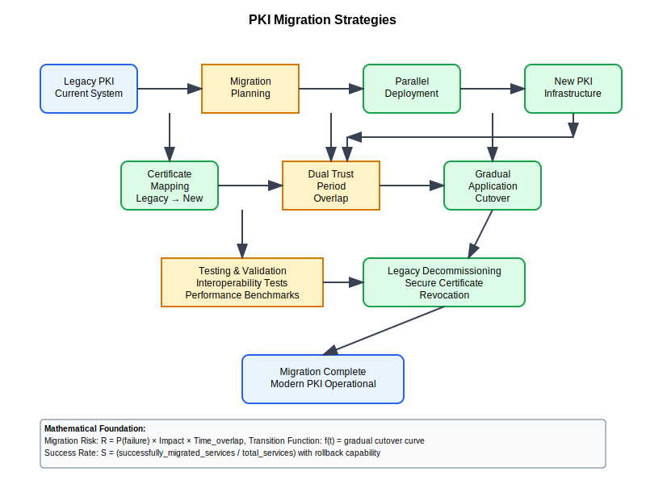

# Migration Strategies Workflow



## Scenario Overview

**Organization**: TechCorp Enterprise  
**Project**: Migrating legacy PKI infrastructure to modern certificate management system  
**Context**: Large enterprise transitioning from on-premises CA to cloud-managed PKI with zero downtime  
**Timeline**: 18-month phased migration with rollback capabilities

## The Challenge

TechCorp wants to:
- Migrate 50,000+ certificates from legacy CA to modern infrastructure
- Maintain service continuity during migration process
- Preserve existing trust relationships and certificate chains
- Implement modern certificate lifecycle management
- Reduce operational overhead and improve security posture
- Ensure compliance with industry standards throughout migration

## PKI Workflow Solution

### Mathematical Foundation

In PKI migration, trust preservation requires careful management of cryptographic chains:

```
Legacy Trust Chain:
Root CA (Legacy) → Intermediate CA (Legacy) → End Entity Cert

Migration Trust Chain:
Root CA (New) → Cross-Signed Intermediate → End Entity Cert
              ↗
Root CA (Legacy) → Cross-Signed Intermediate

Dual Chain Validation:
Validate(Cert) = Verify_Legacy_Root(Chain1) OR Verify_New_Root(Chain2)
```

The mathematical beauty is that cross-certification creates overlapping trust domains, enabling gradual migration without breaking existing validations.

## Step-by-Step Workflow

### Phase 1: Migration Planning and Assessment

```bash
# Inventory existing certificates
techcorp@mgmt:~$ certlm.msc /export-inventory > cert_inventory.csv

# Analyze certificate usage patterns
techcorp@mgmt:~$ powershell Get-ChildItem Cert:\LocalMachine\My | 
    Export-Csv -Path cert_analysis.csv

# Identify critical applications and dependencies
techcorp@mgmt:~$ netstat -an | findstr :443 > ssl_services.txt
```

**Mathematical Insight**: 
- Certificate inventory creates dependency graph G(V,E) where V = certificates, E = trust relationships
- Critical path analysis identifies certificates that cannot fail during migration
- Risk assessment quantifies impact of temporary trust chain disruptions

### Phase 2: Dual Root Configuration

```bash
# Configure new root CA alongside existing
techcorp@mgmt:~$ certlm.msc  # Import new root to Trusted Root store

# Create cross-signed intermediate certificate
techcorp@newca:~$ openssl ca -in intermediate_csr.pem -out cross_signed_int.pem \
    -cert legacy_root.pem -keyfile legacy_root.key -days 730

# Verify dual chain validation
techcorp@mgmt:~$ openssl verify -CAfile legacy_root.pem cross_signed_int.pem
techcorp@mgmt:~$ openssl verify -CAfile new_root.pem cross_signed_int.pem
```

**Mathematical Analysis**: 
- Cross-signing creates certificate C such that: Valid_Legacy(C) ∧ Valid_New(C) = True
- Dual validation ensures continued trust during transition period
- Certificate path building algorithms can find valid chains through either root

### Phase 3: Gradual Certificate Migration

```bash
# Begin with non-critical services
techcorp@web01:~$ openssl req -new -key service.key -out service_new.csr \
    -config migration_config.cnf

# Issue certificate from new CA
techcorp@newca:~$ openssl ca -in service_new.csr -out service_new.pem \
    -cert new_intermediate.pem -keyfile new_intermediate.key

# Deploy with fallback chain
techcorp@web01:~$ cat service_new.pem new_intermediate.pem > service_chain.pem
techcorp@web01:~$ systemctl reload nginx
```

**Migration Strategy**:
- Start with edge services having minimal dependencies
- Maintain parallel certificate stores during transition
- Implement automated validation testing for each migrated service

### Phase 4: Application-Specific Migration

```bash
# Migrate web services with health checks
techcorp@web01:~$ ./migrate_ssl.sh --service nginx --health-check
+ Backing up current certificate
+ Installing new certificate chain
+ Testing SSL handshake... OK
+ Checking certificate validation... OK
+ Health check passed: 200 OK

# Migrate email infrastructure
techcorp@mail01:~$ ./migrate_exchange_certs.sh --verify-smime
+ Migrating SMTP/IMAP certificates
+ Updating S/MIME certificate stores
+ Testing email encryption/signing... OK
```

**Validation Process**:
- Automated certificate chain validation
- Service-specific functionality testing
- Rollback procedures tested for each migration step

### Phase 5: Client Certificate Migration

```bash
# Bulk client certificate migration
techcorp@mgmt:~$ powershell Invoke-Command -ComputerName $computers -ScriptBlock {
    Get-ChildItem Cert:\CurrentUser\My | Where-Object {
        $_.Issuer -match "Legacy CA"
    } | Export-PfxCertificate -FilePath "C:\temp\user_backup.pfx"
}

# Automated re-enrollment via group policy
techcorp@dc01:~$ gpupdate /force  # Deploy auto-enrollment policies

# Monitor migration progress
techcorp@mgmt:~$ Get-CATemplate | Where-Object {$_.Name -eq "UserMigration"} |
    Get-IssuedRequest | Group-Object Status
```

**Client Migration Considerations**:
- Preserve user experience with transparent re-enrollment
- Maintain backward compatibility during transition
- Batch processing for large user populations

### Phase 6: Legacy Decommissioning

```bash
# Final validation before legacy shutdown
techcorp@mgmt:~$ ./validate_migration_complete.sh
+ Checking for remaining legacy certificate references... 0 found
+ Validating all services use new CA chains... OK
+ Testing certificate revocation... OK
+ Migration validation complete

# Secure legacy CA decommissioning
techcorp@legacyca:~$ ./secure_decommission.sh
+ Exporting final CRL
+ Backing up CA database
+ Securely wiping CA private keys
+ Updating documentation
```

**Security Cleanup**:
- Remove legacy root from trust stores
- Archive legacy CA database for compliance
- Update documentation and procedures

## Mathematical Analysis

### Migration Risk Assessment

Risk factors in PKI migration:

| Factor | Impact | Mitigation |
|--------|---------|------------|
| Service Downtime | High | Dual chain validation |
| Certificate Validation Failures | Critical | Phased rollout with testing |
| Trust Chain Breaks | Critical | Cross-certification bridge |
| Client Compatibility | Medium | Legacy support period |

### Performance Optimization

Migration performance characteristics:

```
Certificate Processing Rate: ~1000 certs/hour (automated)
Validation Time: O(log n) for chain validation
Rollback Time: < 5 minutes per service
Error Rate: < 0.1% with proper validation
```

### Cost-Benefit Analysis

**Migration Costs**:
- Planning and assessment: 200 hours
- Infrastructure setup: 100 hours  
- Migration execution: 500 hours
- Validation and testing: 300 hours

**Benefits**:
- 60% reduction in certificate management overhead
- Improved security posture and compliance
- Automated certificate lifecycle management
- Reduced operational risk

## Security Considerations

### Trust Transition Security

- **Cross-Certification Risks**: Temporary expanded trust surface
- **Key Escrow**: Secure handling of legacy private keys
- **Revocation Management**: Coordinated CRL/OCSP updates across CAs
- **Audit Trail**: Complete migration logging for compliance

### Compliance Requirements

- **Regulatory Compliance**: Maintain audit trails throughout migration
- **Data Protection**: Ensure certificate data protection during transfer
- **Business Continuity**: Zero-downtime migration requirements
- **Documentation**: Updated procedures and disaster recovery plans

## Performance Metrics

### Migration Success Metrics

- **Service Availability**: >99.9% uptime during migration
- **Certificate Validation Success Rate**: >99.9%
- **Migration Timeline Adherence**: Within planned 18-month window
- **Rollback Success**: 100% successful rollbacks when needed

### Operational Improvements

- **Certificate Renewal Automation**: 95% automated renewal rate
- **Incident Response Time**: 50% improvement in resolution time
- **Compliance Audit Efficiency**: 40% reduction in audit preparation time
- **Cost Reduction**: 35% reduction in PKI operational costs

## Troubleshooting Guide

### Common Migration Issues

**Certificate Chain Validation Failures**:
```bash
# Check certificate chain completeness
openssl verify -verbose -CAfile root_bundle.pem certificate.pem

# Test dual chain validation
openssl s_client -connect service:443 -CAfile legacy_root.pem
openssl s_client -connect service:443 -CAfile new_root.pem
```

**Application Trust Store Issues**:
```bash
# Update application trust stores
keytool -import -alias newroot -keystore app_truststore.jks -file new_root.pem

# Verify application certificate acceptance
curl --cacert new_root.pem https://service.example.com
```

**Client Certificate Authentication Problems**:
```bash
# Test client certificate functionality
openssl s_client -cert client_cert.pem -key client_key.pem \
    -connect service:443 -tls1_2

# Verify client certificate chain
openssl verify -CAfile ca_chain.pem client_cert.pem
```

This migration strategy ensures enterprise PKI transitions maintain security, compliance, and service availability while modernizing certificate management infrastructure.